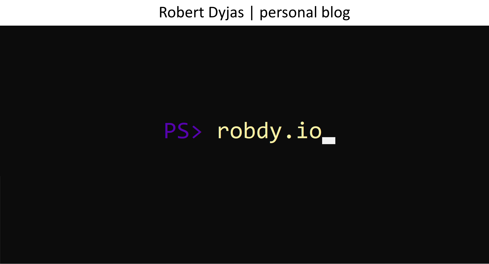

## 👋 Welcome to my blog

You're now checking the repository for my blog. If you want to read the blog, visit [robdy.github.io](https://robdy.github.io).

## 📢 What content can you find here?

I'm writing about multiple technologies. Most of the content found here is about Microsoft 365, especially Teams. As I'm a 😻 big fan of automation 😻 you'll also find a lot of ⌨ PowerShell scripts. ⌨

My hobby is web development, so it's possible that some of the articles are my findings from learning process. I try to explain things as simple as possible and show step-by-step instructions.

## 📝 How can you contribute?

If you see any error/typo, feel free to open [an issue](https://github.com/robdy/robdy.github.io/issues/new/) or (even better) go to [blog folder](https://github.com/robdy/robdy.github.io/tree/src/src/pages/blog) and edit it. Then open a pull request so I can merge it.

## 🛠 What technologies were used to build the site?

Blog is built using [Gatsby](https://www.gatsbyjs.com/). I'm using [Netlify](https://netlify.com) to create build previews and deploy the website to [GitHub Pages](https://pages.github.com).

Content is being managed by [Netlify CMS](https://www.netlifycms.org/).

## 🏗️ Deploy configuration
Push changes to `src` branch. It'll be deployed via script `deploy.sh` to `master` and then visible on [robdy.github.io](https://robdy.github.io). Draft version is visible on Netlify.
