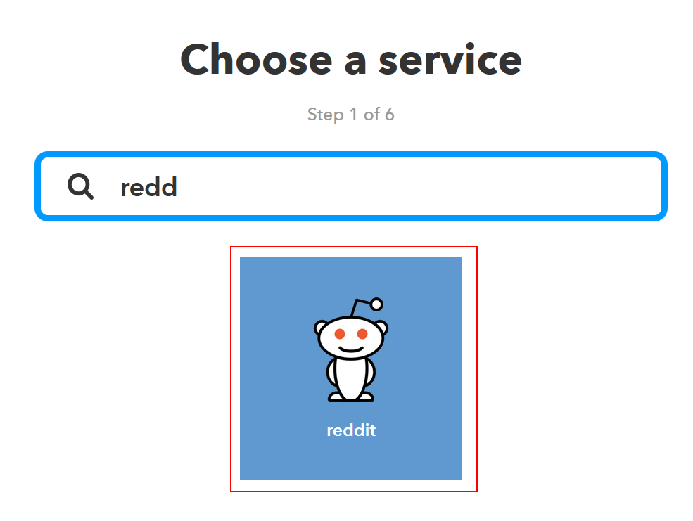
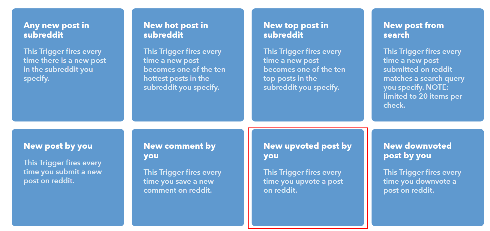
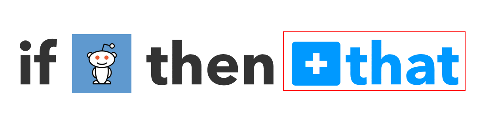
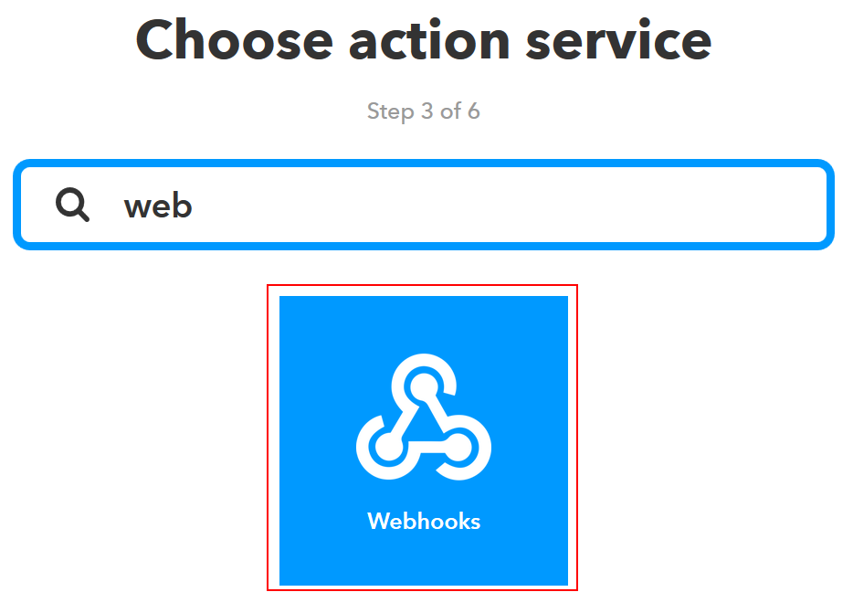
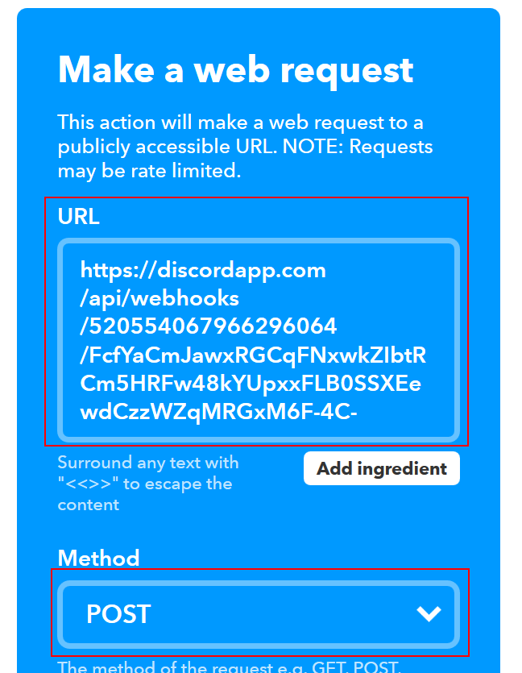
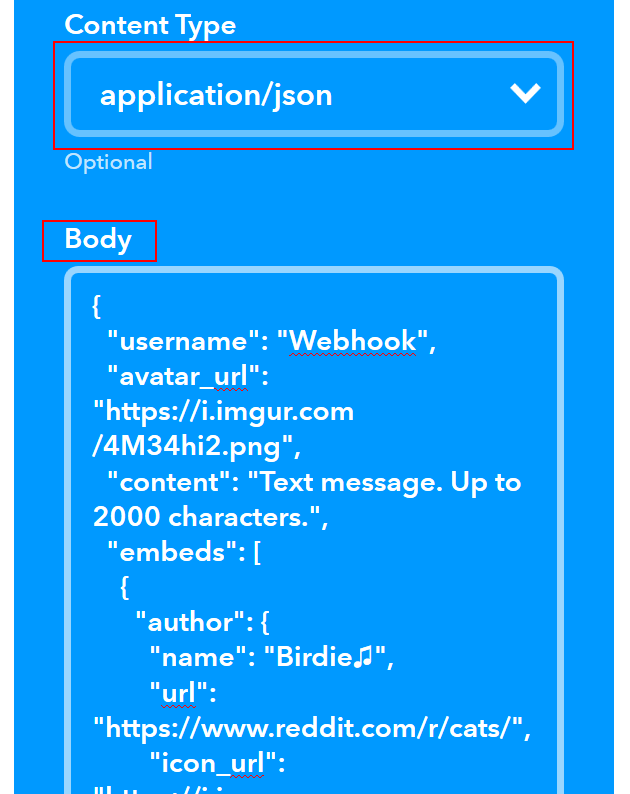
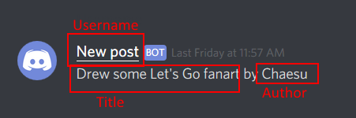
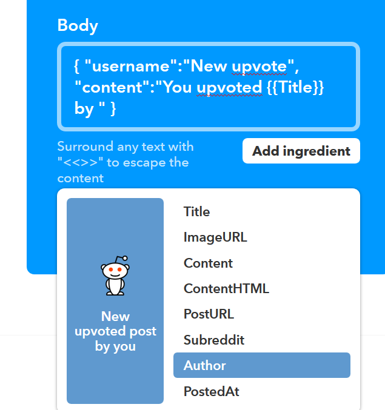
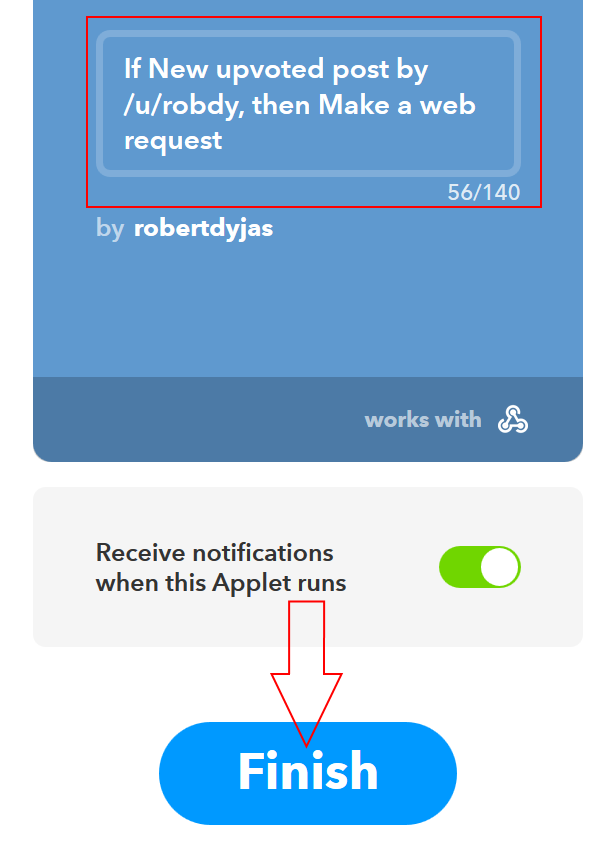
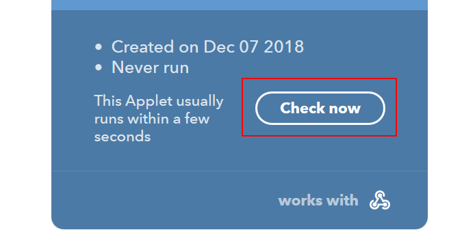

<Note>

This article was written in 2018. It stays here for archiving purposes. 

<br />

If you want your app to post messages to Discord, you can do it with webhooks. Check if your app supports sending requests to webhooks and follow the instructions provided.

<br />

Below, you can discover the format required by Discord. Based on the examples, you should be able to adjust it to your needs.

</Note>

### No coding at all

My first attempt was based on [Mark Ramsey's article](https://medium.com/dolphin-squad/bringing-twitter-tweets-into-discord-channels-e8ded1581da8). If you happen to follow Tweets of specific user and post them to your Discord, read it and you're done. However, if you need to do anything else (i.e reposting top Reddit posts from specific sub, getting weather alerts etc.), follow this tutorial.

<!--more-->

First, go to [creating new applet page on IFTTT](https://ifttt.com/create). Choose the service:



and specific action (I chose post upvote as it's easy to trigger for testing)



Once you configured the trigger, go to action configuration:



Your actions service will be `Webhooks`:



In `URL` field you just have to paste your webhook URL. Do not forget to change method to `POST` (default is `GET`):



`Content Type` should be `application/json` and in the body you enter the message you want to be sent.



There are two options for formatting your message. The simpler one is to just fill username and content for example with this:

``` json
{ "username":"New post", "content":"{{Title}} by {{Author}}" }
```

which would result in such message:



You can use the dropdown `Add ingredient` to see which fields are available for you and to add them to your output:




If you want, you can also create rich embed (you can take example from [here](https://birdie0.github.io/discord-webhooks-guide/discord_webhook.html) and adjust it to your needs). 

Once you're done with the configuration, click `Create action`, rename your applet if needed and click `Finish`:



Now you just need to upvote something using your account. You might sometimes use `Check now` if the applet doesn't run ~~and you're impatient as me~~.

