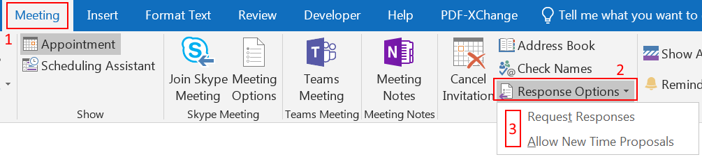
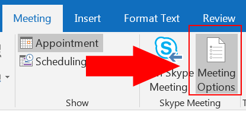
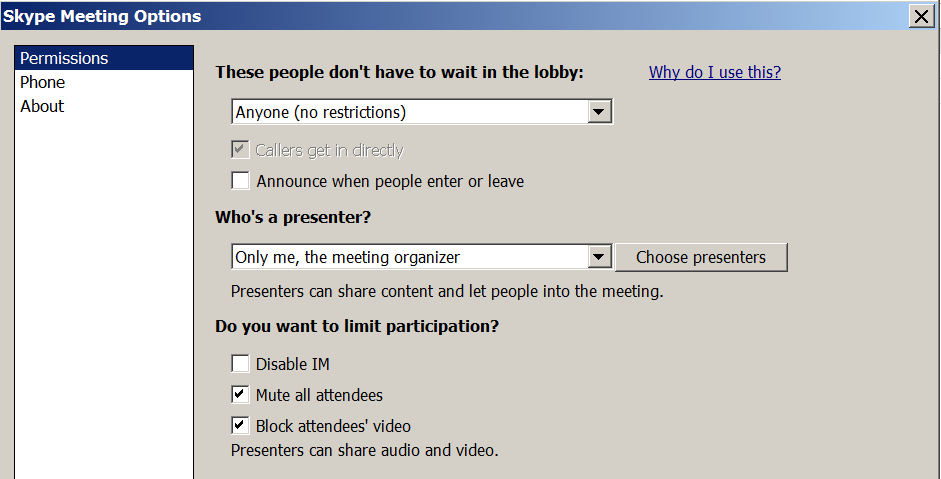
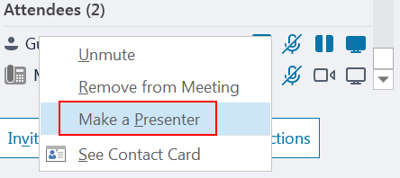
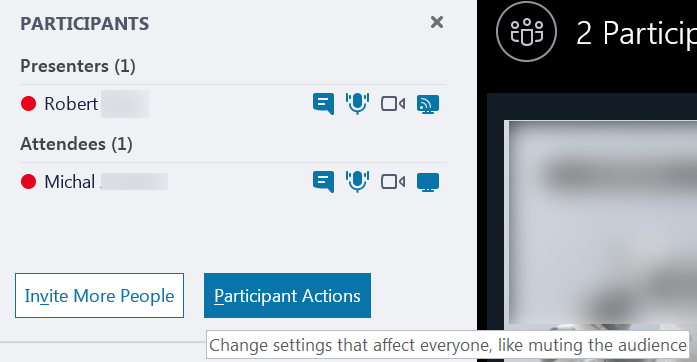
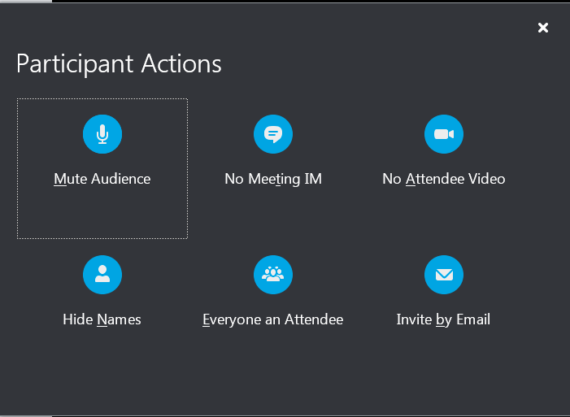

Please note that **I only focus on technical aspects** (configuration of Outlook and Skype for Business) and assume that you know the basics (like preparing the agenda, clarifying the purpose of the meeting, choosing appropriate content for the audience) I also assume that your Skype for Business is working correctly (you have enough bandwidth, stable connection).

## Checklist only

* Make sure to specify if you want to receive responses to the invitation
* Limit the presenter role to the people who need it
* Mute all attendees and block attendees' video
* Upload the presentation before the meeting
* Make the presentation downloadable (including notes and annotations) if you wish
* While sharing content other than presentation – use desktop sharing

<!--more-->

## Table of Contents
```toc
exclude: [Table of Contents, Checklist only]
```

## Frequent issues

* People join with unmuted microphone and they interrupt the audio before they even realize everyone can hear them
* Presenter is removed from the meeting by misclick of one of the participants
* Someone ends the meeting in the middle of the conversation

Below I'm addressing these issues and also suggest what you can do more.

## Start with the invitation
When you create the meeting, there are some useful options which could make your life easier (and in the same time, make you look more professional):

### Response options

On 'Meeting' ribbon in your Outlook you can specify whether you want to receive all the responses to your mailbox. For big meetings it's usually good to unmark the option and avoid reply flood (if you really need it, you can [create a rule in Outlook](https://support.office.com/en-us/article/use-inbox-rules-in-outlook-com-4b094371-a5d7-49bd-8b1b-4e4896a7cc5d) to redirect the replies to a folder).



The invitees will see the information that the organizer hasn't requested the response for the invitation.

When someone accepts the meeting you, as an organizer, won't receive the responses but also **won't be able to track who accepted the meeting**.

### Skype meeting options

*It is important to set the settings during the initial planning. Any changes performed later might not reflect immediately!*

To change the meeting options, you need to go to 'Meeting Options' on the ribbon:



Here's the list of options available for Skype for Business meeting with the suggested configuration:



#### Presenter or attendee?

Before going further it's important to understand the difference beetween the presenter and an attendee.

**Presenter**, in contrary to **attendee** is able to do anything with the meeting (share audio and video, present desktop, mute and remove participants and even **end the meeting**).

An **attendee** can only hear, chat and talk, nothing else.

**During the meeting, any presenter is able to make another attendee a presenter** by right-clicking the attendee and choosing `Make a presenter` option:


#### Available Skype meeting options

* These people don't have to wait in the lobby  
  You can select who will have to wait until **presenter** allows them to enter the meeting. I recommend setting this to `Anyone (no restrictions)` to not have to approve each user entering the meeting.  
  
  Two options below are self-explanatory. `Callers get in directly` allows people who call in with a phone to be connected automatically. The second one `Announce when people enter or leave` is usually not recommended for large meetings (imagine 200 people entering and each of them being announced)
  
* Who's a presenter?  
  It's crucial to choose the appropriate option here. I recommend `Only me, the meeting organizer` (provided that you are sure you join the meeting).
 The alternate option would be to choose the presenters upfront (the option `People I choose` lets you to add anyone you want to the list of presenters)  
 
* Do you want to limit participation?  
  I recommend choosing `Mute all attendees` and `Block attendees' video`. Therefore, all the participants who join the meeting will be muted by default. They won't be able to speak until the audience is unmuted (see [participant actions](#participant-actions) to learn how to do this). 
  
  **Note**: people who joined via phone will still be able to unmute themselves.
  
  IM (chat) is usually useful to confirm that people are able to hear you and can see the presentation.
  
You can also check which setting is recommended for your scenario [on Microsoft KB article](https://support.office.com/en-us/article/change-participant-settings-for-skype-for-business-meetings-9175e297-de5f-43b2-8e0f-85cc05e24986).

## During the meeting

### PowerPoint presentation

If you plan to share PowerPoint presentation, make sure to use `Share PowerPoint Files` option instead of desktop sharing. This will upload the presentation to Skype for Business server and it won't rely on your network connectivity. **Remember that it takes some time to upload the file especially if it contains many slides**.

If you want people to be able to download the presentation you can allow everyone to download it. By default it's limited to the presenters (see [Presenter or attendee?](#presenter-or-attendee) and once again make sure you've chosen the proper option).


**NOTE**: Be aware that people who can download the presentation, as well as all the presenters, will see the notes which you made to the slides!


### Participant actions

Below the list of participants you can find 'Participant Actions' button:



Once you click it, new window will be opened with various options available:



*	Mute audience  
  Using that option will mute everyone except you. Presenters will be able to unmute, but attendees won’t be until you go to the same place and click ‘Unmute audience’. Quite useful option.  
  
  **Note**: people who joined via phone will still be able to unmute themselves.

*	No meeting IM  
  Can be useful in some cases to avoid interruption from users during the presentation but in general I’d avoid that (IM/chat can be useful for people to report issues with the presentation/audio).
  
*	No attendee video  
  Recommended for large meetings (avoids network utilization).
  
*	Hide names  
  Not necessarily needed (unless there’s special case).
  
*	Everyone an attendee  
  Must have if not set in the invitation.
  
*	Invite by email  
  Rarely used (usually if you forgot to invite someone you can just add them to the conference manually)
  
### Desktop sharing
If any additional content (other than PowerPoint presentation) must be shared, it’s generally preferred to use desktop sharing instead application sharing (it uses newer technology which is [Video Based Screen Sharing](http://blog.schertz.name/2015/10/video-based-screen-sharing-in-skype-for-business/) and should work smoother). In addition, switching between windows is easier when you present your desktop than when you present specific application.

  **Note**: if at least one of your participants joins using outdated client version, screensharing will anyway fallback to RDP (old technology) but usually there isn't much to avoid that.
