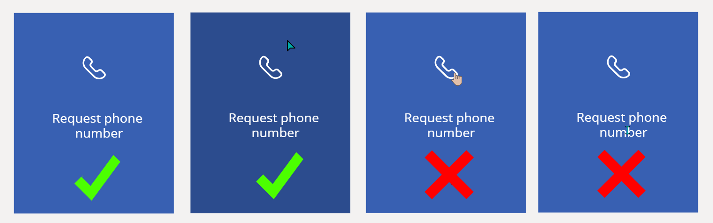
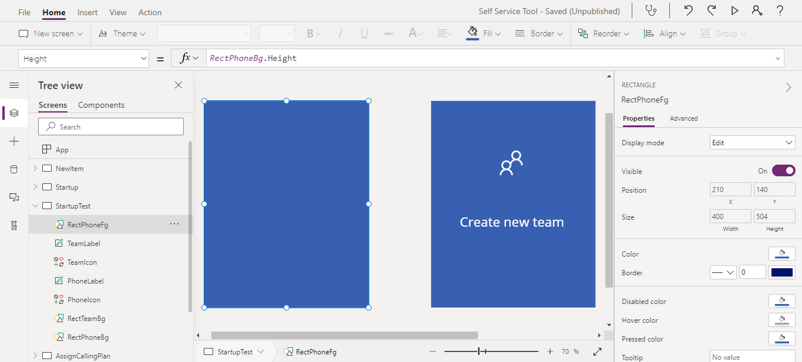

What I'd like to create as the frontend of my Self-Service Tool is two boxes to choose what type of request user wants to create. For now I have created the boxes. Each of them has label and icon:


I'd like to add an 🌟 hover indicator 🌟 so that users notice that it's clickable 🖱.

> **NOTE**: Buttons in PowerApps currently doesn't support changing to hand cursor (neither automatically nor manually). You can 🗳 vote for that feature 🗳 to be added [on Power Apps Community forum](https://powerusers.microsoft.com/t5/Power-Apps-Ideas/Buttons-in-powerapps-form-should-have-an-option-to-change-to/idi-p/278246).

Fortunately, we have `HoverFill` property, where we could set the faded color of the `Fill`. We'll be using [`Self` operator introduced last year](https://powerapps.microsoft.com/en-us/blog/formulas-launch-to-self-and-self-operator/).

The formula to use is

```powershell
ColorFade(Self.Fill,-0.2)
```

## Setting HoverFill value for rectangle

We can apply the formula to all the elements we have by clicking them on **Tree view** with **CTRL** pressed. Then, from the property dropdown, we can choose `HoverFill` and then paste the formula in the function field:


At first glance it seems to be working fine. However, if we go into details, it's not completely correct:



The reason of that behavior is that we have some elements on top of the rectangle. When we hover the cursor over the rectangle itself, it's fine. If we move cursor to the elements, rectangle is no longer hovered.

We'd also need to copy the value of `OnSelect` to all the elements, which makes it more complex. 👎 Imagine troubleshooting non-working formula only to discover that you forgot to update the function on one of the elements.

## Creating rectangle on top

The most straightforward solution is to create transparent ⬜ rectangle on top of the existing ones.

We'll name it similarly to the existing ones, so we can easily find the pair of them. For example, I name the bottom one `RectPhoneBg` and the top one `RectPhoneFg`.

Now let's edit some properties as below:

* **X** = RectPhoneBg.X
* **Y** = RectPhoneBg.Y
* **Width** = RectPhoneBg.Width
* **Height** = RectPhoneBg.Height

We set the position so that the top layer is always in the same place as the bottom one. 👍Buuut, now our top layer covers the whole content. 



Let's make it transparent by setting `Fill` to

```powershell
RGBA(255, 255, 255, 0)
```

The values of RGB don't matter as we set alpha to 0, which makes the element fully transparent. Now we want to create hover effect. 

We can use transparency so that the blue color from the background becomes a bit darker. For example create black element with alpha values of 0.2:

```powershell
RGBA(0, 0, 0, 0.2)
```

Now we have created hover effect for the whole element 💪

The only remaining task to do is to move `OnSelect` value to our top element. In current state, nothing happens when we click as we never reach the bottom element. Once we correct that, we have fully working interface!


