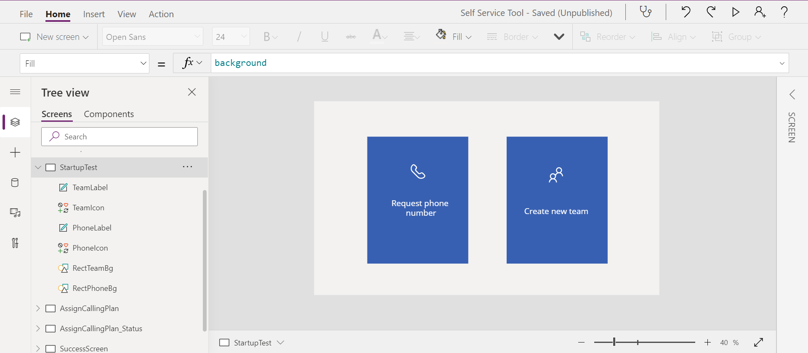

What I'd like to create as the frontend of my Self-Service Tool is the boxes to choose what type of request user wants to create. For now I have created the boxes. Each of them has label and icon:



I'd like to add an hover indicator so that users notice that it's clickable.

> **NOTE**: Buttons in PowerApps currently doesn't support changing to hand cursor (neither automatically nor manually). You can 🗳 vote for that feature 🗳 to be added [on Power Apps Community forum](https://powerusers.microsoft.com/t5/Power-Apps-Ideas/Buttons-in-powerapps-form-should-have-an-option-to-change-to/idi-p/278246).

Fortunately, we have `HoverFill` property, where we could set the faded color of the `Fill`. We'll be using [`Self` operator introduced last year](https://powerapps.microsoft.com/en-us/blog/formulas-launch-to-self-and-self-operator/).

The formula to use is

```powershell
ColorFade(Self.Fill,-0.2)
```

We can apply the formula to all the elements we have by clicking them on **Tree view** with **CTRL** pressed. Then, from the property dropdown, we can choose `HoverFill` and then paste the formula in the function field:

