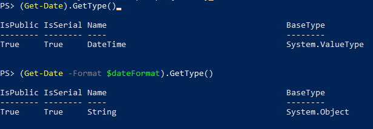

## Case description

In one of my scripts I name my files using `yyyyMMdd` format. Every few days I'd like to cleanup the old files.

In that particular case I don't want to rely on the date of creation nor modification date.

> **NOTE**: There's no solid reasoning behind that, I simply have chosen that design. Thanks to that I notice something worth sharing and there it is 😉

My expected output is the date from 30 days ago in the desired format. Format is saved in variable `$dateFormat`.

## Incorrect solutions

If you try to run any of these cmdlet's, they won't work:

```powershell
$dateFormat = 'yyyyMMdd'
(Get-Date).AddDays(-30) -Format $dateFormat
(Get-Date -Format $dateFormat).AddDays(-30)
```

Let's break them down and see, why.

First option does the following, going step by step:

```powershell
# Prerequisite - define date format
$dateFormat = 'yyyyMMdd'

# Gets current date
Get-Date
# Subtracts 30 days from the date
(Get-Date).AddDays(-30)
# Tries to specify the formatting
(Get-Date).AddDays(-30) -Format $dateFormat
```

If we run them step-by-step, only the last line fails. The error is:

```powershell
At line:1 char:25
+ (Get-Date).AddDays(-30) -Format $dateFormat
+                         ~~~~~~~
Unexpected token '-Format' in expression or statement.
At line:1 char:33
+ (Get-Date).AddDays(-30) -Format $dateFormat
+                                 ~~~~~~~~~~~
Unexpected token '$dateFormat' in expression or statement.
    + CategoryInfo          : ParserError: (:) [], ParentContainsErrorRecordException
    + FullyQualifiedErrorId : UnexpectedToken
```

In simple English it says: you tried to specified `-Format` for something which doesn't accept that parameter.

If we check it carefully, we might notice that we're trying to specify format to the output of `AddDays()`, not to `Get-Date`. If we change the order, we get our second solution. Let's analyse step-by-step:

```powershell
# We already have $dateFormat, no need to specify again
# $dateFormat = 'yyyyMMdd'

# Gets current date
Get-Date
# Convert it to the format specified
Get-Date -Format $dateFormat
# Tries to subtract 30 days
(Get-Date -Format $dateFormat).AddDays(-30)
```

As previously, the last line fails. This time with:

```powershell
Method invocation failed because [System.String] does not contain a method named 'AddDays'.
At line:1 char:1
+ (Get-Date -Format $dateFormat).AddDays(-30)
+ ~~~~~~~~~~~~~~~~~~~~~~~~~~~~~~~~~~~~~~~~~~~
    + CategoryInfo          : InvalidOperation: (:) [], RuntimeException
    + FullyQualifiedErrorId : MethodNotFound
```

Error message gives us pretty clear explanation why it fails, but where on Earth did we use `[System.String]`?

The key is the `-Format` parameter for Get-Date. When used, the cmdlet outputs the value as a string. We can confirm it by invoking \`GetType()\` function:

```powershell
PS> (Get-Date).GetType()

IsPublic IsSerial Name                                     BaseType
-------- -------- ----                                     --------
True     True     DateTime                                 System.ValueType


PS> (Get-Date -Format $dateFormat).GetType()

IsPublic IsSerial Name                                     BaseType
-------- -------- ----                                     --------
True     True     String                                   System.Object
```



String type doesn't have `AddDays` method. It's quite obvoius but let's confirm it using `Get-Member`:

```powershell
Get-Date -Format $dateFormat | Get-Member -Name AddDays
```
No suprise, nothing in output.

## Correct solution

We already know what to do - use `AddDays()` on `DateTime` object and remember about conversion to `String` forced by `-Format`.

Let's do it in two steps

```powershell
# We already have $dateFormat, no need to specify again
# $dateFormat = 'yyyyMMdd'

# Calculate desired date
$30DaysAgo = (Get-Date).AddDays(-30)
# Convert to DateTime and apply formatting
Get-Date -Date $30DaysAgo -Format $dateFormat
```
By having a quick look at the [docs of `Get-Date`](https://docs.microsoft.com/en-us/powershell/module/microsoft.powershell.utility/get-date?view=powershell-7.1#parameters) (emphasis mine):

> -Date
> Type:	DateTime
> Aliases:	LastWriteTime
> Position:	**0**
> Default value:	None
> Accept pipeline input:	**True**
> Accept wildcard characters:	False

We discover that we might skip `-Date` (due to numbered position) or we can use pipeline (as it accepts pipeline input). In that case our last line might be:

```powershell
# Numbered position
Get-Date $30DaysAgo -Format $dateFormat
# Pipeline input
$30DaysAgo | Get-Date -Format $dateFormat
```

## Lessons learned

* `-Format` on `Get-Date` changes type of the output from `DateTime` to `String`
* We can convert `DateTime` object to specific format running `Get-Date` with `-Format` parameter on it
* `Date` parameter on `Get-Date` is the default one so we can supply the data by using position or pipeline