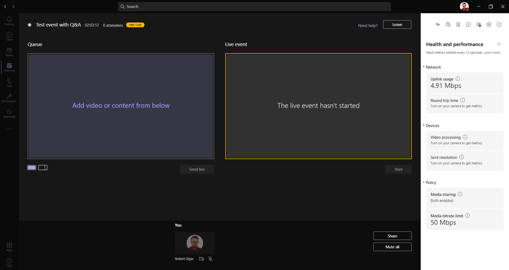
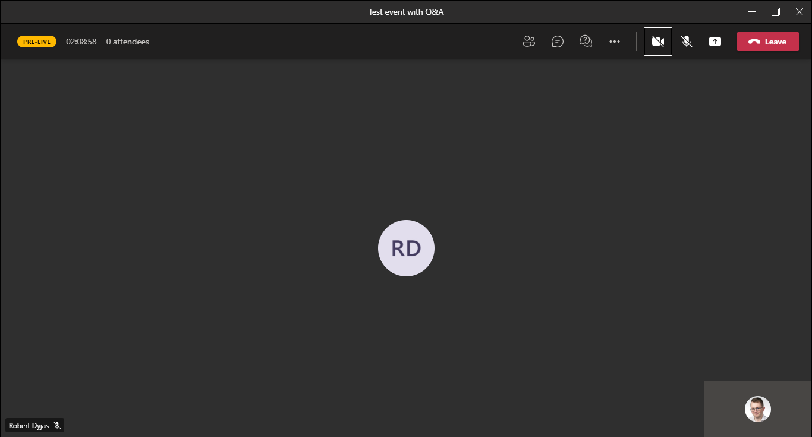
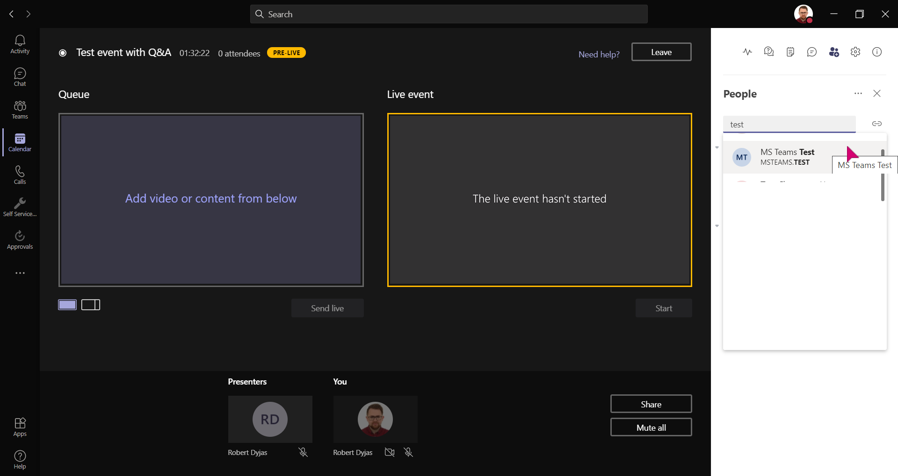
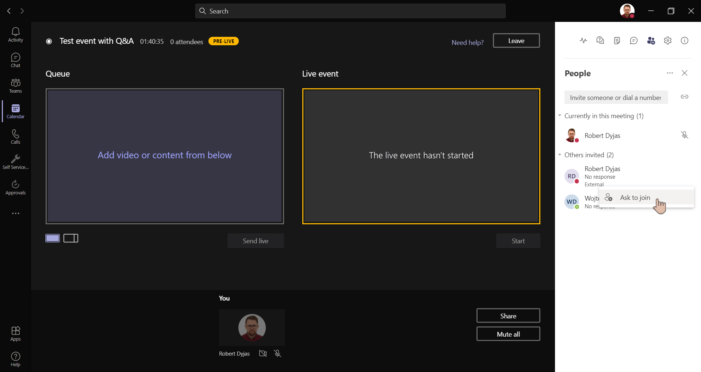

Full description of the available roles can be found [in the docs](https://support.microsoft.com/en-us/office/get-started-with-microsoft-teams-live-events-d077fec2-a058-483e-9ab5-1494afda578a#bkmk_roles). Here I'm highlighting most important informations and tips based on my experience.

## Organizer

The person who schedules Live Event. He/she is the only one who can:

* Change meeting options (e.g. add Q&A, edit recording/captions settings)
* Add more **producers** (presenters [can be added ad-hoc](#ad-hoc-role-assignment))
* Downgrade permissions from producer to presenter (for better performance, see producer's description)
* Change Live Event permissions (e.g. change org-wide event to public event)

By default, organizer has producer rights (unless they explicitly downgrade it).

## Producers

People who start/stop the meeting and manage what's visible to attendees. It's important to have **at least two producers** in case one of them is, for some reason (network issues, doorbell ringing), unable to operate the content.

In general, **try to avoid being both producer and presenter** in the same time due to high system resources usage.

> **TIP**: If you're a producer, but you use Full HD or lower resolution screen, you can use **Ctrl** + **\-** to decrease zoom. Otherwise, you might miss some parts of the producer tools.

### Interface

## Presenters

They can:

* Present their desktop/application
* Share voice and video (including dialing-in via PSTN conferencing feature, if available)
* Manage Q&A section

### Interface

## Moderator

You won't find that role in Live Event configuration wizard. However, based on my experience, it's very useful to have dedicated person who can take care of the questions:

* Publish or dismiss them
* Reply privately
* Reply publicly via moderator announcement
* During Q&A session read the most voted questions to the main presenter

The role we assign to that person in the wizard will be Presenter, but in fact, they are not going to present anything. They'll only work behind the scene.

## Ad-hoc role assignment

There are some cases when we need to add presenter/producer last-minute. For presenters, it's quite straightforward - you can go to *People* tab and search for someone **from our organization**:

> **NOTE**: There's currently no way to add external presenters from *People* tab. You can only add people in your directory (including guests). For externals, you need to edit calendar invite from Teams client.

All people invited from that tab join the meeting as presenters.

If we want them to be added as producers, we need to edit the event in calendar. There might be slight delay with assigning that role.

> **TIP**: If we have someone from external organization in the meeting, they can invite others from their organization using *People* tab.

In some cases, newly added producers might not be able to join the meeting crew, but instead they'll be added as attendees. You can enforce joining the meeting crew by using 'Ask to join':

## Summary

Having proper people with proper responsibilities is key factor of life event's success. By proper role management, we can make sure that our events go smoothly and without interruptions.
