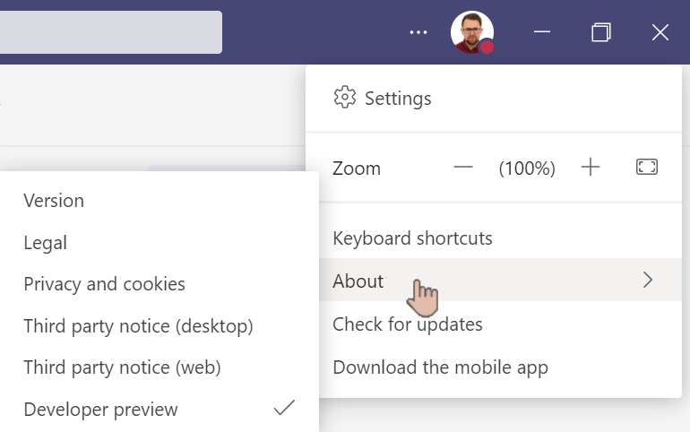

## Live Events

`Get-CsTeamsMeetingBroadcastConfiguration` has now another property: `SdnRuntimeConfiguration`. There's no corresponding parameter for `Set-` cmdlet, so it's currently not clear what values will be accepted.

Related with [SDN/eCDN for Live Events](https://docs.microsoft.com/en-us/microsoftteams/teams-live-events/set-up-for-teams-live-events#step-4-set-up-a-video-distribution-solution-for-live-events-in-teams).

## Messaging

`Get-CsTeamsMessagingPolicy` has now `AllowFullChatPermissionUserToDeleteAnyMessage`. `Set-CsTeamsMessagingPolicy` doesn't have such param yet.

Currently, only the sender can delete sent messages in direct/group chat. It's probably going to be changed as soon as that property is operational.

The question is - who is *full chat permission user*? My guess is that it'd be applied to all members of group chat, unless Microsoft is going to introduce another role for chats. I haven't found any mention of new chat role in [the roadmap for Teams](https://www.microsoft.com/en-us/microsoft-365/roadmap?filters=Microsoft%20Teams) or [UserVoice](https://microsoftteams.uservoice.com/).

For meeting chat, it'd be either everyone invited (excluding ad-hoc added participants) or only someone with either *Organizer* or *Presenter* role.

By the way, have you heard that *Organizer* role will soon be assignable? Microsoft [confirmed that via UserVoice 2 months ago](https://microsoftteams.uservoice.com/forums/555103-public/suggestions/34050022-ms-teams-meeting-delegation).

## Updates

`Get-CsTeamsUpdateManagementPolicy` has now `AllowPublicPreview`, by default set to `FollowOfficePreview`. It might mean that Microsoft is going to automatically set public preview release to everyone, who is set to [get targeted releases for Microsoft 365 Apps for Enterprise](https://searchwindowsserver.techtarget.com/answer/How-do-I-get-access-to-Office-365-preview-versions).
It might explain, why the option to use public preview disappeared from user interface today:

As for the previous ones, there's no corresponding param for `Set-CsTeamsUpdateManagementPolicy` cmdlet. You can read more about these params in [my article about CsTeamsUpdateManagementPolicy cmdlets](https://robdy.io/csteamsupdatemanagementpolicy-cmdlets/). As for now, [they're all undocumented in official repository](https://github.com/MicrosoftDocs/office-docs-powershell/issues/7186).