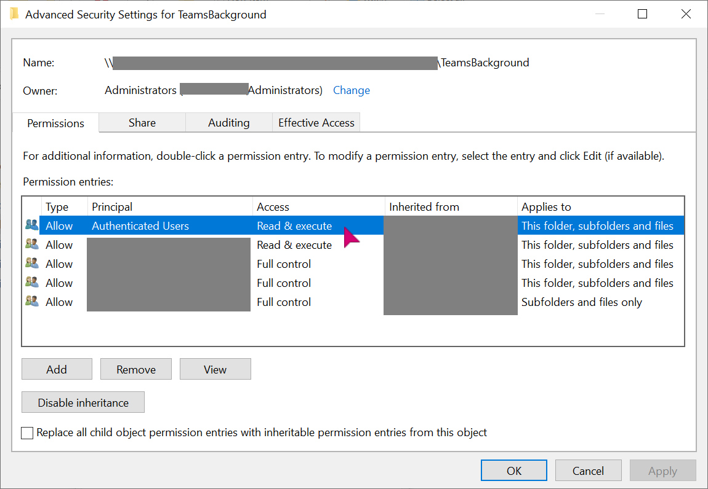
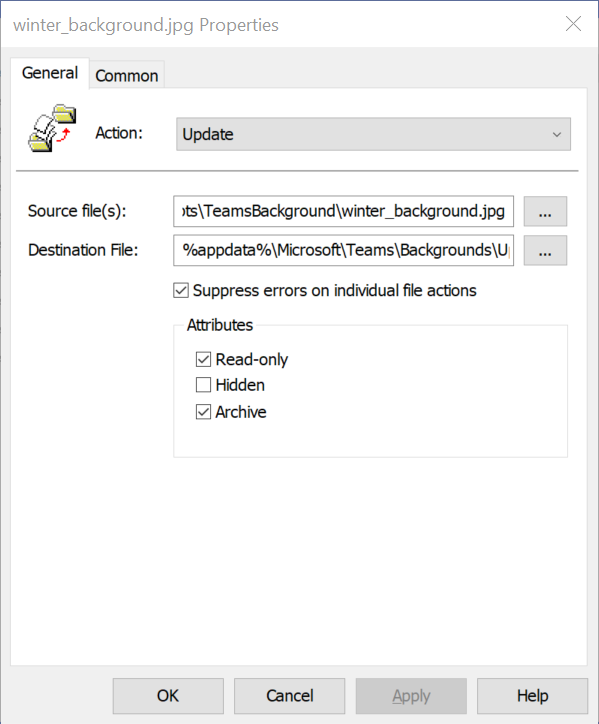
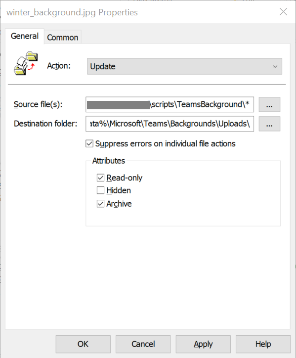

> **NOTE**: The solution described above is not 100% the same as what Microsoft will be providing, as it only applied to domain-joined Windows devices.

Microsoft recently added [Microsoft Teams: Org wide backgrounds (Preview)](https://www.microsoft.com/en-us/microsoft-365/roadmap?&searchterms=80193&filters=&searchterms=80193) as Roadmap item 80193. The description says (emphasis mine):

> Organization-wide backgrounds will now be available in preview. **This feature will require an Advanced Communications license** when it becomes generally available.

It's also published as [Message Center entry MC249777](https://admin.microsoft.com/AdminPortal/Home?ref=MessageCenter/:/messages/MC249777).

We're finally getting an option to deploy custom Teams backgrounds to the entire organization. It is very handy idea, which might help people to celebrate and increase visibility of some special events within the organization.

Ok - have we can deploy it?

## Table of Contents

```toc
exclude: [Table of Contents]
```

## Prepare the backgrounds

For any of the options described below, you need to first prepare the backgrounds. Based on Tony Redmond's article [How to Use Background Images and Blurring in Microsoft Teams Meetings](https://office365itpros.com/2020/04/06/teams-meeting-background-image/) the requirements are:

> Microsoft’s recommendations are a minimum size of 360 x 360 pixels (this will not look good) and a maximum of 2048 x 2048 pixels. BMP, JPEG, and PNG formats are allowed.

Keep in mind the size of the images - if you want to deploy multiple heavy images, it might have impact on performance/network usage. PNGs are usually good choice

## Group Policy file preference

First option is group policy! Knowing where all these custom backgrounds are uploaded in the machines, we can create a policy to put specific files in that folder.

First, create a folder on network share. Make sure that it's accessible to everyone (it should have at least *Read* permissions):



Now let's create group policy. As with all changes, **it's good to roll them out gradually**. We can use [Security Group Filters](https://docs.microsoft.com/en-us/windows/security/threat-protection/windows-firewall/assign-security-group-filters-to-the-gpo).

Our GPO will be applied to users, not to machines. We need to add our files under: *User Configuration => Preferences => Windows Settings => Files*.

We can either add files one-by-one (if we want very granular control):



Or with wildcard (credits to [Copy Files or Folders to All Computers via GPO](http://woshub.com/copy-files-on-all-computers-group-policy/)):



In both cases the action chosen can either be **Create** or **Update**. Do not use **Replace** so that it doesn't replace the files every time GPO is processed. You can read more about that behaviour at [Group Policy Preferences – Replace Existing File](https://www.adamfowlerit.com/2016/07/group-policy-preferences-replace-existing-file/).

## Startup script


## Limitations

All solutions come with certain limitations:

* no mobile devices - custom backgrounds for them [are still in development](https://www.microsoft.com/en-us/microsoft-365/roadmap?searchterms=82234)

Group policy file solution comes with certain limitations:

* Can only be applied to machines using GPO
* Requires domain controller connection
* No additional logic can be applied (for example, for cleaning up, see [below](#cleaning-up))

Startup script also have some limitations:

* Requires domain controller connectivity if applied via GPO
* Requires Intune license if applied via Intune
* 

## Cleaning up

Each time new background is added to *Uploads* folder, Teams creates thumb image. For example:

```powershell
# For background
winter_background.jpg
# we'll have 
winter_background_thumb.jpg
```
If you plan to do cleanup of legacy backgrounds, remember about these files. There are multiple ways to remove them, depending on which deployment mechanism you use. For group policy - add entries with action **Delete**. For others, add proper logic to your scripts. 

## Final thoughts

Remember, that if you put backgrounds into the folder while Teams client is running, they'll appear next time you launch it.

When cleaning up, don't forget about `_thumb` file created by Teams - they won't be needed.