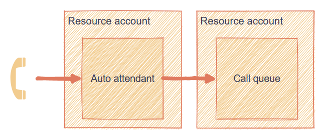
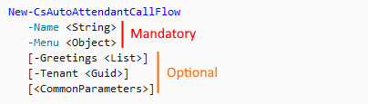

In this tutorial, you'll learn how to automate all the required steps. You'll create [an auto attendant](https://docs.microsoft.com/en-us/microsoftteams/plan-auto-attendant-call-queue#auto-attendants) and associate it with [a call queue](https://docs.microsoft.com/en-us/microsoftteams/plan-auto-attendant-call-queue#call-queues) for a full-fledged voice application.

<Tip>

This article is a part of the series about managing Teams call queues and auto attendants with PowerShell.

Part 1 - Automating Call Queue and Auto Attendant onboarding (this article)

[Part 2 - Managing Auto Attendant general settings with PowerShell](manage-auto-attendant-general/)

</Tip>

## Prerequisites

To go through the steps in this blog post, you need the following:

* Microsoft 365 environment with [Phone System](https://docs.microsoft.com/en-us/MicrosoftTeams/what-is-phone-system-in-office-365)
* Account with at least Teams Communications Administrator and User Administrator roles
* PowerShell with Teams module installed. See [installation guide](https://docs.microsoft.com/en-us/MicrosoftTeams/teams-powershell-install)

## Desired configuration

You'll create an auto attendant and configure it to redirect to the call queue.

An auto attendant in conjunction with a call queue ensures the best flexibility. It is also easy to extend. The diagram of what you're going to create would be:



For simplicity, you'll not assign the number to your application yet.

## Call Queue

Ok then, enough talking. Let's start creating. Before you start, connect to Microsoft Teams from your PowerShell:

```powershell
Connect-MicrosoftTeams
```

You can now specify variables to use later:

```powershell
# Your config
$cqName = 'RobTestQueue2'
$resourceAccountDomain = 'yourdomain.onmicrosoft.com'
```

Before working on the auto attendant, you can create a call queue. In that configuration, you'll be able to configure forward to the call queue immediately.

> I use splatting for all cmdlets below. If you want to learn more about that term, take a look at [PowerShell Splatting: What is it and How Does it Work?](https://adamtheautomator.com/powershell-splatting/).
>
> You might wonder why use splatting when you provide only one or two parameters to the cmdlet. You're right that it seems a bit unnecessary. The purpose of it here is to make the code easily expandable when you add more features.

```powershell
# Create resource account of call queue type
$cqRaParams = @{
	UserPrincipalName = "RA_CQ_$cqName@$resourceAccountDomain"
	# ID taken from cmdlet documentation
	ApplicationId = '11cd3e2e-fccb-42ad-ad00-878b93575e07'
	DisplayName = "RA_CQ_$cqName"
}
$newCqRa = New-CsOnlineApplicationInstance @cqRaParams

# Create call queue
$newCqParams = @{
	Name = "CQ_$($cqName)"
	UseDefaultMusicOnHold = $true
}
$newCq = New-CsCallQueue @newCqParams

# Associate resource account with call queue
$newCqAppInstanceParams = @{
	# Requires array of strings
	# Use array sub-expression operator
	Identities = @($newCqRa.ObjectId)
	ConfigurationId = $newCq.Identity
	ConfigurationType = 'CallQueue'
	ErrorAction = 'Stop'
}
$associationRes = New-CsOnlineApplicationInstanceAssociation @newCqAppInstanceParams
```

You finished the first part - congrats! The next one is a little bit more complicated. Fear not, though - you'll get there smoothly.

## Auto Attendant

Your call queue is up and running. Let's work on the auto attendant.

Setting a resource account is very similar to the one you created for a call queue. The only difference is the application ID you'll use:

```powershell
$newAaRaParams = @{
	UserPrincipalName = "RA_AA_$($cqName)@$resourceAccountDomain"
	# ID taken from cmdlet documentation
	ApplicationId = 'ce933385-9390-45d1-9512-c8d228074e07'
	DisplayName = "RA_AA_$($cqName)"
}
$newAaRa = New-CsOnlineApplicationInstance @newAaRaParams
```

To create auto attendant, you use [`New-CsAutoAttendant`](https://docs.microsoft.com/en-us/powershell/module/skype/new-csautoattendant?view=skype-ps). It requires 4 parameters:

* Name
* LanguageId
* TimeZoneId
* DefaultCallFlow

> For finding mandatory parameters, you'll have to check the documentation. Look for names not surrounded with square brackets `[ ... ]`. Take a look at the example:
>
> 

The first three of the parameters listed above are strings. They can be defined inline. *DefaultCallFlow* can be created using [`New-CsAutoAttendantCallFlow`](https://docs.microsoft.com/en-us/powershell/module/skype/new-csautoattendantcallflow?view=skype-ps), which takes name and menu.

The cmdlet to create the menu is [`New-CsAutoAttendantMenu`](https://docs.microsoft.com/en-us/powershell/module/skype/new-csautoattendantmenu?view=skype-ps). The only required parameter for it is *Name*.

However, to configure automatic forward to the call queue, you'll have to configure some objects:

* Callable identity using [`New-CsAutoAttendantCallableEntity`](https://docs.microsoft.com/en-us/powershell/module/skype/new-csautoattendantcallableentity?view=skype-ps)
* Menu option using [`New-CsAutoAttendantMenuOption`](https://docs.microsoft.com/en-us/powershell/module/skype/new-csautoattendantmenuoption?view=skype-ps)

So many cmdlets! Let's put them together to your script, shall we?

```powershell
# Options
$aaLanguage = 'en-GB'
$aaTimezone = 'GMT Standard Time'

# Callable entity
$callableEntityParams = @{
	# Point to resource account, not call queue
	Identity = $newCqRa.ObjectId
	Type = 'ApplicationEndpoint'
}
$targetCqEntity = New-CsAutoAttendantCallableEntity @callableEntityParams

# Menu option
$menuOptionParams = @{
	Action = 'TransferCallToTarget'
	DtmfResponse = 'Automatic'
	CallTarget = $targetCqEntity
}
$menuOptionZero = New-CsAutoAttendantMenuOption @menuOptionParams

# Finally, the menu
$menuParams = @{
	Name = "$aaName Default Menu"
	# Accepts list, so use array sub-expression operator
	MenuOptions = @($menuOptionZero)
}
$menu = New-CsAutoAttendantMenu @menuParams

# And the call flow
$defaultCallFlowParams = @{
	Name = "$aaName Default Call Flow"
	Menu = $menu
}
$defaultCallFlow = New-CsAutoAttendantCallFlow @defaultCallFlowParams

# You have all the objects
# Now, you can create an auto attendant
$autoAttendantParams = @{
	Name = "AA_$cqName"
	LanguageId = $aaLanguage
	TimeZoneId = $aaTimezone
	DefaultCallFlow = $defaultCallFlow
	ErrorAction = 'Stop'
}
$newAA = New-CsAutoAttendant @autoAttendantParams

# Last but not least, the association
$aaAssociationParams = @{
	# As the previous association, array expected
	Identities = @($newAARA.ObjectId)
	ConfigurationId = $newAA.Identity
	ConfigurationType = 'AutoAttendant'
	ErrorAction = 'Stop'
}
$associationRes = New-CsOnlineApplicationInstanceAssociation @aaAssociationParams
```

## Verification

To make sure everything went smoothly, let's verify that all the objects are created and configured.

```powershell
# Check if resource accounts exist
Get-CsOnlineApplicationInstance -Identities @($newAaRa.ObjectId, $newCqRa.ObjectId)
```

You should receive something along these lines (IDs redacted):

```powershell
RunspaceId        : 00000000-0000-0000-0000-000000000000
ObjectId          : 00000000-0000-0000-0000-000000000000
TenantId          : 00000000-0000-0000-0000-000000000000
UserPrincipalName : RA_CQ_RobTestQueue@yourdomain.onmicrosoft.com
ApplicationId     : 00000000-0000-0000-0000-000000000000
DisplayName       : RA_CQ_RobTestQueue
PhoneNumber       :

RunspaceId        : 00000000-0000-0000-0000-000000000000
ObjectId          : 00000000-0000-0000-0000-000000000000
TenantId          : 00000000-0000-0000-0000-000000000000
UserPrincipalName : RA_AA_RobTestQueue@yourdomain.onmicrosoft.com
ApplicationId     : 00000000-0000-0000-0000-000000000000
DisplayName       : RA_AA_RobTestQueue
PhoneNumber       :
```

Then check for call queue:

```powershell
Get-CsCallQueue -Identity $newCq.Identity
```

Which returns:

```powershell
WARNING:  No Distribution Lists or Users added to callqueue. There will be no agents to call.


TenantId                                       : 00000000-0000-0000-0000-000000000000
Name                                           : CQ_RobTestQueue
Identity                                       : 00000000-0000-0000-0000-000000000000
RoutingMethod                                  : Attendant
DistributionLists                              :
Users                                          :
DistributionListsLastExpanded                  :
Agents                                         :
AllowOptOut                                    : False
ConferenceMode                                 : False
PresenceBasedRouting                           : False
AgentsCapped                                   : False
AgentsInSyncWithDistributionLists              : True
AgentAlertTime                                 : 30
LanguageId                                     :
OverflowThreshold                              : 50
OverflowAction                                 : DisconnectWithBusy
OverflowActionTarget                           :
OverflowSharedVoicemailTextToSpeechPrompt      :
OverflowSharedVoicemailAudioFilePrompt         :
OverflowSharedVoicemailAudioFilePromptFileName :
EnableOverflowSharedVoicemailTranscription     : False
TimeoutThreshold                               : 1200
TimeoutAction                                  : Disconnect
TimeoutActionTarget                            :
TimeoutSharedVoicemailTextToSpeechPrompt       :
TimeoutSharedVoicemailAudioFilePrompt          :
TimeoutSharedVoicemailAudioFilePromptFileName  :
EnableTimeoutSharedVoicemailTranscription      : False
WelcomeMusicFileName                           :
UseDefaultMusicOnHold                          : True
MusicOnHoldFileName                            :
Statistics                                     : Current queue size = 0
ApplicationInstances                           : 00000000-0000-0000-0000-000000000000
```

And then for auto attendant:

```powershell
Get-CsAutoAttendant -Identity $newAA.Identity
```

Which returns:

```powershell
Identity                        : 00000000-0000-0000-0000-000000000000
TenantId                        : 00000000-0000-0000-0000-000000000000
Name                            : AA_RobTestQueue
LanguageId                      : en-GB
VoiceId                         : Female
DefaultCallFlow                 : AA_RobTestQueue Default Call Flow
Operator                        :
TimeZoneId                      : GMT Standard Time
VoiceResponseEnabled            : False
CallFlows                       :
Schedules                       :
CallHandlingAssociations        :
Status                          :
DialByNameResourceId            :
DirectoryLookupScope            :
ApplicationInstances            : {00000000-0000-0000-0000-000000000000}
GreetingsSettingAuthorizedUsers : {}
```

## Next steps

You now have a working application - take a moment to do your happy dance 🎉. Once done, you can think about adding more functionalities:

* Call queue members (so someone receives the calls)
* Telephone number so clients can call it. Remember to assign Virtual Phone System license, unless you already have [group-based licensing](https://adamtheautomator.com/group-based-licensing-office-365/) doing that for you.
* Out of hours and vacation workflows
* Greeting
* And many more

Not sure where to start? Check my next article from this series: [Part 2 - Managing Auto Attendant general settings with PowerShell](manage-auto-attendant-general/)

## Conclusion

Creating call queues and auto attendants is a time-consuming process. As usual, PowerShell might help you to save some time. Use the skeleton from this article and adapt it to your needs. Happy coding!
