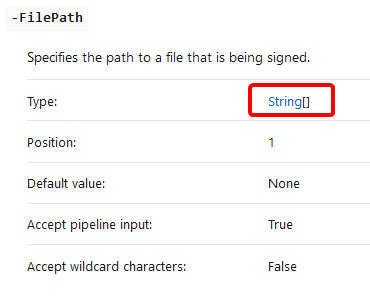

Have you ever wondered what you should do when the certificate you use for code signing is going to expire? Certainly, you don't want your code to have an invalid signature. It might cause a bad surprise when you notice all your scripts stopped working suddenly.

You've prepared and got the new certificate. Now you can go through the files one by one and sign them. But how to set the signature for all files at once? Let's create the script!

## Prerequisites

* Code signing certificate generated
* Code signing certificate trusted
* PowerShell 5.1 or higher

## Signing scripts with the new certificate

We'll be using [`Set-AuthenticodeSignature`](https://docs.microsoft.com/en-us/powershell/module/microsoft.powershell.security/set-authenticodesignature?view=powershell-7.1) cmdlet to sign the files.

1. First, we go to the folder containing the files we're going to sign:

   ```powershell
   Set-Location 'C:\scripts\src\'
   ```
2. We got all the files we'd like to sign.

    The script below uses `-Filter` to get only PowerShell script. The results are then piped to `Where-Object` to only include files with the correct signature.

    We don't want to sign all the files blindly. Most importantly, we don't want to sign scripts that have the incorrect signature to be re-signed and considered valid.

   ```powershell
   $signed = Get-ChildItem -filter *.ps1 -Recurse | 
   	Get-AuthenticodeSignature | Where-Object status -eq 'valid'
   ```
3. To sign files we need to select a certificate.

   In my case, all the code signing certificates are in **Trusted Root Certification Authorities** store. I want to get the one with the latest expiration time.

   ```powershell
   $cert = Get-ChildItem Cert:\CurrentUser\Root -CodeSigningCert |
   	Sort-Object notafter -Descending | Select-Object -First 1
   ```
4. Last, but not least - sign the files.

   ```powershell
   Set-AuthenticodeSignature -FilePath $signed.path -Certificate $cert
   ```

   Note that we're providing an array of paths for `-FilePath`. We can do that only because the `-FilePath `param accepts an array of strings, according to [the cmdlet documentation](https://docs.microsoft.com/en-us/powershell/module/microsoft.powershell.security/set-authenticodesignature?view=powershell-7.1).

   In the screenshot below (which comes from the `Set-AuthenticodeSignature` documentation) `[]` means an array of preceding objects so `String[]` means an array of String type objects:

   

## The entire script

Let's put it all together:

```powershell
# Go to the folder containing the certificates
Set-Location 'C:\scripts\src\'

# Get all the files which are properly signed
$signed = Get-ChildItem -filter *.ps1 -Recurse |
  Get-AuthenticodeSignature | Where-Object status -eq 'valid'

# Get the latest certificate
$cert = Get-ChildItem Cert:\CurrentUser\Root -CodeSigningCert |
 Sort-Object notafter -Descending | Select-Object -First 1

# Sign the files
Set-AuthenticodeSignature -FilePath $signed.path -Certificate $cert
```

## More resources

If you'd like to learn more, check the articles below from [AdamTheAutomator.com](https://adamtheautomator.com):

[New-SelfSignedCertificate: Creating Certificates with PowerShell](https://adamtheautomator.com/new-selfsignedcertificate/) - you can learn how to generate the self-signed certificate. You can use the certificate for signing your scripts. Hint: search for `CodeSigningCert`.

[How to Sign a PowerShell Script (And Run It)](https://adamtheautomator.com/how-to-sign-powershell-script/) - you will find out how to sign the scripts and then verify the signature. As a bonus, you'll learn about the timestamp server. If you use it, you won't need to sign the scripts when your certificate expires. That means you won't need my article again 🤭.
