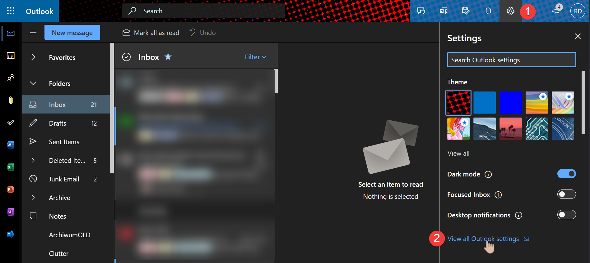

## Prerequisites

* Exchange Online (Outlook.com and Exchange Server to be checked)
* Access via [Outlook Web Access (OWA)](https://support.microsoft.com/en-us/office/how-to-sign-in-to-outlook-on-the-web-763fab4d-0138-4814-b450-37fc286bcb79)

For the purpose of this demonstration, we'll use Exchange Online mailbox.

## Emptying folders from OWA

Outlook Web Access provides an interface to remove all the emails folder by folder. The steps to use it are demonstrated below:

1. Open the web browser and go to <https://outlook.office.com/mail>.
2. Sign in using our Microsoft 365 account
3. Once we're signed in go to the **gear icon** (1) and click **View all Outlook settings** (2):

   

### Removing items from the shared mailbox

### Limitations

## Cleaning up the folder using a retention policy

## Cleaning up the folder using AutoArchive

## Cleaning up the folder using sweep rules

## Comparison