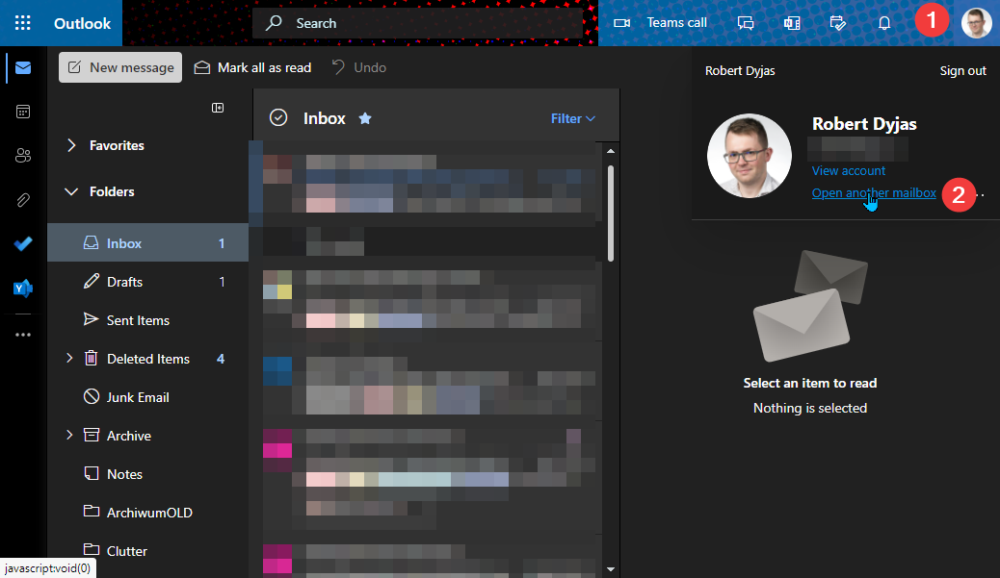

## Prerequisites

* Exchange Online (Outlook.com and Exchange Server to be checked)
* Access via [Outlook Web Access (OWA)](https://support.microsoft.com/en-us/office/how-to-sign-in-to-outlook-on-the-web-763fab4d-0138-4814-b450-37fc286bcb79)

For this demonstration, we'll use Exchange Online mailbox.

## Emptying folders from OWA

Outlook Web Access provides an interface to remove all the emails folder by folder. The steps to use it are demonstrated below:

1. Open the web browser and go to <https://outlook.office.com/mail>.
2. Sign in using our Microsoft 365 account
3. Once we're signed in go to the **gear icon** (1) and click **View all Outlook settings** (2):

   

4. In **Settings** window, choose **General** (3) and then **Storage** (4):

   <Tip>

   Direct link to storage settings is [https://outlook.office.com/mail/options/general/storage](https://outlook.office.com/mail/options/general/storage).

   </Tip>

   

5. In the right pane, find the name of the folder we'd like to clean and choose **Empty** link (5). We'll see the dropdown to choose a time range for cleanup:

   <Note>

   The list displays only the folder name. If we have multiple folders with the same name, let's be careful! We can also rename the folder before cleaning up.

   </Note>

   

6. Last, but not least - confirm:

   

7. The screenshot below shows that we submitted the cleanup request correctly. While the folder cleanup is being processed, we can repeat the process for other folders.

   

### Removing items from the shared mailbox

The method described above shows the step to empty folders in the personal mailbox. What if we want to do the same for a shared mailbox?

First of all, we need to have *Full Access* permissions over the mailbox. Then we need to open it from OWA. We need to click on our profile picture and then choose **Open another mailbox**:



In the shared mailbox tab, we need to repeat the process described in [Emptying folders from OWA](#emptying-folders-from-owa)

<Tip>

You can use a direct link to go to the storage section in a shared mailbox. The link would be:

```powershell
# Replace email@domain.com with the shared mailbox address
https://outlook.office.com/mail/email@domain.com/options/general/storage
```

</Tip>

### Limitations

## Cleaning up the folder using a retention policy

## Cleaning up the folder using AutoArchive

## Cleaning up the folder using sweep rules

## Comparison
