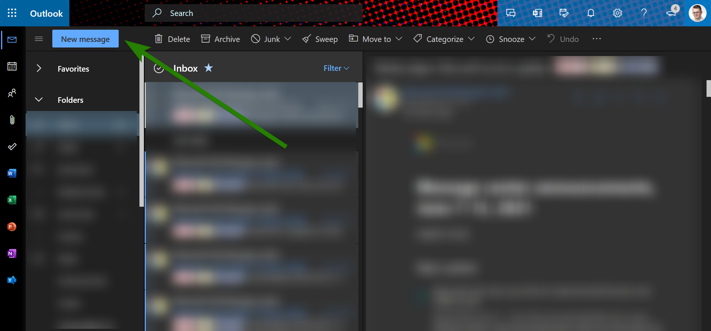
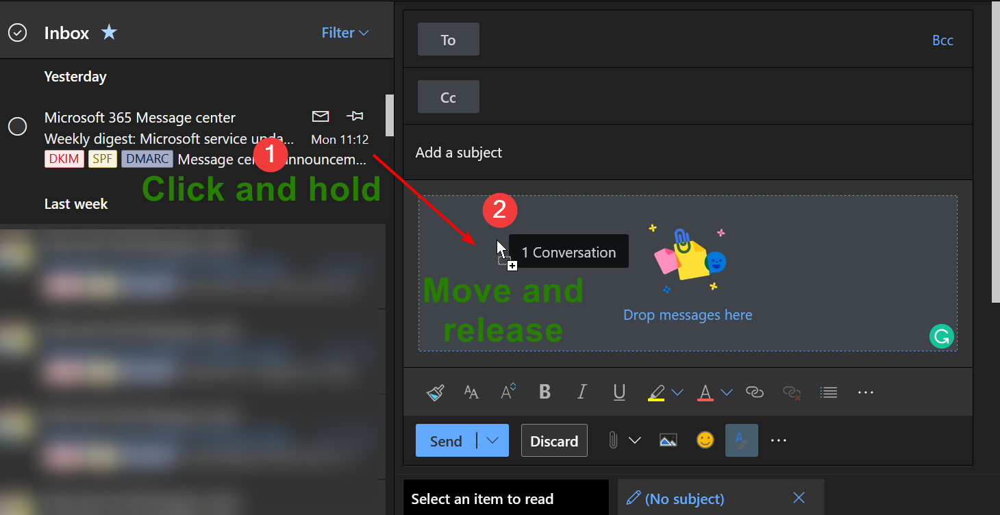
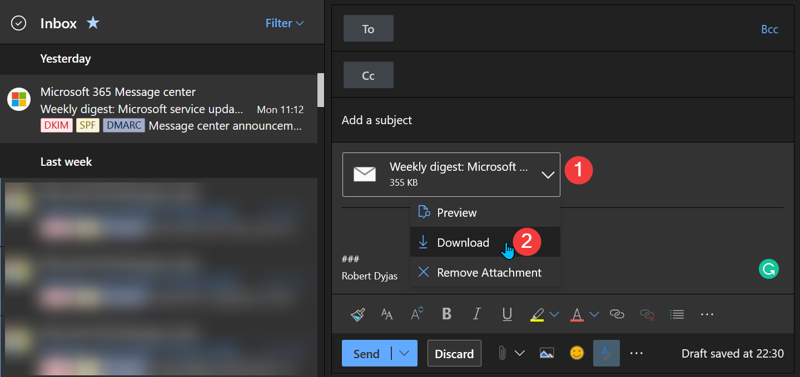
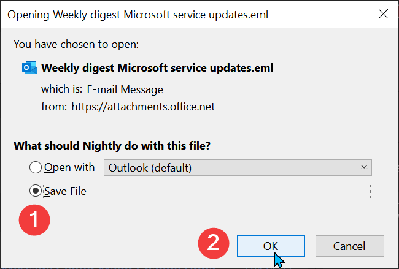

To export the message from OWA, follow the steps below:

1. In your web browser, go to [outlook.office.com/mail](https://outlook.office.com/mail/)
2. If you're not signed in, follow the instructions to log into your account
3. Once you're in your mailbox view, start composing a new message. Use the **New message** button in the top left corner:

   
4. Click the message you'd like to save. Hold the mouse key and move the cursor to the composing message window. Once you see **Drop messages here** area, release the key.

   
5. The message will be added as an attachment to the message draft. From the dropdown, choose **Download**:

   
6. Follow the browser instruction to save your file. Below, we choose **Save file** (1) and then confirm by **OK** (2):

   

## Limitations

Using Outlook Web App to save messages comes with some limitations. The most important one is that we're not able to choose the format of the message. For example, **we cannot save the email in `.msg` format**. The only format available is `.eml`.

Saving multiple messages at once is not possible out of the box. As a workaround, we can send the message to ourselves.