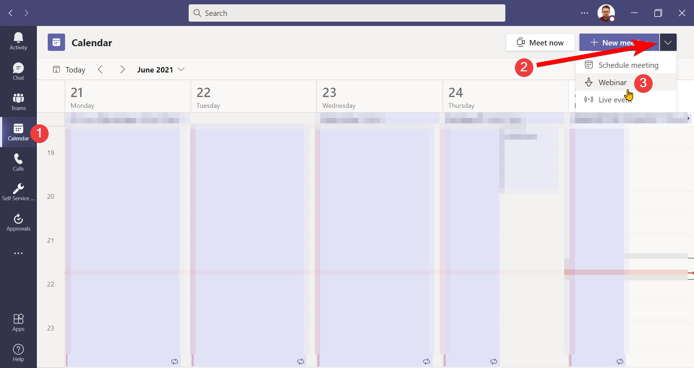

## Requirements

To go through the steps below, you'll need a few tools and the required level of access:

* PowerShell - see the [installation guide](https://docs.microsoft.com/en-us/powershell/scripting/install/installing-powershell?view=powershell-7.1) if you don't have it yet
* [Microsoft Teams module](https://docs.microsoft.com/en-us/microsoftteams/teams-powershell-install) and [SharePoint Online Management Shell](https://docs.microsoft.com/en-us/powershell/sharepoint/sharepoint-online/connect-sharepoint-online)
* An account with Global Admin or at least the roles listed below:

  * [Teams Communications Administrator or Teams Service Administrator](https://docs.microsoft.com/en-us/MicrosoftTeams/using-admin-roles)
  * [SharePoint Administrator](https://docs.microsoft.com/en-us/sharepoint/sharepoint-admin-role)

## Checking if you can schedule webinars

Before we start - let's check whether you're able to schedule webinars:

1. Sign in to Microsoft Teams. From the left menu choose **Calendar** (1).
2. In the calendar view, you have the **New meeting** button. The button is located on the top right, below your profile picture.
3. The button to schedule a new meeting might have an arrow (2) next to it. If there's no arrow, you cannot schedule webinars. If you have the arrow, click it and you should have the option to schedule a webinar (3):



There might be several reasons why the webinar option is missing in the Teams client. Let's break them down.

## Webinars are not yet rolled out

The first reason might be that the new webinar functionality is not yet available for your organization. Let's check the [Microsoft 365 Roadmap for the capabilities of the webinar](https://www.microsoft.com/en-us/microsoft-365/roadmap?filters=&searchterms=microsoft%2Cteams%3A%2Cteams%2Cwebinars%2Ccapabilities).

At the moment of writing, webinars are not available for [GCC tenants](https://docs.microsoft.com/en-us/office365/servicedescriptions/office-365-platform-service-description/office-365-us-government/office-365-us-government), as you can see in the red below. It's unclear whether we should expect it for GCC High and DoD tenants.


**Conclusion**: if you're not in US Government tenancy, webinars are already available for you.

## Teams meeting policy

Ok, we already checked that our organization should have webinars. Let's now check [Set up for webinars in Microsoft Teams](https://docs.microsoft.com/en-us/microsoftteams/set-up-webinars) article. We'd like to see if we met the prerequisites.

After checking the article we can see that we should check the following parameters in Teams meeting policy:

* AllowMeetingRegistration
* AllowPrivateMeetingScheduling

We don't need to check *WhoCanRegister* value. The option to schedule webinars should be available regardless of the value set.

To check the values set in the Teams meeting policy, we need to use PowerShell. The settings we're looking for are not visible from the Teams Admin Center. Let's check it then, shall we?

1. Connecting to Microsoft Teams

   To manage the policies we need to sign in with our administrative account. Note that *administrative* means Microsoft 365/Teams administrator. No elevated permissions to the machine are needed.

   Open PowerShell and run:

   ```powershell
   Connect-MicrosoftTeams
   ```
2. Follow the instructions to sign in with your account.

   
3. Check which Teams meeting policy is assigned to your account. To do this, run:

   ```powershell
   Get-CsOnlineUser firstname.lastname@contoso.com |
     Select-Object -ExpandProperty TeamsMeetingPolicy
   ```
4. If you get empty output, it means the account has the global policy assigned. If you get any name, save it. You'll need it in a second.
5. List the policies with their required properties. Run the following cmdlet:

   ```powershell
   Get-CsTeamsMeetingPolicy |
     Select-Object identity, AllowMeetingRegistration, AllowPrivateMeetingScheduling
   ```
6. Check for either the global policy or the one with the name you noted. If both properties have `True` your settings are correct:

   
7. If any of the properties says `False` you might need to change it using `Set-CsTeamsMeetingPolicy`: 

   ```
   # Set policy name
   # Skip tag: for custom policies
   # For global policy use empty string ''
   $policyName = 'PolicyNameGoesHere'
   Set-CsTeamsMeetingPolicy -Identity $policyName -AllowMeetingRegistration $true -AllowPrivateMeetingScheduling $true
   ```

## Microsoft Lists availability

Another prerequisite for webinars is to have [Microsoft Lists](https://www.microsoft.com/en-us/microsoft-365/microsoft-lists) turned on. Webinars' registration data is stored in personal lists on the organizer's account. Therefore, our tenant must have it turned on.

Let's check our tenant settings based on [Control settings for Microsoft Lists](https://docs.microsoft.com/en-us/sharepoint/control-lists) article:

1. Open PowerShell windows and run the cmdlet to connect to SharePoint Online Management Shell.

   Replace `contoso` with your tenant name (the one before `.onmicrosoft.com` in your default domain).
2. Follow the instructions to sign in with your account.

   

https://docs.microsoft.com/en-us/sharepoint/control-lists

## Teams Live Event policy