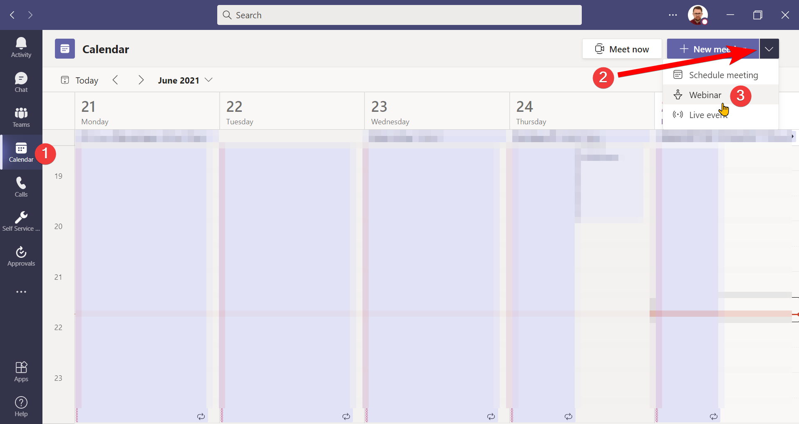
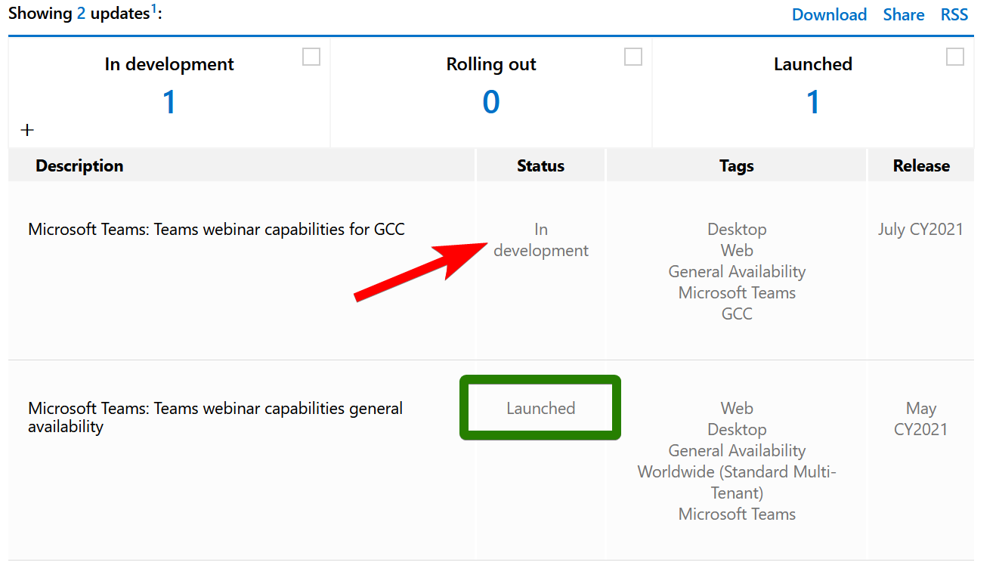
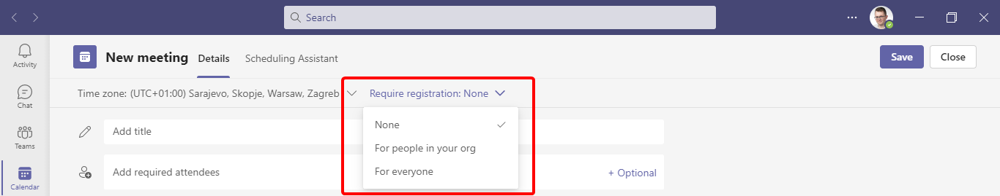
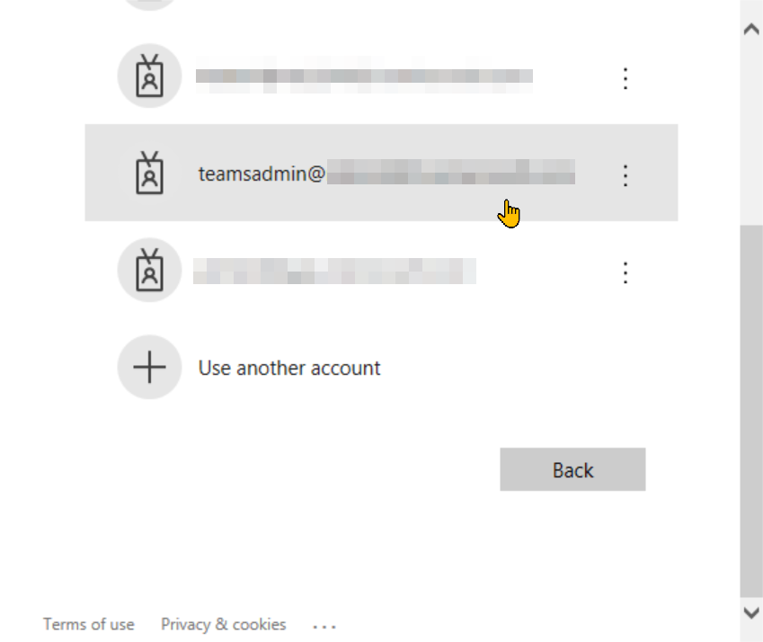
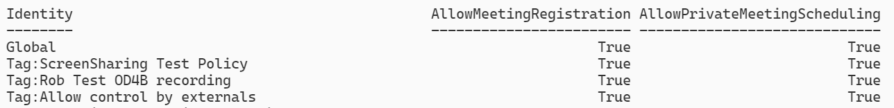

<Note>

aaa **bbb**

</Note>

<Error>

aaa **bbb**

</Error>

## Requirements

To go through the steps below, you'll need a few tools and the required level of access:

- PowerShell - see the [installation guide](https://docs.microsoft.com/en-us/powershell/scripting/install/installing-powershell?view=powershell-7.1) if you don't have it yet
- [Microsoft Teams module](https://docs.microsoft.com/en-us/microsoftteams/teams-powershell-install) and [SharePoint Online Management Shell](https://docs.microsoft.com/en-us/powershell/sharepoint/sharepoint-online/connect-sharepoint-online)
- An account with Global Admin or at least the roles listed below:

  - [Teams Communications Administrator or Teams Service Administrator](https://docs.microsoft.com/en-us/MicrosoftTeams/using-admin-roles)
  - [SharePoint Administrator](https://docs.microsoft.com/en-us/sharepoint/sharepoint-admin-role)

## Checking if you can schedule webinars

Before we start - let's check whether you're able to schedule webinars:

1. Sign in to Microsoft Teams. From the left menu choose **Calendar** (1).
2. In the calendar view, you have the **New meeting** button. The button is located on the top right, below your profile picture.
3. The button to schedule a new meeting might have an arrow (2) next to it. If there's no arrow, you cannot schedule webinars. If you have the arrow, click it and you should have the option to schedule a webinar (3):



There might be several reasons why the webinar option is missing in the Teams client. Let's break them down.

## Webinars are not yet rolled out

The first reason might be that the new webinar functionality is not yet available for your organization. Let's check the [Microsoft 365 Roadmap for the capabilities of the webinar](https://www.microsoft.com/en-us/microsoft-365/roadmap?filters=&searchterms=microsoft%2Cteams%3A%2Cteams%2Cwebinars%2Ccapabilities).

At the moment of writing, webinars are not available for [GCC tenants](https://docs.microsoft.com/en-us/office365/servicedescriptions/office-365-platform-service-description/office-365-us-government/office-365-us-government), as you can see in the red below. It's unclear whether we should expect it for GCC High and DoD tenants.



**Conclusion**: if you're not in US Government tenancy, webinars are already available for you.

## License

Based on [Introducing Webinars in Microsoft Teams](https://www.microsoft.com/en-us/microsoft-365/blog/2021/05/11/introducing-webinars-in-microsoft-teams-easy-professional-webinars-to-engage-customers/) the availability of webinars might be different based on the license you use:

> These new capabilities will be available in **Microsoft 365 E3/E5**,
> **Microsoft 365 A3/A5**, and **Microsoft 365 Government G3/G5 plans**.
>
> Microsoft 365 Business Standard and Microsoft 365 Business Premium plans will
> include all the features above for up to 300 attendees.

And the last sentence from it is also interesting

> And for the rest of 2021, we are offering a promotional period where all Teams
> users can try the features with their existing subscription.

What does it exactly mean? There's a thread on Microsoft Tech Community that has the explanation: [Teams Webinar Feature availability in Business Plans](https://techcommunity.microsoft.com/t5/microsoft-teams/teams-webinar-feature-availability-in-business-plans/m-p/2453015/highlight/true#M94705). One of the replies quotes the reply from Microsoft Support (credits to [Andrés Gorzelany](https://twitter.com/AndresGorzelany/status/1413177431192707073/photo/1) for pointing this out):

<Note>

We confirm that the webinar is included on the Business Standard and Business
Premium licenses however **it does not have the fancy button** that you will
see on the enterprise license. We acknowledge that there is a room for
improvement especially on documentation and we also apologize for any
confusion.

</Note>

So in reality, the only thing you miss is the button. You still have the registration capability.

<Note>

It's unclear whether in non-enterprise plans you still have the ability to escalate the webinar to a Live Event if it gets more than 1000 attendees.

</Note>

The options for registration should be visible on the meeting schedule window:



## Teams meeting policy

Ok, we already checked that our organization should have webinars. Let's now check [Set up for webinars in Microsoft Teams](https://docs.microsoft.com/en-us/microsoftteams/set-up-webinars) article. We'd like to see if we met the prerequisites.

After checking the article we can see that we should check the following parameters in Teams meeting policy:

- AllowMeetingRegistration
- AllowPrivateMeetingScheduling

We don't need to check _WhoCanRegister_ value. The option to schedule webinars should be available regardless of the value set.

To check the values set in the Teams meeting policy, we need to use PowerShell. The settings we're looking for are not visible from the Teams Admin Center. Let's check it then, shall we?

1. Connecting to Microsoft Teams

   To manage the policies we need to sign in with our administrative account. Note that _administrative_ means Microsoft 365/Teams administrator. No elevated permissions to the machine are needed.

   Open PowerShell and run:

   ```powershell
   Connect-MicrosoftTeams
   ```

2. Follow the instructions to sign in with your account.

   

3. Check which Teams meeting policy is assigned to your account. To do this, run:

   ```powershell
   Get-CsOnlineUser firstname.lastname@contoso.com |
     Select-Object -ExpandProperty TeamsMeetingPolicy
   ```

4. If you get empty output, it means the account has the global policy assigned. If you get any name, save it. You'll need it in a second.
5. List the policies with their required properties. Run the following cmdlet:

   ```powershell
   Get-CsTeamsMeetingPolicy |
     Select-Object identity, AllowMeetingRegistration, AllowPrivateMeetingScheduling
   ```

6. Check for either the global policy or the one with the name you noted. If both properties have `True` your settings are correct:

   

7. If any of the properties says `False` you might need to change it using `Set-CsTeamsMeetingPolicy`:

   <Note>

   **NOTE**: Be careful. If you change global policy you're changing the
   settings for the entire organization!

   </Note>

   ```
   # Set policy name
   # Skip tag: for custom policies
   # For global policy use empty string ''
   $policyName = 'PolicyNameGoesHere'
   Set-CsTeamsMeetingPolicy -Identity $policyName -AllowMeetingRegistration $true -AllowPrivateMeetingScheduling $true
   ```

## Microsoft Lists availability

Another prerequisite for webinars is to have [Microsoft Lists](https://www.microsoft.com/en-us/microsoft-365/microsoft-lists) turned on. Webinars' registration data is stored in personal lists on the organizer's account. Therefore, our tenant must have it turned on.

Let's check our tenant settings based on [Control settings for Microsoft Lists](https://docs.microsoft.com/en-us/sharepoint/control-lists) article:

1. Open PowerShell windows and run the cmdlet to connect to SharePoint Online Management Shell.

   Replace `contoso` with your tenant name (the one before `.onmicrosoft.com` in your default domain).

2. Follow the instructions to sign in with your account.

   

3. Run the following cmdlet to see if Lists are disabled:

   ```powershell
   Get-SPOTenant | Select-Object -ExpandProperty DisablePersonalListCreation
   ```

4. If the result is `False` - you're good.
5. If you don't see anything, that might mean that your SharePoint Online shell is outdated. Update it with:

   ```powershell
   Update-Module 'Microsoft.Online.SharePoint.PowerShell'
   ```

6. If the value of `DisablePersonalListCreation` is `True` - your organization has Lists disabled. If you want to enable it, you can use the cmdlet shown below.

   <Note>

   **NOTE**: Be careful, as you're changing the settings for the entire
   organization!

   </Note>

   ```powershell
   Set-SPOTenant -DisablePersonalListCreation $true
   ```

## Teams Live Event policy

Some of the requirements for webinars are undocumented. I mentioned that at the beginning of my article. Now it's time to learn more about it.

You might have heard that webinars might be escalated to Live Events. This happens when you hit 1000 participants in the call. But would you expect, that disabling Live Events would hide the button to schedule webinars?

If you're not capable to schedule Live Events, you won't see the button to schedule webinars. However, the registration capability will still be enabled from the meeting schedule window.

The behavior is similar to what happens if we're on a non-enterprise license:


Let's check if our organization has the correct Live Event settings.

1. We should already be connected to Microsoft Teams PowerShell. If not, let's reconnect by using:

   ```powershell
   Connect-MicrosoftTeams
   ```

2. Check which Teams meeting broadcast policy is assigned to your account. To do this, run:

   ```powershell
   Get-CsOnlineUser firstname.lastname@contoso.com |
     Select-Object -ExpandProperty TeamsMeetingBroadcastPolicy
   ```

3. If you get empty output, it means the account has the global policy assigned. If you get any name, save it. You'll need it in a second.
4. List the policies with their required properties. Run the following cmdlet:

   ```powershell
   Get-CsTeamsMeetingBroadcastPolicy |
     Select-Object identity, AllowBroadcastScheduling
   ```

5. Check for either the global policy or the one with the name you noted. If **AllowBroadcastScheduling** is set to `True` your settings are correct:

   

6. If **AllowBroadcastScheduling** says `False` you might need to change it using `Set-CsTeamsMeetingBroadcastPolicy`:

   <Note>

   **NOTE**: Be careful. If you change global policy you're changing the
   settings for the entire organization!

   </Note>

   ```
   # Set policy name
   # Skip tag: for custom policies
   # For global policy use empty string ''
   $policyName = 'PolicyNameGoesHere'
   Set-CsTeamsMeetingBroadcastPolicy -Identity $policyName -AllowBroadcastScheduling $true
   ```

## Conclusion

The lack of a button to schedule webinars might be caused by multiple factors. Even by checking Microsoft documentation, you might not be aware of all of the requirements.

Things are getting more complicated if you're on a non-enterprise license. The experience you receive is different from what you see in the help articles.
