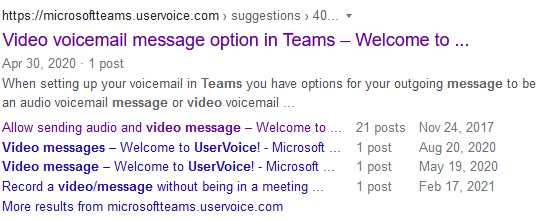

## Policies changes

### Messaging

`AllowVideoMessages` - self-explanatory, but highly unexpected. Seems like we're getting video messages in chats. Wow!

That functionality seems to have been requested many years ago, based on UserVoice entries (currently only available from Google search [due to administrative glitch](https://twitter.com/AndresGorzelany/status/1425184304699686912)):




### Meeting

`AllowTasksFromTranscript` - could that be AI-based task suggestion similar to what we have in My Analytics?

`AllowCartCaptionsScheduling` - no idea what is that one doing

`ChannelRecordingDownload` - related with [Roadmap item 82053](https://www.microsoft.com/en-us/microsoft-365/roadmap?filters=&searchterms=82053) which gives the ability to have view-only recordings. Possible values are `Allow` and `Block`. 

`CommaSeparator` - to separate... (insert your guess here) with comma. Perhaps related to the invite languages?

`MeetingInviteLanguages` - requires one or more supported languages. For now supported languages are: ar-SA,az-Latn-AZ,bg-BG,ca-ES,cs-CZ,cy-GB,da-DK,de-DE,el-GR,en-GB,es-ES,es-MX,et-EE,eu-ES,fi-FI,fil-PH,fr-CA,fr-FR,gl-ES,he-IL,hi-IN,hr-HR,hu-HU,id-ID,is-IS,it-IT,ja-JP,ka-GE,kk-KZ,ko-KR,lt-LT,lv-LV,mk-MK,ms-MY,nb-NO,nl-NL,nn-NO,pl-PL,pt-BR,pt-PT,ro-RO,ru-RU,sk-SK,sl-SL,sq-AL,sr-Latn-RS,sv-SE,th-TH,tr-TR,uk-UA,vi-VN,zh-CN,zh-TW

### Calling

`AllowCallRedirect` - seems to be related with call transfer. The supporting cmdlets are described below ([CsTeamsCallHoldPolicy cmdlets](#CsTeamsCallHoldPolicy-cmdlets) and [CsOnlineAudioFile cmdlets](#CsOnlineAudioFile-cmdlets).

### Mobility

`MobileDialerPreference` - takes a string value. Perhaps it will specify whether to use Teams or telephone calls while calling a number.

## Cmdlets added temporarily

The following cmdlets were added on the 17th of June and removed on the 16th of July:

* `Get-CsTeamsAudioConferencingPolicy`
* `Grant-CsTeamsAudioConferencingPolicy`
* `New-CsTeamsAudioConferencingPolicy`
* `Remove-CsTeamsAudioConferencingPolicy`
* `Set-CsTeamsAudioConferencingPolicy`

All 5 cmdlets were introduced in 2.4.0-preview version and removed in 2.4.1-preview.

## Removed cmdlets

* `New-CsOnlineSession` - replaced with `Connect-MicrosoftTeams`
* `Set-CsGroupPolicyAssignment`
* `Get-CsInternalModuleVersion`

## Added cmdlets

### Get-LicenseReportForChangeNotificationSubscription

The cmdlet tells whether the user is capable to export their messages via [change notification subscription](https://docs.microsoft.com/en-us/graph/teams-licenses).

### Get-MultiGeoRegion

It allows you to check where user/group data from Teams is stored.

Examples of use:

```powershell
# User
$userId = (Get-CsOnlineUser 'rob@domain.com').ObjectId
Get-MultiGeoRegion -EntityId $userId -EntityType user

# Group
$groupId = (Get-Teams -DisplayName 'teamName').GroupId
Get-MultiGeoRegion -EntityId $groupId -EntityType group
```

The cmdlet returns a single object with one property: `Region`. The property contains the region three-letter abbreviation. 

### CsTeamsCallHoldPolicy cmdlets

The cmdlets which were added are:

* `Get-CsTeamsCallHoldPolicy`
* `Grant-CsTeamsCallHoldPolicy`
* `New-CsTeamsCallHoldPolicy`
* `Remove-CsTeamsCallHoldPolicy`
* `Set-CsTeamsCallHoldPolicy`

The documentation for them is not yet available. It's already prepared and waiting to be merged under [\#7817](https://github.com/MicrosoftDocs/office-docs-powershell/pull/7817/).

The cmdlets rely on `*-CsOnlineAudioFile` cmdlets, described below.

Call hold policy allows using the custom audio file to be played during the hold. If you want to learn more about music on hold, check [Music on hold during Teams call transfer](https://erik365.blog/2021/07/02/music-on-hold-during-teams-call-transfer/amp/) from Erik's blog.

### CsOnlineAudioFile cmdlets

Cmdlets added:

* `Get-CsOnlineAudioFile`
* `Remove-CsOnlineAudioFile`

These cmdlets are to view and remove audio files. You can add audio files using [`New-CsOnlineAudioFile` cmdlet](https://docs.microsoft.com/en-us/powershell/module/skype/new-csonlineaudiofile?view=skype-ps) from Skype for Business Online module.

Audio files were previously used only in Auto Attendant/Call Queue. Now the support for music on hold for consult transfer is coming (see [Roadmap item 82957](https://www.microsoft.com/en-us/microsoft-365/roadmap?filters=&searchterms=82957)) and custom audio files will have a new way of use.

### Get-Operation

The cmdlet takes two parameters: `GroupId` and `OperationId`.  It's currently unclear what it does.

### TeamsShiftsConnection cmdlets

All cmdlets to manage Shifts connection with third-party workforce management system (WFM). That functionality is currently in private preview with very limited description available.

Cmdlets are:

* `Get-CsTeamsShiftsConnectionConnector`
* `Get-CsTeamsShiftsConnectionInstance`
* `Get-CsTeamsShiftsConnectionSyncResult`
* `Get-CsTeamsShiftsConnectionTeamMap`
* `Get-CsTeamsShiftsConnectionUser`
* `Get-CsTeamsShiftsConnectionWfmTeam`
* `New-CsTeamsShiftsConnectionInstance`
* `New-CsTeamsShiftsConnectionTeamMap`
* `Remove-CsTeamsShiftsConnectionInstance`
* `Remove-CsTeamsShiftsConnectionTeamMap`
* `Set-CsTeamsShiftsConnectionInstance`
* `Test-CsTeamsShiftsConnectionValidate`

## Cmdlet params changes

### Connect-MicrosofTeams

Changes are (newest at the bottom):

* Removed: `AccessToken`
* Added: `MsAccessToken`, `AadAccessToken`
* Added: `AccessTokens`
* Removed: `MsAccessToken`, `AadAccessToken`
* Removed: `CertificateThumbprint`, `ApplicationId`

It's obvious some changes to connection are coming and MS is experimenting to give us better ways to connect.

### Grant-CsGroupPolicyPackageAssignment

Added: `PolicyRankings`, `PolicyStringRankings`

### Move-CsInternalHelper

Added: `MajorVersion`

### New-CsCustomPolicyPackage

Added: `PolicyList`, `PolicyStringList`

## Summary

Plenty of changes introduced recently. I had a short break with documenting them. This is because of my new side-project, which provides automated and interactive way to view the changes I describe here.

Stay tuned for more updates!