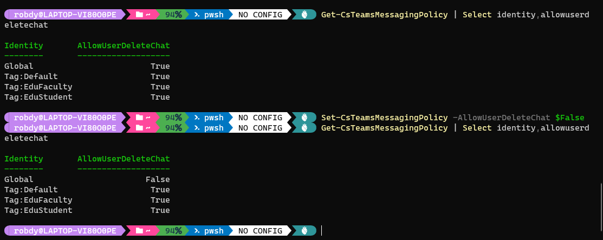
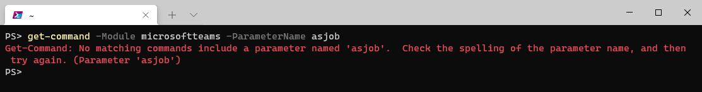

In this article you'll learn about changes introduced to Teams PowerShell module in the second half of 2021.

## Table of Contents
```toc
exclude: [Table of Contents]
```

## New cmdlets

Several cmdlets in multiple areas were introduced.

### Audio conferencing policies

Audio conferencing policy cmdlets were mentioned to be added temporarily in [recent datamining article](/teams-powershell-datamining-aug-2021/#cmdlets-added-temporarily). They are now back and they weren't removed from GA (General Availability) release `3.0.0`.

As the cmdlets are present in GA release, we could consider them released. However, no documentation is available.

Audio conferencing policy cmdlets are:

* *Get-CsTeamsAudioConferencingPolicy*
* *Grant-CsTeamsAudioConferencingPolicy*
* *New-CsTeamsAudioConferencingPolicy*
* *Remove-CsTeamsAudioConferencingPolicy*
* *Set-CsTeamsAudioConferencingPolicy*

Based on the parameters of *Set-CsTeamsAudioConferencingPolicy* we're going to get the following options to set:

* *AllowTollFreeDialin* <Object\>
* *MeetingInvitePhoneNumbers* <Object\>

Based on these parameters, we can guess what that policy could do. We'll get the option to allow/disallow toll-free numbers for specific users. We'll be able to specify numbers to be included in meeting invite. Currently, we need to do this individually on people's accounts.

### Unassigned number treatment

As the name implies, these cmdlets allow to specify how to treat unassigned numbers. The cmdlets give us ability to specify the target and pattern.

As for the audio conferencing policy, the unassigned number cmdlets are present in the GA release `3.0.0`. And similarly, no documentation is available yet.

Cmdlets related to unassigned number treatment are:

* *Get-CsTeamsUnassignedNumberTreatment*
* *New-CsTeamsUnassignedNumberTreatment*
* *Remove-CsTeamsUnassignedNumberTreatment*
* *Set-CsTeamsUnassignedNumberTreatment*

### Telephone number order

Five cmdlets related to telephone number ordering were added:

* [Clear-CsOnlineTelephoneNumberOrder](https://docs.microsoft.com/en-us/powershell/module/teams/clear-csonlinetelephonenumberorder?view=teams-ps)
* [Complete-CsOnlineTelephoneNumberOrder](https://docs.microsoft.com/en-us/powershell/module/teams/complete-csonlinetelephonenumberorder?view=teams-ps)
* [Get-CsOnlineTelephoneNumberOrder](https://docs.microsoft.com/en-us/powershell/module/teams/get-csonlinetelephonenumberorder?view=teams-ps)
* [Get-CsOnlineTelephoneNumberCountry](https://docs.microsoft.com/en-us/powershell/module/teams/get-csonlinetelephonenumbercountry?view=teams-ps)
* [Get-CsOnlineTelephoneNumberType](https://docs.microsoft.com/en-us/powershell/module/teams/get-csonlinetelephonenumbertype?view=teams-ps)

Documentation for these cmdlets is already available. In fact, it was available [one month before these cmdlets appeared in public version](https://github.com/MicrosoftDocs/office-docs-powershell/pull/8239) of the module.

### Encryption policy

[End-to-end encryption](https://www.microsoft.com/en-us/microsoft-365/roadmap?filters=&searchterms=70780) was introduced and the relevant cmdlets were all added:

* [Get-CsTeamsEnhancedEncryptionPolicy](https://docs.microsoft.com/en-us/powershell/module/teams/get-csteamsenhancedencryptionpolicy?view=teams-ps)
* [Set-CsTeamsEnhancedEncryptionPolicy](https://docs.microsoft.com/en-us/powershell/module/teams/set-csteamsenhancedencryptionpolicy?view=teams-ps)
* [New-CsTeamsEnhancedEncryptionPolicy](https://docs.microsoft.com/en-us/powershell/module/teams/new-csteamsenhancedencryptionpolicy?view=teams-ps)
* [Grant-CsTeamsEnhancedEncryptionPolicy](https://docs.microsoft.com/en-us/powershell/module/teams/grant-csteamsenhancedencryptionpolicy?view=teams-ps)
* [Remove-CsTeamsEnhancedEncryptionPolicy](https://docs.microsoft.com/en-us/powershell/module/teams/remove-csteamsenhancedencryptionpolicy?view=teams-ps)

### ACS federation configuration

For [Azure Communication Services](https://docs.microsoft.com/en-us/azure/communication-services/overview) we're getting cmdlets. They will let us limit which resources are allowed or disallowed.

The cmdlets are:

* [*Get-CsTeamsAcsFederationConfiguration*](https://docs.microsoft.com/en-us/powershell/module/teams/get-csteamsacsfederationconfiguration?view=teams-ps)
* [*Set-CsTeamsAcsFederationConfiguration*](https://docs.microsoft.com/en-us/powershell/module/teams/set-csteamsacsfederationconfiguration?view=teams-ps)

ACS federation functionality is currently in Limited Preview. However, the cmdlets' documentation is already available.

## Removed cmdlets

### Temporarily removed

Some of the cmdlets are still yet to be included in GA release. Therefore, they are being added back and forth between GA and preview:

* *Get-CsTeamsShiftsConnectionConnector*
* *Get-CsTeamsShiftsConnectionInstance*
* *Get-CsTeamsShiftsConnectionSyncResult*
* *Get-CsTeamsShiftsConnectionTeamMap*
* *Get-CsTeamsShiftsConnectionUser*
* *Get-CsTeamsShiftsConnectionWfmTeam*
* *New-CsTeamsShiftsConnectionInstance*
* *New-CsTeamsShiftsConnectionTeamMap*
* *Remove-CsTeamsShiftsConnectionInstance*
* *Remove-CsTeamsShiftsConnectionTeamMap*
* *Set-CsTeamsShiftsConnectionInstance*
* *Test-CsTeamsShiftsConnectionValidate*
* *Add-TeamChannelUser*
* *Add-TeamsAppInstallation*
* *Get-LicenseReportForChangeNotificationSubscription*
* *Get-TeamChannelUser*
* *Get-TeamsAppInstallation*
* *Get-TeamTargetingHierarchyStatus*
* *Remove-TeamChannelUser*
* *Remove-TeamsAppInstallation*
* *Remove-TeamTargetingHierarchy*
* *Set-TeamTargetingHierarchy*
* *Update-TeamsAppInstallation*

### Blocked number exception pattern

Blocked number exception pattern cmdlets [have been removed in 2.6.0 module version](https://github.com/MicrosoftDocs/office-docs-powershell/pull/8404):

* Get-CsTenantBlockedNumberExceptionPattern
* New-CsTenantBlockedNumberExceptionPattern
* Remove-CsTenantBlockedNumberExceptionPattern
* Set-CsTenantBlockedNumberExceptionPattern

### Presence policy

*Get-CsPresencePolicy* has been removed. Most likely as a part of Skype for Business Online cleanup.

## New params

Several new parameters were added.

### Calling policy

The following params were added for calling policy:

* *AllowSIPDevicesCalling* - determines whether the user is allowed to use SIP device for calling on behalf of Teams client (from [the docs](https://docs.microsoft.com/en-us/powershell/module/skype/set-csteamscallingpolicy?view=skype-ps))


* *AllowNetworkConfigurationSettingsLookup* - defaults to `false`. No mention in the docs as for now. Similar parameter exists in meeting policy (see below). It might mean that feature is coming for calls and meetings.

These parameters are available for *Get-* and *Set-/New-* cmdlets.


### Meeting policy

The following params were added for meeting policy:

* *AllowCartCaptionsScheduling* - this has been mentioned in [August edition of datamining](teams-powershell-datamining-aug-2021/). Now it's covered in [the docs](https://docs.microsoft.com/en-us/powershell/module/skype/set-csteamsmeetingpolicy?view=skype-ps) and it's clear that `CART` is Communicatons Access Real-Time Translation.

* *AllowTasksFromTranscript* - not mentioned in the docs yet.

  Any attempt to run it with PowerShell returns *You are not permitted to invoke Set-CsTeamsMeetingPolicy with the following parameters: AllowTasksFromTranscript*.

  My guess is that we're going to get some kind of intelligence to create tasks based on what was said during the meeting. It'd be similar to what Outlook Web App does based on mail content.

* *AllowAnonymousUsersToJoinMeeting* - related with [MC297030](https://m365log.com/teams/anonymous-join-policy-2/) Message Center entry

* *NewMeetingRecordingExpirationDays* - related with [auto-expiration of meeting recordings](https://www.microsoft.com/en-us/microsoft-365/roadmap?searchterms=82057&searchterms=84580&filters=Microsoft%20Teams&searchterms=84580).

  <Note>

	[Message Center entry](https://m365log.com/onedrive/teams-meeting-recordings-auto-expiration-in-onedrive-and-sharepoint/) previously mentioned *MeetingRecordingExpirationDays* but now the parameter has *New* prefix added.

	The legacy parameter was removed in October (with `2.6.0` and `2.6.2` versions).

	</Note>

* *AllowNetworkConfigurationSettingsLookup* - defaults to `false`. No mention in the docs as for now. Similar parameter exists in calling policy (described above). It might mean that feature is coming for calls and meetings.

These parameters are available for *Get-* and *Set-/New-* cmdlets.

### App setup policy

App setup policy cmdlets got new parameter: *PinnedMessageBarApps*.

Guess - we're going to set which apps are pinned in message bar. Sounds more like composing window than the chat top bar.

### External access policy

*EnableTeamsConsumerInbound* has been added to *New-CsExternalAccessPolicy* and *Set-CsExternalAccessPolicy* cmdlets. It's also being returned by *Get-CsExternalAccessPolicy*.

### Federation configuration

Similarly to external access policy (which is by-user), federation configuration is also updated with Teams consumer-related parameter - *AllowTeamsConsumerInbound*.

Relevant cmdlets are *Set-CsTenantFederationConfiguration* and *Get-CsTenantFederationConfiguration*.

<Note>

*AllowTeamsConsumer* parameter was already available when I started watching the changes.

</Note>

Notice the difference - while for policies the parameters start with *Enable*, in configuration they start with *Allow*.

### Call park policy

Call park policy cmdlets got new parameters:

* *ParkTimeoutSeconds*
* *PickupRangeStart*
* *PickupRangeEnd*

Previously, we were able only to specify whether we allow call park for users. Now we can specify timeout and the range of numbers used in parking.

### Online application instance

*Get-CsOnlineApplicationInstance* got the parameter *Identities*. It currently has both *Identity* and *Identities* as parameters.

### Messaging policy

One new parameter introduced: *AllowUserDeleteChat*. The default value of this parameter is *true*.

Upon checking on my test tenancies, I don't see any option to delete chats entirely. There's also no mention about that in [the Roadmap](https://www.microsoft.com/en-us/microsoft-365/roadmap?filters=Microsoft%20Teams&searchterms=chat).

There's no documentation about that feature yet.

What is interesting, you can already set the value of that parameter in policies and there's no error returned:



### Guest messaging configuration

*AllowUserDeleteChat* has been introduced to *Set-CsTeamsGuestMessagingConfiguration* cmdlet, too. It's default value is also *true*.

Using that cmdlet we could configure the ability to delete chats (if my guess is correct) for all guests.

### Emergency calling policy

*EnhancedEmergencyServiceDisclaimer* has been added to an emergency calling policy cmdlets.

There's no mention of that parameter in [the docs of *Set-CsTeamsEmergencyCallingPolicy*](https://docs.microsoft.com/en-us/powershell/module/skype/set-csenhancedemergencyservicedisclaimer?view=skype-ps). However, similar cmdlet [Set-CsEnhancedEmergencyServiceDisclaimer*](https://docs.microsoft.com/en-us/powershell/module/skype/set-csenhancedemergencyservicedisclaimer?view=skype-ps) exists for Skype for Business.

The purpose of E911 disclaimer is to provide a message that will be played whenever someone calls emergency services from Teams. We could warn users about the consequences of using outdated emergency location.

Based on the roadmap we can guess that it's related with [Dynamic Emergency Calling for Work From Home]https://www.microsoft.com/en-us/microsoft-365/roadmap?filters=&searchterms=82956). There are [similar entries for VDI](https://www.microsoft.com/en-us/microsoft-365/roadmap?filters=&searchterms=dynamic%2Cemergency%2Ccalling), too.

### Enhanced encryption policy

Enhanced encryption policy is responsible for [end-to-end encryption (E2EE)](https://techcommunity.microsoft.com/t5/microsoft-teams-blog/use-end-to-end-encryption-for-one-to-one-microsoft-teams-calls/ba-p/2867066) - now [in General Availability](https://techcommunity.microsoft.com/t5/microsoft-teams-blog/end-to-end-encryption-for-one-to-one-microsoft-teams-calls-now/ba-p/3037697).

## Removed params

### AllowCallRedirect

*AllowCallRedirect* has been temporarily removed from *Set-CsTeamsCallingPolicy*. It's been added after few days. Interestingly, this param has no mention [in the docs for *Set-CsTeamsCallingPolicy*](https://docs.microsoft.com/en-us/powershell/module/skype/set-csteamscallingpolicy?view=skype-ps).

### Refactored cmdlets

In September, there was a mass removal of some of the parameters, which might indicate code cleanup. The parameters removed are:

* Tenant
* DomainController
* AsJob
* Credential
* RunspaceId
* PSComputerName
* PSShowComputerName

Now, these parameters are not available anymore. The only remaining parameter is *Credential*, which is used for *Connect-MicrosoftTeams*

Short script to check if any of the params exists:

```powershell
"Tenant", "DomainController", "AsJob", "Credential", "RunspaceId", "PSComputerName", "PSShowComputerName" | ForEach-Object {
	$PSItem
	Get-Command -Module microsoftteams -ParameterName $PSItem -ErrorAction SilentlyContinue
}
``` 

If you omit `-ErrorAction SilentlyContinue` you should receive the error message:

```powershell
No matching commands include a parameter named 'PSShowComputerName'.  Check the spelling of the parameter name, and then try again.
```

As in the screenshot below:


