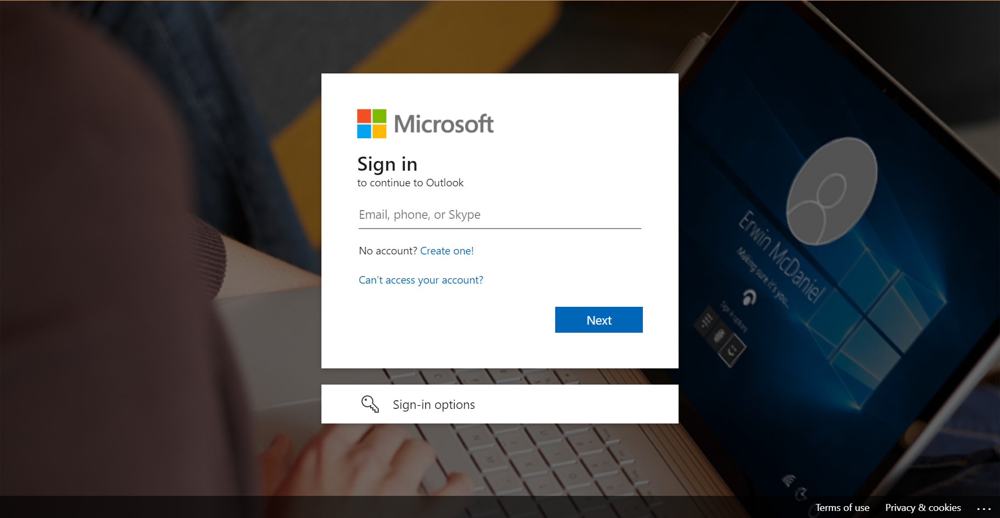
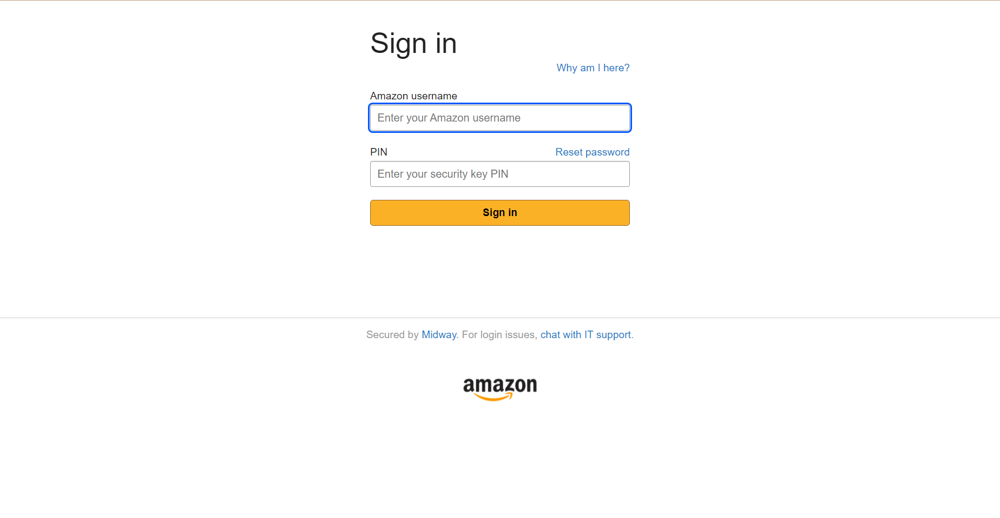

If you use Outlook Web App, you probably know the steps to sign in to your account.

To sign in to your account, you need to go to the [outlook.office365.com](https://outlook.office365.com/owa/), enter your email address, get redirected to specific sign-in page and then enter your credentials.

The entire process takes several seconds, but what if we had an option to simplify it? For example, how to skip first steps and get redirected strictly to company sign-in page.

## Sign-in link for specific domain

The link for specific domain needs [query string](https://en.wikipedia.org/wiki/Query_string) specifying the domain. For example, for `microsoft.com` domain it would be: 

```
https://outlook.office365.com/owa/?realm=microsoft.com
```

## Simplified process

Once you use the link, you'll either get branded sign-in page (use [link for microsoft.com](https://outlook.office365.com/owa/?realm=microsoft.com) as an example) or will be redirected to AD FS website, if the domain is federated (use link for [amazon.com](https://outlook.office365.com/owa/?realm=amazon.com) as an example)

See the images below for comparison.

For microsoft.com you get:



And for Amazon you get:



## Limitations

There are some specific cases you'd need to consider for using the company-specific link:

* The link doesn't work if you're already signed-in
* You don't get any benefit is the domain is managed (not federated) and the sign-in page is not branded