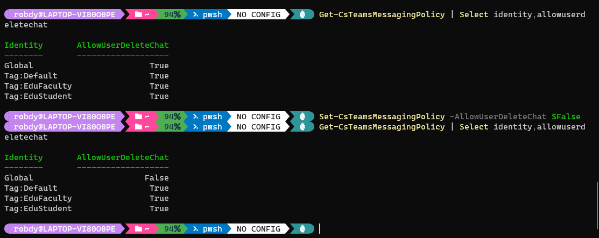

In this article, you'll learn about changes introduced to the Teams PowerShell module in the second half of 2021.

<!-- omit in toc -->
## Table of Contents
- [New cmdlets](#new-cmdlets)
	- [Audio conferencing policies](#audio-conferencing-policies)
	- [Unassigned number treatment](#unassigned-number-treatment)
	- [Telephone number order](#telephone-number-order)
	- [Encryption policy](#encryption-policy)
	- [ACS federation configuration](#acs-federation-configuration)
- [Removed cmdlets](#removed-cmdlets)
	- [Temporarily removed](#temporarily-removed)
	- [Blocked number exception pattern](#blocked-number-exception-pattern)
	- [Presence policy](#presence-policy)
- [New params](#new-params)
	- [Calling policy](#calling-policy)
	- [Meeting policy](#meeting-policy)
	- [App setup policy](#app-setup-policy)
	- [External access policy](#external-access-policy)
	- [Federation configuration](#federation-configuration)
	- [Call park policy](#call-park-policy)
	- [Online application instance](#online-application-instance)
	- [Messaging policy](#messaging-policy)
	- [Guest messaging configuration](#guest-messaging-configuration)
	- [Emergency calling policy](#emergency-calling-policy)
	- [Enhanced encryption policy](#enhanced-encryption-policy)
- [Removed params](#removed-params)
	- [AllowCallRedirect](#allowcallredirect)
	- [Refactored cmdlets](#refactored-cmdlets)
- [Conclusion](#conclusion)

## New cmdlets

Microsoft introduced several cmdlets in many areas.

### Audio conferencing policies

Audio conferencing policy cmdlets were mentioned in [recent datamining article](/teams-powershell-datamining-aug-2021/#cmdlets-added-temporarily). At that point, they showed up and disappeared. They are now back and they weren't removed from General Availability (GA) release `3.0.0`.

As the cmdlets are present in the GA release, we could consider them production-ready. Yet, no documentation is available.

Audio conferencing policy cmdlets are:

* *Get-CsTeamsAudioConferencingPolicy*
* *Grant-CsTeamsAudioConferencingPolicy*
* *New-CsTeamsAudioConferencingPolicy*
* *Remove-CsTeamsAudioConferencingPolicy*
* *Set-CsTeamsAudioConferencingPolicy*

I've checked the parameters of *Set-CsTeamsAudioConferencingPolicy*. Turns out we're going to get the following options:

* *AllowTollFreeDialin* <Object\>
* *MeetingInvitePhoneNumbers* <Object\>

Based on these parameters' names, we can guess what that policy could do.

We'll get the option to allow/disallow toll-free numbers for specific users. We'll be able to specify numbers to be included in the meeting invite. Currently, we need to do this individually on people's accounts.

### Unassigned number treatment

As the name implies, these cmdlets allow specifying how to treat unassigned numbers. The cmdlets give us the ability to specify the target and pattern.

As for the audio conferencing policy, the unassigned number cmdlets are present in the GA release `3.0.0`. The documentation is already available.

Cmdlets related to unassigned number treatment are:

* [Get-CsTeamsUnassignedNumberTreatment](https://docs.microsoft.com/en-us/powershell/module/teams/get-csteamsunassignednumbertreatment?view=teams-ps)
* [New-CsTeamsUnassignedNumberTreatment](https://docs.microsoft.com/en-us/powershell/module/teams/new-csteamsunassignednumbertreatment?view=teams-ps)
* [Remove-CsTeamsUnassignedNumberTreatment](https://docs.microsoft.com/en-us/powershell/module/teams/remove-csteamsunassignednumbertreatment?view=teams-ps)
* [Set-CsTeamsUnassignedNumberTreatment](https://docs.microsoft.com/en-us/powershell/module/teams/set-csteamsunassignednumbertreatment?view=teams-ps)

### Telephone number order

Microsoft added five cmdlets related to telephone number ordering:

* [Clear-CsOnlineTelephoneNumberOrder](https://docs.microsoft.com/en-us/powershell/module/teams/clear-csonlinetelephonenumberorder?view=teams-ps)
* [Complete-CsOnlineTelephoneNumberOrder](https://docs.microsoft.com/en-us/powershell/module/teams/complete-csonlinetelephonenumberorder?view=teams-ps)
* [Get-CsOnlineTelephoneNumberOrder](https://docs.microsoft.com/en-us/powershell/module/teams/get-csonlinetelephonenumberorder?view=teams-ps)
* [Get-CsOnlineTelephoneNumberCountry](https://docs.microsoft.com/en-us/powershell/module/teams/get-csonlinetelephonenumbercountry?view=teams-ps)
* [Get-CsOnlineTelephoneNumberType](https://docs.microsoft.com/en-us/powershell/module/teams/get-csonlinetelephonenumbertype?view=teams-ps)

Documentation for these cmdlets is already available. It was available [one month before these cmdlets appeared in public version](https://github.com/MicrosoftDocs/office-docs-powershell/pull/8239) of the module.

### Encryption policy

[End-to-end encryption](https://www.microsoft.com/en-us/microsoft-365/roadmap?filters=&searchterms=70780) was introduced and the relevant cmdlets were all added:

* [Get-CsTeamsEnhancedEncryptionPolicy](https://docs.microsoft.com/en-us/powershell/module/teams/get-csteamsenhancedencryptionpolicy?view=teams-ps)
* [Set-CsTeamsEnhancedEncryptionPolicy](https://docs.microsoft.com/en-us/powershell/module/teams/set-csteamsenhancedencryptionpolicy?view=teams-ps)
* [New-CsTeamsEnhancedEncryptionPolicy](https://docs.microsoft.com/en-us/powershell/module/teams/new-csteamsenhancedencryptionpolicy?view=teams-ps)
* [Grant-CsTeamsEnhancedEncryptionPolicy](https://docs.microsoft.com/en-us/powershell/module/teams/grant-csteamsenhancedencryptionpolicy?view=teams-ps)
* [Remove-CsTeamsEnhancedEncryptionPolicy](https://docs.microsoft.com/en-us/powershell/module/teams/remove-csteamsenhancedencryptionpolicy?view=teams-ps)

### ACS federation configuration

For [Azure Communication Services](https://docs.microsoft.com/en-us/azure/communication-services/overview) we're getting cmdlets to manage tenant-wide settings. They will let us limit which resources are allowed or disallowed.

The cmdlets are:

* [Get-CsTeamsAcsFederationConfiguration](https://docs.microsoft.com/en-us/powershell/module/teams/get-csteamsacsfederationconfiguration?view=teams-ps)
* [Set-CsTeamsAcsFederationConfiguration](https://docs.microsoft.com/en-us/powershell/module/teams/set-csteamsacsfederationconfiguration?view=teams-ps)

ACS federation functionality is currently in Limited Preview. But, the cmdlets' documentation is already available.

## Removed cmdlets

Certainly, we're getting more cmdlets added than removed. But, it's worth having a look at the ones which are no longer available.

### Temporarily removed

Some of the cmdlets are still yet to be included in GA release. Therefore, Microsft adds them back and forth between GA and preview:

* *Get-CsTeamsShiftsConnectionConnector*
* *Get-CsTeamsShiftsConnectionInstance*
* *Get-CsTeamsShiftsConnectionSyncResult*
* *Get-CsTeamsShiftsConnectionTeamMap*
* *Get-CsTeamsShiftsConnectionUser*
* *Get-CsTeamsShiftsConnectionWfmTeam*
* *New-CsTeamsShiftsConnectionInstance*
* *New-CsTeamsShiftsConnectionTeamMap*
* *Remove-CsTeamsShiftsConnectionInstance*
* *Remove-CsTeamsShiftsConnectionTeamMap*
* *Set-CsTeamsShiftsConnectionInstance*
* *Test-CsTeamsShiftsConnectionValidate*
* *Add-TeamChannelUser*
* *Add-TeamsAppInstallation*
* *Get-LicenseReportForChangeNotificationSubscription*
* *Get-TeamChannelUser*
* *Get-TeamsAppInstallation*
* *Get-TeamTargetingHierarchyStatus*
* *Remove-TeamChannelUser*
* *Remove-TeamsAppInstallation*
* *Remove-TeamTargetingHierarchy*
* *Set-TeamTargetingHierarchy*
* *Update-TeamsAppInstallation*

### Blocked number exception pattern

Blocked number exception pattern cmdlets [have been removed in 2.6.0 module version](https://github.com/MicrosoftDocs/office-docs-powershell/pull/8404):

* *Get-CsTenantBlockedNumberExceptionPattern*
* *New-CsTenantBlockedNumberExceptionPattern*
* *Remove-CsTenantBlockedNumberExceptionPattern*
* *Set-CsTenantBlockedNumberExceptionPattern*

### Presence policy

*Get-CsPresencePolicy* has been removed. Most likely as a part of Skype for Business Online cleanup.

## New params

Several new parameters were added. You might already know some of them. I mean especially these related to already-released features.

Fear not, though! If you keep reading, you'll certainly find something you don't know yet!

### Calling policy

The following params were added for the calling policy:

* *AllowSIPDevicesCalling* - determines whether SIP device can be used for calling on behalf of Teams client (from [the docs](https://docs.microsoft.com/en-us/powershell/module/skype/set-csteamscallingpolicy?view=skype-ps))


* *AllowNetworkConfigurationSettingsLookup* - defaults to `false`. No mention in the docs as of now. A similar parameter exists in meeting policy (see below). It might mean that feature is coming for calls and meetings.

These parameters are available for *Get-* and *Set-/New-* cmdlets.


### Meeting policy

The following params were added for meeting policy:

* *AllowCartCaptionsScheduling* - this has been mentioned in [August edition of datamining](teams-powershell-datamining-aug-2021/). Now it's covered in [the docs](https://docs.microsoft.com/en-us/powershell/module/skype/set-csteamsmeetingpolicy?view=skype-ps). `CART` stands for *Communications Access Real-Time Translation*.

* *AllowTasksFromTranscript* - not mentioned in the docs yet.

  Any attempt to run it with PowerShell returns the following error:
	
	```powershell
	You are not permitted to invoke Set-CsTeamsMeetingPolicy with the following parameters: AllowTasksFromTranscript.
	```
  I guess that we're going to get some kind of intelligence to create tasks based on what was said during the meeting. It'd be like what Outlook Web App does based on mail content.

* *AllowAnonymousUsersToJoinMeeting* - related with [MC297030](https://m365log.com/teams/anonymous-join-policy-2/) Message Center entry

* *NewMeetingRecordingExpirationDays* - related with [auto-expiration of meeting recordings](https://www.microsoft.com/en-us/microsoft-365/roadmap?searchterms=82057&searchterms=84580&filters=Microsoft%20Teams&searchterms=84580).

  <Note>

	[Message Center entry](https://m365log.com/onedrive/teams-meeting-recordings-auto-expiration-in-onedrive-and-sharepoint/) earlier mentioned *MeetingRecordingExpirationDays*. Now the parameter has *New* prefix added.

	The legacy parameter was removed in October (with `2.6.0` and `2.6.2` versions).

	</Note>

* *AllowNetworkConfigurationSettingsLookup* - defaults to `false`.

	No mention in the docs as of now. A similar parameter exists in the calling policy (described above). It might mean that feature is coming for calls and meetings.

These parameters are available for *Get-* and *Set-/New-* cmdlets.

### App setup policy

App setup policy cmdlets got new parameter: *PinnedMessageBarApps*.

Guess - we're going to set which apps are pinned in the message bar. Sounds more like composing window than the chat top bar.


<Tip>

My prediction was correct, Microsoft announced that *Admins can pin message extensions* in the [What’s New in Microsoft Teams | April 2022](https://techcommunity.microsoft.com/t5/microsoft-teams-blog/what-s-new-in-microsoft-teams-april-2022/ba-p/3297881) article.

</Tip>

### External access policy

*EnableTeamsConsumerInbound* has been added to *New-CsExternalAccessPolicy* and *Set-CsExternalAccessPolicy* cmdlets. It's also being returned by *Get-CsExternalAccessPolicy*.

### Federation configuration

The external access policy described above works by-user. The federation configuration represents tenant-wide settings. This configuration is also updated with Teams consumer-related parameter - *AllowTeamsConsumerInbound*.

Relevant cmdlets are *Set-CsTenantFederationConfiguration* and *Get-CsTenantFederationConfiguration*.

<Note>

*AllowTeamsConsumer* parameter was already available when I started watching the changes.

</Note>


<Warning>

Notice the difference - while for policies the parameters start with *Enable*, in the configuration they start with *Allow*.

</Warning>

### Call park policy

Call park policy cmdlets got new parameters:

* *ParkTimeoutSeconds*
* *PickupRangeStart*
* *PickupRangeEnd*

Before, we were able only to specify whether we allow call park functionality for users. Now we can specify timeout and the range of numbers used in parking.

### Online application instance

*Get-CsOnlineApplicationInstance* got the parameter *Identities*. It currently has both *Identity* and *Identities* as parameters.

### Messaging policy

One new parameter introduced: *AllowUserDeleteChat*. The default value of this parameter is `true`.

Upon checking on my test tenancies, I don't see any option to delete chats entirely. There's also no mention of that in [the Roadmap](https://www.microsoft.com/en-us/microsoft-365/roadmap?filters=Microsoft%20Teams&searchterms=chat).

There's no documentation about that feature yet.

You can already set the value of that parameter in policies and there's no error returned. This is an interesting behaviour:



### Guest messaging configuration

*AllowUserDeleteChat* has been introduced to *Set-CsTeamsGuestMessagingConfiguration* cmdlet, too. It's default value is also `true`.

Using that cmdlet we could configure the ability to delete chats (if my guess is correct) for all guests.

### Emergency calling policy

*EnhancedEmergencyServiceDisclaimer* has been added to an emergency calling policy cmdlets.

There's no mention of that parameter in [the docs of *Set-CsTeamsEmergencyCallingPolicy*](https://docs.microsoft.com/en-us/powershell/module/skype/set-csenhancedemergencyservicedisclaimer?view=skype-ps). However, similar cmdlet [Set-CsEnhancedEmergencyServiceDisclaimer](https://docs.microsoft.com/en-us/powershell/module/skype/set-csenhancedemergencyservicedisclaimer?view=skype-ps) exists for Skype for Business.

The purpose of the E911 disclaimer is to provide a message that will be played whenever someone calls emergency services from Teams. We could warn users about the consequences of using outdated emergency location.

Based on the roadmap we can guess that it's related to [Dynamic Emergency Calling for Work From Home](https://www.microsoft.com/en-us/microsoft-365/roadmap?filters=&searchterms=82956). There are [similar entries for VDI](https://www.microsoft.com/en-us/microsoft-365/roadmap?filters=&searchterms=dynamic%2Cemergency%2Ccalling), too.

### Enhanced encryption policy

Enhanced encryption policy handles [end-to-end encryption (E2EE)](https://techcommunity.microsoft.com/t5/microsoft-teams-blog/use-end-to-end-encryption-for-one-to-one-microsoft-teams-calls/ba-p/2867066) - now [in General Availability](https://techcommunity.microsoft.com/t5/microsoft-teams-blog/end-to-end-encryption-for-one-to-one-microsoft-teams-calls-now/ba-p/3037697).

## Removed params

### AllowCallRedirect

*AllowCallRedirect* has been temporarily removed from *Set-CsTeamsCallingPolicy*. It's been added after a few days. Interestingly, this param has no mention [in the docs for *Set-CsTeamsCallingPolicy*](https://docs.microsoft.com/en-us/powershell/module/skype/set-csteamscallingpolicy?view=skype-ps).

### Refactored cmdlets

In September, Microsoft removed  some of the parameters from all cmdlets. Such removal might mean code cleanup. The parameters removed are:

* *Tenant*
* *DomainController*
* *AsJob*
* *Credential*
* *RunspaceId*
* *PSComputerName*
* *PSShowComputerName*

Now, these parameters are not available anymore. The only remaining parameter is *Credential*, which is used for *Connect-MicrosoftTeams*

Short script to check if any of the params exist:

```powershell
"Tenant", "DomainController", "AsJob", "Credential", "RunspaceId", "PSComputerName", "PSShowComputerName" | ForEach-Object {
	$PSItem
	Get-Command -Module microsoftteams -ParameterName $PSItem -ErrorAction SilentlyContinue
}
``` 

If you omit `-ErrorAction SilentlyContinue` you should receive the error message:

```powershell
No matching commands include a parameter named 'PSShowComputerName'.  Check the spelling of the parameter name, and then try again.
```

As in the screenshot below:


## Conclusion

Watching Teams PowerShell module changes gives us a lot of insight. We can learnwhat's coming to Teams, even when before an official announcement.

The  list of added cmdlets and parameters is long. It shows that Microsoft works on improving Teams service. M365 Roadmap describes the majority of them already. There's a list of the ones still missing anywhere. Turns out the latter can be interesting, too.
