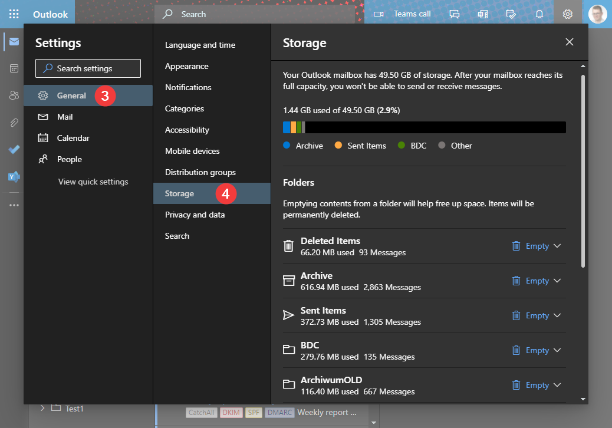
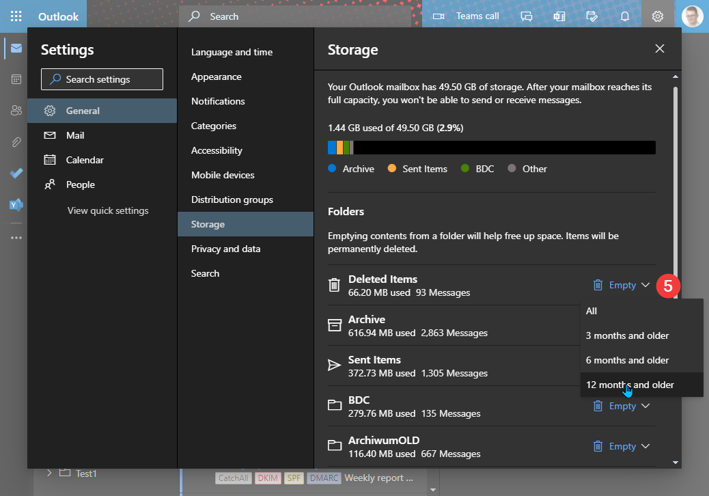
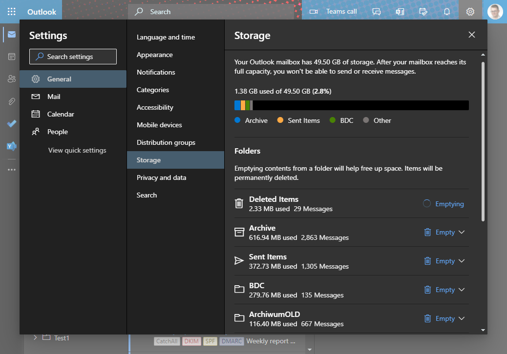
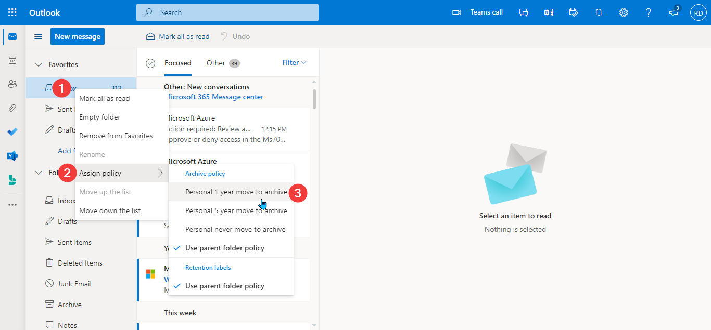
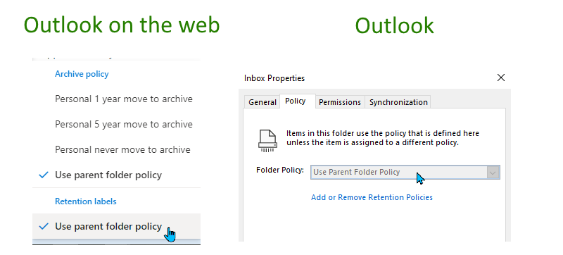
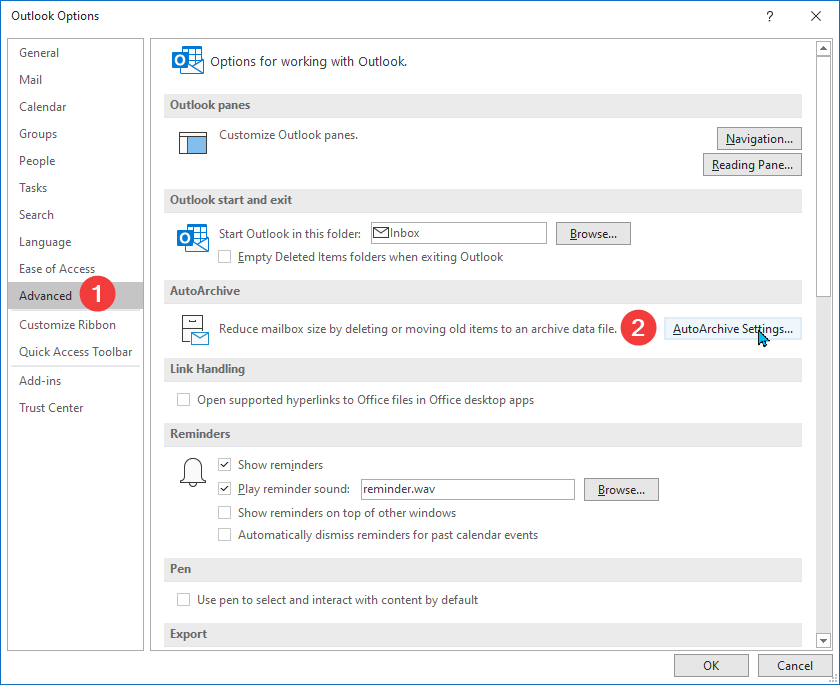

## Prerequisites

* Exchange Online (Outlook.com and Exchange Server to be checked)
* Access via [Outlook Web Access (OWA)](https://support.microsoft.com/en-us/office/how-to-sign-in-to-outlook-on-the-web-763fab4d-0138-4814-b450-37fc286bcb79)
* Mailbox archive enabled -  follow [Enable archive mailboxes in the compliance center](https://docs.microsoft.com/en-us/microsoft-365/compliance/enable-archive-mailboxes?view=o365-worldwide) if you don't have it

   <Note>

   The archive is not required, if we plan to delete emails. It's necessary if we want to move emails to the archive.

   </Note>

   <Warning>

   Enabling archive with default settings will move all emails (and other items) **older than 2 years** to archive. Keep that in mind. 

   </Warning>

For this demonstration, we'll use Exchange Online mailbox.

## Emptying folders from OWA

Outlook Web Access provides an interface to remove all the emails folder by folder. The steps to use it are demonstrated below:

1. Open the web browser and go to <https://outlook.office.com/mail>.
2. Sign in using our Microsoft 365 account
3. Once we're signed in go to the **gear icon** (1) and click **View all Outlook settings** (2):

   

4. In **Settings** window, choose **General** (3) and then **Storage** (4):

   <Tip>

   Direct link to storage settings is [https://outlook.office.com/mail/options/general/storage](https://outlook.office.com/mail/options/general/storage).

   </Tip>

   

5. In the right pane, find the name of the folder we'd like to clean and choose **Empty** link (5). We'll see the dropdown to choose a time range for cleanup:

   <Note>

   The list displays only the folder name. If we have multiple folders with the same name, let's be careful! We can also rename the folder before cleaning up.

   </Note>

   

6. Last, but not least - confirm:

   

7. The screenshot below shows that we submitted the cleanup request correctly. While the folder cleanup is being processed, we can repeat the process for other folders.

   

### Removing items from the shared mailbox

The method described above shows the step to empty folders in the personal mailbox. What if we want to do the same for a shared mailbox?

First of all, we need to have *Full Access* permissions over the mailbox. Then we need to open it from OWA. We need to click on our profile picture and then choose **Open another mailbox**:


In the shared mailbox tab, we need to repeat the process described in [Emptying folders from OWA](#emptying-folders-from-owa)

<Tip>

You can use a direct link to go to the storage section in a shared mailbox. The link would be:

```powershell
# Replace email@domain.com with the shared mailbox address
https://outlook.office.com/mail/email@domain.com/options/general/storage
```

</Tip>

### Limitations

Using *Empty folder* functionality comes with some limitations:

* Cannot be triggered automatically
* We cannot choose between removing or archiving the content

## Cleaning up the folder using a retention policy

Using retention policy we can force Exchange service to do cleanup on our behalf. We'll also 

In the following steps, we'll be applying personal [retention tag](https://docs.microsoft.com/en-us/exchange/security-and-compliance/messaging-records-management/retention-tags-and-policies#retention-tags) to a folder.

### Applying archive policy to a folder using Outlook on the web

To apply archive policy to a folder using Outlook on the web, let's follow these steps:

1. Open [Outlook on the web](https://outlook.office.com/mail/)
2. Right-click the folder we'd like to archive (1)
3. Go to **Assign policy** (2) and choose the desired archive policy (3)

The screenshot below demonstrates the steps:



### Applying archive policy to a folder using Outlook

To apply archive policy to a folder using Outlook, let's follow these steps:

1. Open Outlook and find the folder on the folder pan
2. Right-click the folder (1) and choose **Properties** (2)

   

3. In the newly-opened window, choose **Policy** (3)
4. Under **Online Archive** select the policy from the dropdown (4)
5. Confirm with **OK** (5)

   

### Applying retention policy to a folder

When we want to delete emails instead of archiving them, we're using a retention policy. The process of applying them is quite similar to archive policy.

In Outlook on the web we'll use settings under **Retention labels**:


In Outlook we'll choose the setting under **Folder policy**:


There's a slight difference between archive and retention policies. As described in [Retention tags and policies article](https://docs.microsoft.com/en-us/exchange/security-and-compliance/messaging-records-management/retention-tags-and-policies):

> Users can apply archive policies to default folders, user-created folders or subfolders, and individual items. Users can apply a retention policy to user-created folders or subfolders and individual items (including subfolders and items in a default folder), **but not to default folders**.

What does it mean? Personal tags cannot be applied to folder like *Inbox*, *Sent items*, etc. That means we can only rely on policies created by administrators.

If we try to change policy for any default folder, we'd not see personal tags:



### Applying a policy to all folders


<Note>


</Note>

### Checking the effects of the policy

### Creating custom retention tag

### Adding retention tag to retention policy

### Limitations

## Cleaning up the folder using AutoArchive

AutoArchive is a feature similar to archiving policy. The main difference is the destination of the archive.

For archiving policy, we specify rules about items being moved to the Online Archive. For AutoArchive, we save files locally. Local files mean that the machine owner needs to take care of the backup. The data is no longer protected by Exchange mechanisms.

### Setting up AutoArchive

1. In Outlook, go to **File** and **Options**
2. In **Options** window, go to **Advanced** (1) and find **AutoArchive Settings**:

  

3. In **AutoArchive** window, set the options and confirm by **OK**:

  

That's all. AutoArchive is now enabled. Every 14 days (or whatever period we set) we'll be prompted to confirm cleanup operation:

### ADD THE PROMPT SCREENSHOT (MEGANB PROFILE)

### Limitations

Using AutoArchive comes with some limitations:

* Items can only be archived to local file
* Only available in Outlook
* Cannot be enabled if online archive is enabled

<Tip>

Based on my checking, AutoArchive settings won't be visible if that feature is not available for **primary mailbox** in Outlook profile. In such case, we'd need to [Create a new profile](https://support.microsoft.com/en-us/office/create-an-outlook-profile-f544c1ba-3352-4b3b-be0b-8d42a540459d).

</Tip>

## Cleaning up the folder using sweep rules

### Limitations

## Comparison