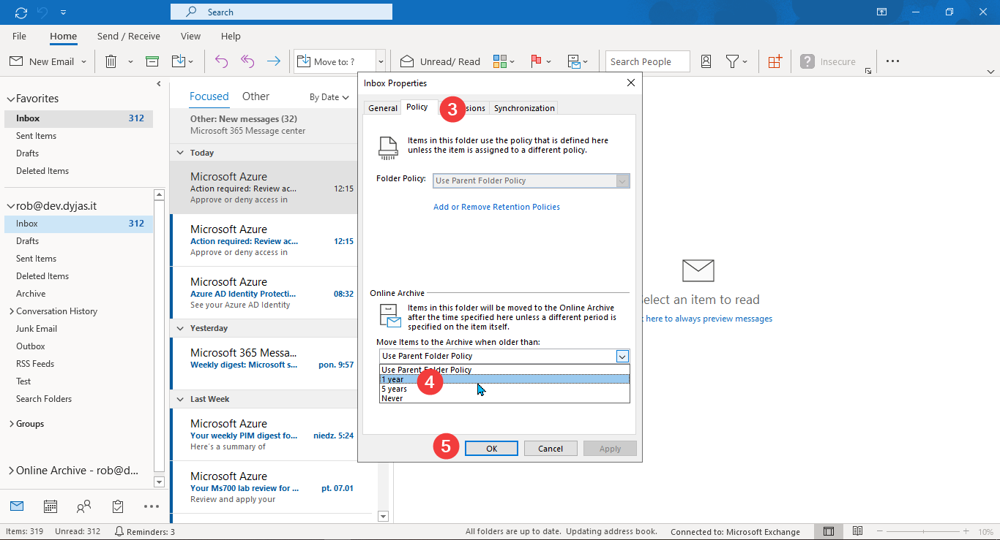

## Prerequisites

* Exchange Online (Outlook.com and Exchange Server support some of the features)
* Access via [Outlook Web Access (OWA)](https://support.microsoft.com/en-us/office/how-to-sign-in-to-outlook-on-the-web-763fab4d-0138-4814-b450-37fc286bcb79)
* Mailbox archive enabled. Follow [Enable archive mailboxes in the compliance center](https://docs.microsoft.com/en-us/microsoft-365/compliance/enable-archive-mailboxes?view=o365-worldwide) if you don't have it

   <Note>

   The archive is not required, if we plan to delete emails. It's necessary if we want to move emails to the archive.

   </Note>

   <Warning>

   Archive policy defaults to 2 years. Enabling archive will move all emails (and other items) **older than 2 years** to archive. Keep that in mind.

   </Warning>

For this demonstration, we'll use Exchange Online mailbox.

## Table of Contents

```toc
exclude: [Table of Contents, Prerequisites]
to-heading: 2
```

## Emptying folders from OWA

Outlook Web Access provides an interface to remove all the emails folder by folder. The steps to use it are demonstrated below:

1. Open the web browser and go to <https://outlook.office.com/mail>.
2. Sign in using our Microsoft 365 account
3. Once we're signed in go to the **gear icon** (1) and click **View all Outlook settings** (2):

   

4. In **Settings** window, choose **General** (3) and then **Storage** (4):

   <Tip>

   The direct link to storage settings is [https://outlook.office.com/mail/options/general/storage](https://outlook.office.com/mail/options/general/storage).

   </Tip>

   

5. In the right pane, find the name of the folder we'd like to clean and choose the **Empty** link (5). We'll see the dropdown to choose a time range for cleanup:

   <Note>

   The list displays only the folder name. If we have multiple folders with the same name, let's be careful! We can also rename the folder before cleaning up.

   </Note>

   

6. Last, but not least - confirm:

   

7. The screenshot below shows that we submitted the cleanup request correctly. While the folder cleanup is being processed, we can repeat the process for other folders.

   

### Removing items from the shared mailbox

The method described above shows the step to empty folders in the personal mailbox. What if we want to do the same for a shared mailbox?

First of all, we need to have *Full Access* permissions over the mailbox. Then we need to open it from OWA. We need to click on our profile picture and then choose **Open another mailbox**:


In the shared mailbox tab, we need to repeat the process described in [Emptying folders from OWA](#emptying-folders-from-owa)

<Tip>

You can use a direct link to go to the storage section in a shared mailbox. The link would be:

```powershell
# Replace email@domain.com with the shared mailbox address
https://outlook.office.com/mail/email@domain.com/options/general/storage
```

</Tip>

### Limitations

Using *Empty folder* functionality comes with some limitations:

* Cannot be triggered automatically
* We cannot choose between removing or archiving the content

## Cleaning up the folders using sweep rules

*Sweep rules* are another way to clean up emails. This mechanism is a bit different from the others described in this article.

We apply sweep rules to messages in *Inbox* or the other folders created by the mailbox owner. This rule cannot be applied to folders like *Sent Items*, *Deleted Items*, *Archive*, etc.

To configure sweep rules, we need to use Outlook on the web. Let's follow the steps:

1. Open [Outlook on the web](https://outlook.office.com/mail)
2. Find a message from the sender we'd like to sweep

  <Tip>

  If we currently don't have any message from the sender available in Inbox, we can move it temporarily.

  </Tip>

3. In the top bar, click the **Sweep** button (1):

  

4. In the dialog box, choose a suitable option. For example, this is the rule I use for most of the newsletters. Confirm with **OK** (2):

  

5. To view or manage your sweep rules, go to Outlook options -> **Mail** -> **Sweep** (or use [direct link](https://outlook.office.com/mail/options/mail/sweep)):

  

Notice that the management interface is very limited. You cannot even edit the existing rule. If you want to change something, you need to delete the rule and recreate it.

### Limitations

* Only available in Outlook on the web
* Must be configured per-sender
* No filtering by any other field than sender address

## Cleaning up the mailbox using archive and retention tags

We can force Exchange service to do cleanup on our behalf. We'll do it using retention policy with archive and retention tags.

<Note>

Do not mix up [Exchange retention policy](https://docs.microsoft.com/en-us/previous-versions/exchange-server/exchange-150/jj156628(v=exchg.150)?redirectedfrom=MSDN) with [Microsoft 365 retention policy](https://docs.microsoft.com/en-us/microsoft-365/compliance/create-retention-policies?view=o365-worldwide).

The latter is compliance feature, which can be applied to more than Exchange. However, it doesn't provide archiving.

</Note>

In the following steps, we'll be applying personal [retention tag](https://docs.microsoft.com/en-us/exchange/security-and-compliance/messaging-records-management/retention-tags-and-policies#retention-tags) to a folder.

### Applying archive policy to a folder using Outlook on the web

To apply archive policy to a folder using Outlook on the web, let's follow these steps:

1. Open [Outlook on the web](https://outlook.office.com/mail/)
2. Right-click the folder we'd like to archive (1)
3. Go to **Assign policy** (2) and choose the desired archive policy (3)

The screenshot below demonstrates the steps:


### Applying archive policy to a folder using Outlook

To apply archive policy to a folder using Outlook, let's follow these steps:

1. Open Outlook and find the folder on the folder pan
2. Right-click the folder (1) and choose **Properties** (2)

   

3. In the newly-opened window, choose **Policy** (3)
4. Under **Online Archive** select the policy from the dropdown (4)
5. Confirm with **OK** (5)

   

### Applying retention policy to a folder

When we want to delete emails instead of archiving them, we're using a retention policy. The process of applying them is quite similar to archive policy.

In Outlook on the web we'll use settings under **Retention labels**:


In Outlook we'll choose the setting under **Folder policy**:


There's a slight difference between archive and retention policies. As described in [Retention tags and policies article](https://docs.microsoft.com/en-us/exchange/security-and-compliance/messaging-records-management/retention-tags-and-policies):

> Users can apply archive policies to default folders, user-created folders or subfolders, and individual items. Users can apply a retention policy to user-created folders or subfolders and individual items (including subfolders and items in a default folder), **but not to default folders**.

What does it mean? We cannot apply personal tags to a folder like *Inbox*, *Sent items*, etc.. That means we can only rely on policies created by administrators.

If we try to change policy for any default folder, we'd not see personal tags:


### Applying a policy to all folders

When applying the policy to a folder, we might have noticed the default option. It is to **Use parent folder policy**:


All folders inherit from their parents by default. We could use that to apply the policy to more than one folder at a time.

But wait, what is the parent folder for a top-level folder (*Inbox*, *Sent items*, etc.)? For those, the parent folder is the one called the *root* folder.

We can change the settings of the root folder. We do it by right-clicking our mailbox name/email address in Outlook. In Outlook on the web, we need to right-click the *Folders* label:


If we apply the policy to the root folder, it'd be applied to all folders which are set to inherit from the parent.

<Note>

Remember about the rule about personal tags. The root folder is a default folder. Thus only admin-defined retention policies can be applied.

There's one specific thing about the root folder. From what I checked, personal archive tags cannot be applied to the root folder.

</Note>

In Outlook on the web, the process of setting up the policy is the same. Whether we apply the policy to the root folder or any other folder, we right-click and go to **Assign policy**.

The process for Outlook has one slight difference. If we right-click your email address, you won't see **Properties**. Instead, let's look for **Data folder properties**: 


Further steps are the same as for other folders.

### Checking the effects of the policy

The effect of archive policy will be the items moved to *Online Archive* mailbox. This mailbox is automatically added to our Outlook:


### Limitations

The biggest retention policies limitation comes from the fact that it's admin driven:

* Admin must define the policy first
* Root folder cannot have personal archive tags applied

## Archiving the mailbox using AutoArchive

AutoArchive is a feature similar to archiving policy. The main difference is the destination of the archive.

For archiving policy, we specify rules about items being moved to the Online Archive. For AutoArchive, we save files locally. Local files mean that the machine owner needs to take care of the backup. The data is no longer protected by Exchange mechanisms.

### Setting up AutoArchive

1. In Outlook, go to **File** and **Options**
2. In **Options** window, go to **Advanced** (1) and find **AutoArchive Settings**:

  

3. In the **AutoArchive** window, set the options and confirm by **OK**:

  

That's all. AutoArchive is now enabled. Every 14 days (or whatever period we set) the archive process will begin. If we set to be prompted. we'll be asked to confirm the cleanup operation:


### Limitations

Using AutoArchive comes with some limitations:

* Items can only be archived to a local file
* Only available in Outlook
* Cannot be enabled if the online archive is enabled
* Cut-off date might only be *X months ago*

<Tip>

AutoArchive settings won't be visible if that feature is not available for **primary mailbox** in Outlook. In such a case, we'd need to [Create a new profile](https://support.microsoft.com/en-us/office/create-an-outlook-profile-f544c1ba-3352-4b3b-be0b-8d42a540459d).

</Tip>

## Archiving the mailbox using Clean Up Old Items

In Outlook, we have additional functionality called **Clean Up Old Items**.

To use **Clean Up Old Items** functionality:

1. Open Outlook
2. Click **File** in the top-left corner
3. Under **Info** tab (1), click **Tools** (2)
4. Choose **Clean Up Old Items** from the dropdown (3)


From the **Archive** window, we can now manually trigger the AutoArchive process.

We also have an option to clean a specific folder (including its subfolders). If we choose to clean the folder, we can specify a cut-off date. It can be yesterday. It also can be several months ago.

### Limitations

We could consider *Clean Up Old Items* as an add-on to AutoArchive. It has similar limitations except for the cut-off date:

* Items can only be archived to a local file
* Only available in Outlook
* Cannot be enabled if the online archive is enabled

## Managing incoming emails using inbox rules

Another option for cleaning up our mailbox is **inbox rules**. We could utilize this mechanism to move emails to a specific folder. We can do so based on their subject, body, data, or many more.

Creating and managing inbox rules is a complex topic. It's also a bit out of scope for our article. Fortunately, Microsoft covers that topic. You can read their articles:

* [Manage email messages by using rules (in Outlook)](https://support.microsoft.com/en-us/office/manage-email-messages-by-using-rules-c24f5dea-9465-4df4-ad17-a50704d66c59) 
* [Inbox rules in Outlook Web App](https://support.microsoft.com/en-us/office/manage-email-messages-by-using-rules-c24f5dea-9465-4df4-ad17-a50704d66c59).

### Limitations

Inbox rules are not strictly intended for cleaning old items. They help a lot with maintaining the tidiness in our folders. From our topic's perspective there are some limitations:

* Cannot be applied to old items only
* Some rules can only be applied in Outlook (check [Server-side vs. client-only rules](https://support.microsoft.com/en-us/office/server-side-vs-client-only-rules-e1847992-8aa1-4158-8e24-ad043decf1eb))

## Comparison

There are several approaches to keep our mailboxes tidy.

### Admin-configured

*Archive/retention tags* rely on our admin to configure. All others can be configured by users.

### Triggered automatically

Manual triger = bigger effort. You set them once and they work. Mechanisms that will be trigerred/scheduled automatically are:
 
* sweep rules
* archive/retention tags
* AutoArchive
* inbox rules

### Manual, but still useful

Using manually-trigerred mechanisms might work for some cases. We don't always have a way to define what should be removed after certain period of time. Deleting old emails manually, but in bulk, can be handy then.

Manually-triggered mechanisms are:

* Empty folder (Outlook on the web)
* Clean Up Old Items (Outlook)

### Server-side

Some mechanism are processed server-side. That means we don't need to even sign-in to the mailbox and the rules will work anyway. Server-side mechanisms are:

* archive/retention tags
* sweep rules
* inbox rules.

### Platform-specific

There are certain ways specific to the platform. Outlook on the web provides *empty folder* and *sweep rules*. Outlook has *AutoArchive* and *Clean Up Old Items*.

## Conclusion

We can keep our mailbox clean and tidy, if we know the tools to do it right.

Using *Ctrl+A* followed by *Delete* key can work. But why not to use some automation when we can?
