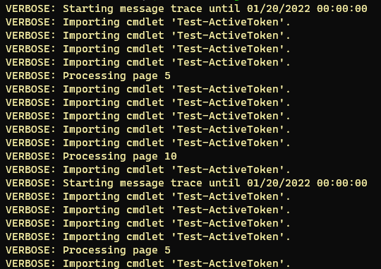
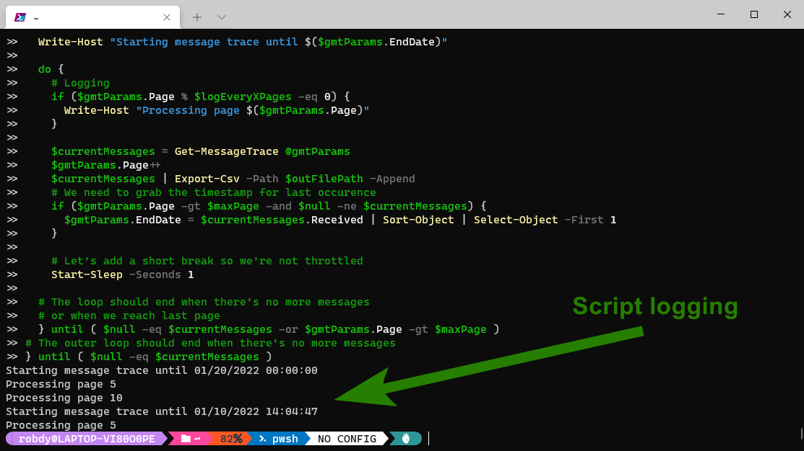
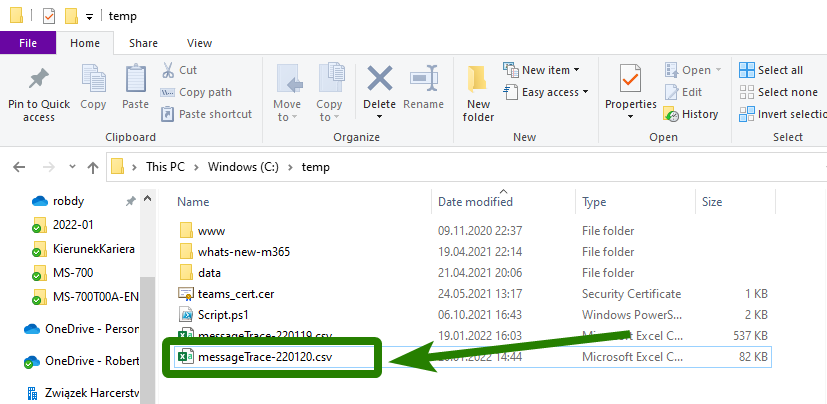

Sometimes we need to pull a lot of emails from message trace in Exchange Online. We might want to grab some stats. We might want to analyze only specific emails.

For example, I did some analysis of the delay introduced by [Microsoft 365 Safe Attachments](https://docs.microsoft.com/en-us/microsoft-365/security/office-365-security/safe-attachments?view=o365-worldwide). I wanted to check only emails bigger than 1MB. To get such data I had to pull all the emails and then use `Where-Object`.

The cmdlet we're going to use for this demonstration is [`Get-MesssageTrace`](https://docs.microsoft.com/en-us/powershell/module/exchange/get-messagetrace?view=exchange-ps).

## Prerequisites

Only two things we need for this exercise are:

* Exchange Online organization with admin account (PERMISSIONS TO BE VERIFIED)
* Exchange Online module for PowerShell installed ([V1](https://docs.microsoft.com/en-us/powershell/exchange/v1-module-mfa-connect-to-exo-powershell?view=exchange-ps) or [V2](https://docs.microsoft.com/en-us/powershell/exchange/exchange-online-powershell?view=exchange-ps), see the note below)

<Note>

  The version of the Exchange module you can use depends on your PowerShell and OS version. The content in this article works for either version.

</Note>

In this article, I'm using V2 of Exchange Online PowerShell. There might be some slight differences between the module versions. They are related to how we connect.

## TODO Check if module autoconnects

## The issue

Documentation for `Get-MessageTrace` states about the limitations:

> By default, this cmdlet returns a maximum of 1000 results, and will timeout on very large queries. If your query returns too many results, consider splitting it up using smaller StartDate and EndDate intervals.

In addition, we need to implement paging as the maximum value for the `PageSize` parameter is 5000.

## Constructing the loop

Ok, let's start and wrap the cmdlet into a loop. But first, let's define some parameters we'll use later:

```powershell
# We want to get emails until today
$endDate = (Get-Date).Date
# And as many of them as possible = 10 days
# 10 days is maximum supported by the cmdlet
$startDate = ($endDate).AddDays(-10)
# Let's specify maximum page size
$pageSize = 5000
# And max number of pages if we want to modify
$maxPage = 1000
# And let's initialize a variable
$allMessages = @()
```

As we don't know how many times to run the cmdlet, we'll use `do ... until` loop:

```powershell
# We'll use splatting for readability
# And also because it's cool
$gmtParams = @{
  StartDate = $startDate
  EndDate = $endDate
  PageSize = $pageSize
  Page = 1
}
do {
  $currentMessages = Get-MessageTrace @gmtParams
  $gmtParams.Page++
  $allMessages += $currentMessages
  # Let's add a short break so we're not throttled
  Start-Sleep -Seconds 1
# The loop should end when there's no more messages
# or when we reach last page
} until { $null -eq $currentMessages -or $gmtParams.Page -gt $maxPage } 
```

## Lowering memory usage

When we save a lot of messages to `$allMessages`, we'll notice high memory usage. Let's try to prevent that.

Our remediation will be to save the data to disk.

```powershell
# Let's define a file path
$outFilePath = "C:\temp\messageTrace-$(Get-Date -Format "yyMMdd").csv"

# Now we need to replace
$allMessages += $currentMessages
# With
$currentMessages | Export-Csv -Path $outFilePath -Append
```

## Supporting more than 5M items

The last adjustment to the script - let's make it universal! The [docs for `Get-MesssageTrace`](https://docs.microsoft.com/en-us/powershell/module/exchange/get-messagetrace?view=exchange-ps) says:

* Maximum page size is 5000
* There might be 1000 pages

If we multiply these numbers, we'll receive five milions of emails. That's the number we can get by iterating through 1000 pages.

What if we know that our organization sends more emails? Let's expand the script to support that scenario!

We'll add another loop. Its purpose would be to start another trace with another end date. Our results start from the most recent emails. That is why we're modifying the end date.

The loop would be:

```powershell
do {
  # We need to reset the page number
  $gmtParams.Page = 1

  do {
    # Code from previous steps applies
    # But we need to grab the timestamp for last occurence
    if ($gmtParams.Page -gt $maxPage -and $null -ne $currentMessages) {
      $gmtParams.EndDate = $currentMessages.Received | Sort-Object | Select-Object -First 1
    }
  } until ( $null -eq $currentMessages -or $gmtParams.Page -gt $maxPage )

} until ( $null -eq $currentMessages )
```

## Logging

We can also add logging to better control what happens within our script. We'll use [`Write-Host`](https://docs.microsoft.com/en-us/powershell/module/microsoft.powershell.utility/write-host?view=powershell-7.2) for that purpose.

<Tip>

The reason why we're not using `Write-Verbose`. It'd interfere with the verbose messages sent by `Get-MessageTrace`:



</Tip>

The logging lines will be:

```
# In the outer loop
Write-Host "Starting message trace until $($gmtParams.EndDate)"

# In the inner loop
Write-Host "Processing page $($gmtParams.Page)"
```

We can also reduce the number of messages and log every X pages:

```powershell
# At the top of the script
$logEveryXPages = 5

# Wrap inner loop with the if statement
if ($gmtParams.Page % $logEveryXPages -eq 0) {
  Write-Host "Processing page $($gmtParams.Page)"
}
```

## Compiling script together

Now we completed all the steps. Let's compile the script.


```powershell
# First or all, we need to connect to Exchange PowerShell
# Replace that with whatever method you use for connecting
Connect-ExchangeOnline

#############
#region Customizable settings
#############
# We want to get emails until today
$endDate = (Get-Date).Date
# And as many of them as possible = 10 days
# 10 days is maximum supported by the cmdlet
$startDate = ($endDate).AddDays(-10)

# Let's specify maximum page size
$pageSize = 5000
# And max number of pages if we want to modify
$maxPage = 1000

# We want to log every X pages
# Set it to 1 to log every page
$logEveryXPages = 5

# And let's define where the results are saves
$outFilePath = "C:\temp\messageTrace-$(Get-Date -Format "yyMMdd").csv"

#############
#endregion Customizable settings
#############

# Let's initialize a variable
$allMessages = @()

# We'll use splatting for readability
# And also because it's cool
$gmtParams = @{
  StartDate = $startDate
  EndDate = $endDate
  PageSize = $pageSize
  Page = 1
}

do {
  $gmtParams.Page = 1

  Write-Host "Starting message trace until $($gmtParams.EndDate)"

  do {
    # Logging
    if ($gmtParams.Page % $logEveryXPages -eq 0) {
      Write-Host "Processing page $($gmtParams.Page)"
    }
    
    $currentMessages = Get-MessageTrace @gmtParams
    $gmtParams.Page++
    $currentMessages | Export-Csv -Path $outFilePath -Append
    # We need to grab the timestamp for last occurence
    if ($gmtParams.Page -gt $maxPage -and $null -ne $currentMessages) {
      $gmtParams.EndDate = $currentMessages.Received | Sort-Object | Select-Object -First 1
    }

    # Let's add a short break so we're not throttled
    Start-Sleep -Seconds 1

  # The loop should end when there's no more messages
  # or when we reach last page
  } until ( $null -eq $currentMessages -or $gmtParams.Page -gt $maxPage )
# The outer loop should end when there's no more messages
} until ( $null -eq $currentMessages )
```

## Testing

To make a quick test, let's set the page values to something small.

```powershell
# Choose any time span to have more than 20 messages
$startDate = ($endDate).AddDays(-1)
$pageSize = 2 
$maxPage = 10
$logEveryXPages = 5
```

Now, we need to copy all under

```powershell
#############
#endregion Customizable settings
#############
```

and paste into PowerShell.

The result should look similar to the image below:



And the output file should appear. Let's check the folder we specified:



## Conclusion

`Get-MessageTrace` doesn't support getting more than 5 millions of elements. We written a wrapper for that. Now we can get as many messages as we want.