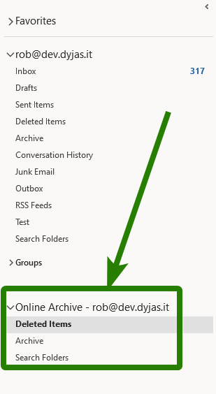
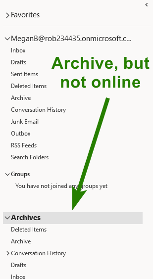
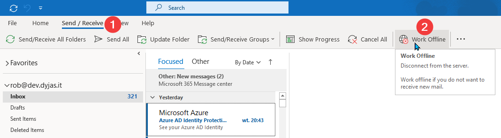
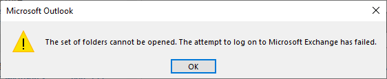
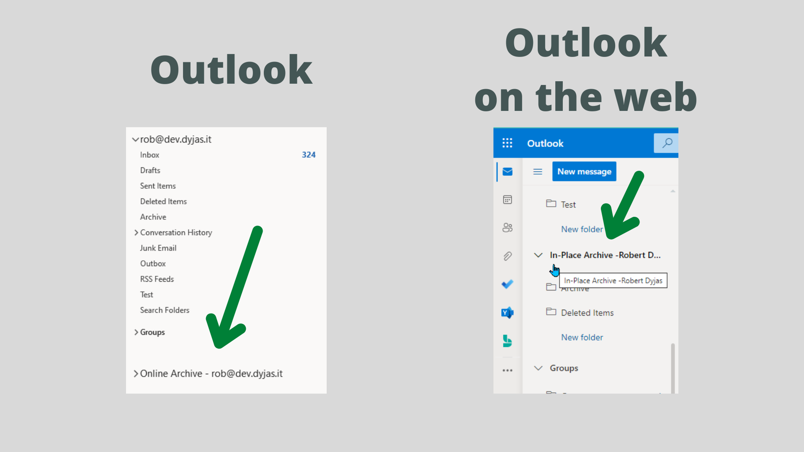
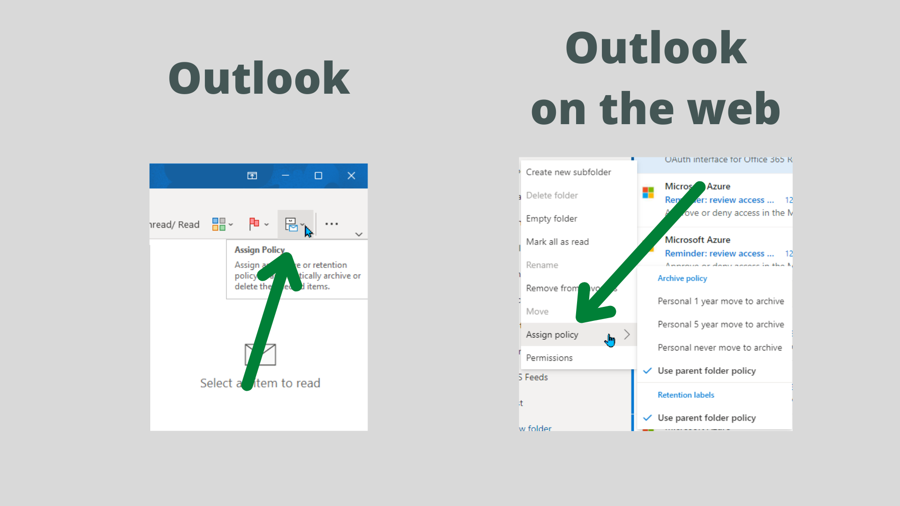
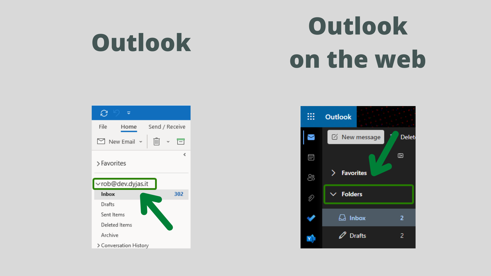

In this article, we're going through the functionalities of the Online Archive. We'll describe its key features (and limitations). You'll also see some guides about Online Archiving.

If you use or want to use Online Archive in Microsoft 365 (previously called Office 365), this article is for you.

## When do I need Online Archive?

Depending on our email activity, we might reach the point our mailbox is very big. It comes with several implications.

Our Outlook might start getting slower and slower. We might start getting alerts from our administrator saying that our mailbox will soon reach its quota.

Is there a way to sort this out? Of course, it is! Its name is Online Archive.

## What is Outlook Online Archive?

Online Archive is an additional storage space in Exchange Online. It's optimized to store our old emails.

We're not going to access emails stored in the archive daily. Thus, they can be stored online and not use our disk space. That's why it's called *Online Archive*.

Alternative terms for Online Archive in Microsoft 365 are:

* Outlook Online Archive
* Exchange Online Archive

You can find both terms in the documentation and online resources.

## How can I check if I have an Online Archive?

Online Archive is visible as an additional mailbox in our Outlook. We can distinguish that based on its name.

## What is the difference between Online Archive and archive in Outlook?

Our Outlook can also have a mailbox called *Archives*. If we see it on our list, we have local archiving enabled:

Local archiving stores data on our disk. That means - we need to take care of the backup. The data is no longer protected by Exchange mechanisms. An example of such a mechanism is replication to multiple databases.

The local archive can still be useful in some cases. For example, some of our folders might have data about old projects. The projects already ended and we don't need the data in our mailbox. We can archive it to a local file and store it in the secure location

<Tip>

If you want to learn how to enable local archiving, I mention it in one of my articles. Its name is [6 ways to clean up Outlook mailbox](/outlook-mailbox-clean-up).

</Tip>

## What is the size of an Online Archive?

The size of the Online Archive mailbox depends on the license.

You can find the most accurate list in Microsoft documentation. Refer to [*Mailbox storage limits* section of Exchange Online service description](https://docs.microsoft.com/en-us/office365/servicedescriptions/exchange-online-service-description/exchange-online-limits#mailbox-storage-limits).

At the moment of writing, 50GB of archive storage is available for:

* Microsoft 365 Business Basic
* Microsoft 365 Business Standard
* Office 365 Enterprise E1

The archive mailbox is not available for Office 365 Enterprise F3.

1.5TB of archive storage is available for:

* Microsoft 365 Business Premium
* Office 365 Enterprise E3
* Office 365 Enterprise E5

If we have these licenses we'll receive auto-expanding archive. Its initial size will be 100GB. When the archive mailbox reaches the quota, additional 100GBs will be added. It doesn't require contacting Microsoft (that was the case in the past).

### Note about auto-expanding archives

We can have 1.5TB of mail storage for a single mailbox. Amazing, isn't it?

Some people might think about buying a single license to store multiple archives at once. I'm not saying it's you. But, if you know anyone who came up with that idea, warn them!

Here's what Microsoft states about such a case:

> Using journaling, transport rules, or auto-forwarding rules to copy messages to an Exchange Online mailbox for the purposes of archiving is not permitted. A user's archive mailbox is intended for just that user. **Microsoft reserves the right to deny additional archive storage space** in instances where a user's archive mailbox is used to store archive data for other users or in other cases of inappropriate use.

## Features of Online Archive

Online Archive comes in two variants: for Exchange Online and for Exchange Server. There's a table comparing the features across the variants. You can find it in [Exchange Online Archiving service description](https://docs.microsoft.com/en-us/office365/servicedescriptions/exchange-online-archiving-service-description/exchange-online-archiving-service-description#feature-availability-across-exchange-online-archiving-plans).

The differences are quite small. For us, the non-administrative users it's practically the same.

The list of features includes:

* Moving messages from `.pst` files
* Importing messages using Outlook *Import and Export* wizard
* Moving messages from primary mailbox (manually or automatically via [Retention Tags and Retention Policies](https://docs.microsoft.com/en-us/Exchange/policy-and-compliance/mrm/retention-tags-and-retention-policies))
* Deleted email recovery (from *Deleted Items* or using *Recover Deleted Items*)
* Mailbox server redundancy.\
  We won't see it, but our mailbox is replicated to multiple regions across Microsoft datacenters
* Autodiscover - we don't need to sign-in separately to Online Archive. We get it automatically in our Outlook

Online Archive supports many security and compliance features. As this article is not intended for administrators, we won't go into details.

If you want to learn more, check [Compliance and security features in Exchange Online Archiving - Service Descriptions | Microsoft Docs](https://docs.microsoft.com/en-us/office365/servicedescriptions/exchange-online-archiving-service-description/compliance-and-security-features).

## Limits of Online Archive

Most obvious limit of the Online Archive is that... it's online. What does it mean? If we lose access to the network, we cannot access the archive.

We can test it. In Outlook, let's switch to offline mode. In the **Send/Receive** tab (1) we click **Work offline** (2):

Now when we click the archive mailbox we'll receive an error. It states about failing to log on to Exchange:

The scenario when we need to access old emails offline is not very frequent. If we work offline a lot (for example travelling), it's important to be aware of such a limitation.

## How can I get Online Archive?

As a users, we cannot enable the archive ourselves. This must be done by Exchange administrators.

Good place to start with Online Archive is the article: [Enable archive mailboxes for Microsoft 365 Compliance - Microsoft 365 Compliance | Microsoft Docs](https://docs.microsoft.com/en-us/microsoft-365/compliance/enable-archive-mailboxes?view=o365-worldwide).

## How do I access an Online Archive?

Online Archive appears as an additional mailbox in both Outlook and [Outlook on the web](https://outlook.office365.com/mail). See the image below for comparison:

## How do I start archiving emails?

Archiving will start as soon as the archive mailbox is enabled. It requires a proper archive policy. Administrators don't need to define such a policy. There's a default one, which archives all items older than 2 years.

<Tip>

Do not worry if the items are not moved to the archive automatically. Archiving process is not designed to start automatically. The server-side process for archiving runs at least **every seven days**. Here's the [technical reference](https://docs.microsoft.com/en-us/microsoft-365/compliance/set-up-an-archive-and-deletion-policy-for-mailboxes?view=o365-worldwide#optional-step-5-run-the-managed-folder-assistant-to-apply-the-new-settings) for that. 

</Tip>

## How do I check my archiving settings?

We can check archiving settings using the **Assign policy** button in Outlook.

In Outlook on the web, we'll see the **Assign policy** entry in the context menu. The menu is visible when we right-click the folder.

See the image below for comparison:

We'll notice that the default option is to use the parent folder policy. For folders like *Inbox*, *Sent Items*, and others, the parent folder will be the root folder.

The root folder in Outlook is the one with our email address. In Outlook on the web, it's the one with the name *Folders*.

See the image below to identify the root folder:

We check the policy the same way as for other folders.

## How do I set my archiving settings?

<Warning>

If archiving is not enabled, we might still see *Retention policies* to be set. Let's be careful about that - retention tags in the policy are responsible for deleting the messages!

If we set the retention policy by mistake, we might lose emails.

</Warning>

Let's take one more look at the image from the previous chapter. It shows where to find the **Assign policy** button:

Once we are in the **Assign policy** section, we can choose from the predefined set of policies.

<Note>

Not all archiving policies can be set by non-administrators. Only the ones marked as *Personal* can be used.

An exception to it is the root folder. No personal policies can be assigned to it.

</Note>

## How do I turn Online Archive off?

There's no way to turn off the entire Online Archive. We could turn off the archiving for a single folder.

To turn off archiving for a single folder:

1. Go to the **Assign policy** section
2. Choose **Do not archive** from the list

If the subfolders are set to use the parent folder's policy, archiving will be disabled for all of them.

## Does Online Archive reduce mailbox size?

Yes, it does! Any item moved from main mailbox to the archive uses the archive's quota.

This is one of the main reasons to enabled Online Archive. If the administrators see the size of mailboxes growing, they usually start researching the Online Archive.

## Summary

In this article we've learnt a lot about Online Archive in Microsoft 365.

Do you see anything missing? Or do you still have questions about Online Archive? Drop them in the comments below!