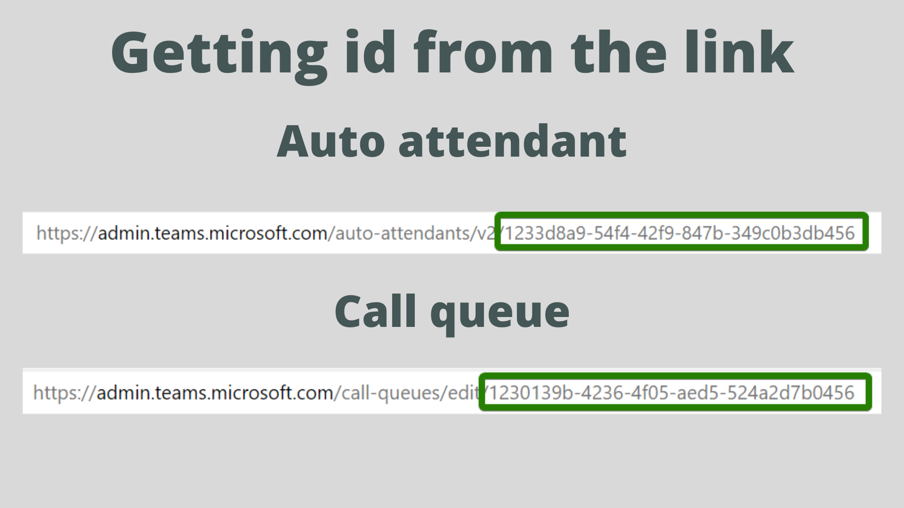

## Prerequisites

## Preparation

For the purpose of this article we'll use a test attendant. We'll also modify the call queue, where the calls land after going through auto attendant.

Let's save their names to variables:

```powershell
$attendantName = 'ATT_TEST'
$callQueueName = 'CQ_TEST'
```

### Getting the identifiers

Next, we'll use PowerShell to pull call queue and auto attendant objects. We'll use [`Get-CsAutoAttendant`](https://docs.microsoft.com/en-us/powershell/module/skype/get-csautoattendant?view=skype-ps) and [`Get-CsCallQueue`](https://docs.microsoft.com/en-us/powershell/module/skype/get-cscallqueue?view=skype-ps). 

Both cmdlets have similar parameters. Two of them might be useful to get the identifiers of our objects: `Identity` and `NameFilter`. Both parameters accept string.

We could use `NameFilter` to get our objects. We need to be careful though. Using `NameFilter` returns all objects matching the filter. For example, if our filter is *Test*, we'll get the objects with names:

* Test (this is desired)
* Test2
* NotTest

We'll use the cmdlets to list the identities and then save them to variables manually

<Tip>

We can also get the identity from the Teams Admin Center. When we edit an auto attendant or a call queue, id is the last part of the page URL:



</Tip>


## Changing greeting


## Changing working hours

## Changing out of hours workflow

## Adding members in bulk


## Conclusion