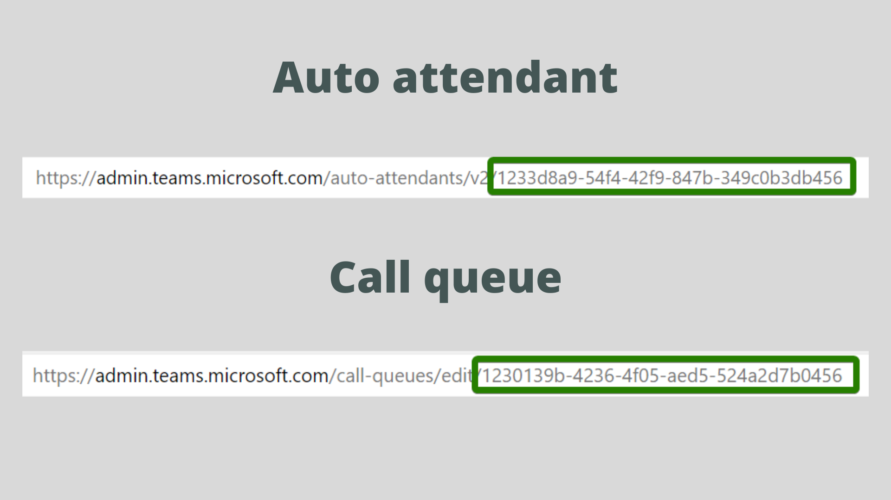
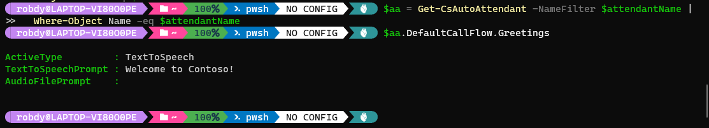
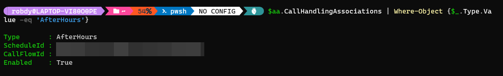
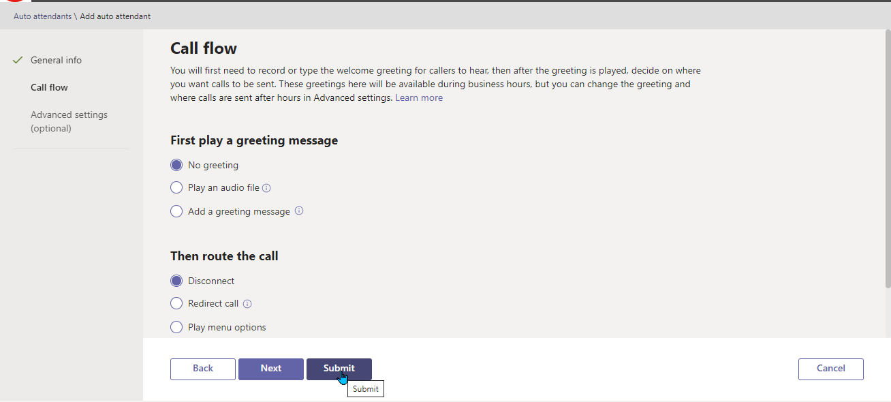
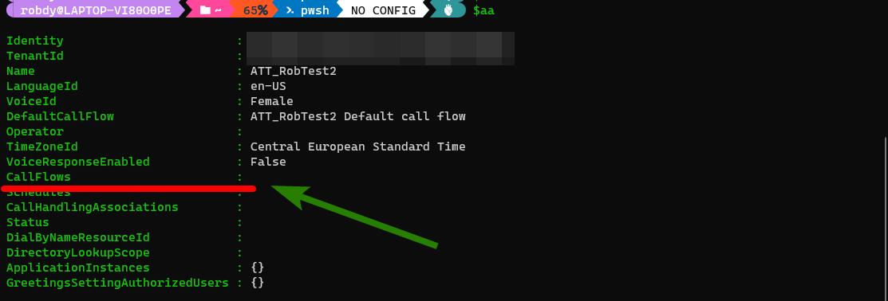

## Prerequisites

## Preparation

For the purpose of this article, we'll use a test attendant. We'll also modify the call queue, where the calls land after going through auto attendant.

Let's save their names to variables:

```powershell
$attendantName = 'ATT_TEST'
$callQueueName = 'CQ_TEST'
```

### Getting the identifiers

Next, we'll use PowerShell to pull call queue and auto attendant objects. We'll use [`Get-CsAutoAttendant`](https://docs.microsoft.com/en-us/powershell/module/skype/get-csautoattendant?view=skype-ps) and [`Get-CsCallQueue`](https://docs.microsoft.com/en-us/powershell/module/skype/get-cscallqueue?view=skype-ps). 

<Tip>

We can also get the identity from the Teams Admin Center. When we edit an auto attendant or a call queue, id is the last part of the page URL:



</Tip>

Both cmdlets have similar parameters. Two of them might be useful to get the identifiers of our objects: `Identity` and `NameFilter`. Both parameters accept string.

We will use `NameFilter` to get our objects. We need to be careful though. Using `NameFilter` returns all objects matching the filter. For example, if our filter is *Test*, we'll get the objects with names:

* Test (this is desired)
* Test2
* NotTest

After the *Get-* cmdlets we'll add an additional `Where-Object` at the end. This is to ensure that we only use the object with the exact name we provided:

```powershell
$aa = Get-CsAutoAttendant -NameFilter $attendantName |
  Where-Object Name -eq $attendantName
$cq = Get-CsCallQueue -NameFilter $callQueueName |
  Where-Object Name -eq $callQueueName
```

We now have our objects saved to the variable. Let's start modifying them!

<Tip>

The activities below are not dependent (unless specified otherwise). We can use only one of them and the effect will be the same.

</Tip>

## Managing general options

### Changing the operator to a person

### Changing the operator to call queue or auto attendant

### Changing the operator to phone number

### Removing the operator

### Changing the time zone

## Managing default call flow

### Changing default greeting

Ok, something simple first - let's change a greeting for the auto attendant default workflow. Our greeting will be of text-to-speech type:

```powershell
# First we define the greeting
$TTSPrompt = New-CsAutoAttendantPrompt -TextToSpeechPrompt "Welcome to Contoso!"
# Then we overwrite current AA configuration
$aa.DefaultCallFlow.Greetings = @($TTSPrompt)
# And we set the auto attendant
Set-CsAutoAttendant -Instance $aa
```

We can verify the prompt is saved successfully:

```powershell
# We pull the AA info again
$aa = Get-CsAutoAttendant -NameFilter $attendantName |
  Where-Object Name -eq $attendantName
# And now we list
$aa.DefaultCallFlow.Greetings
```

The output should look similar to the image below:



### Changing default greeting to audio file

Changing the default greeting to the audio file is very similar. We'll use the example from the [`New-CsAutoAttendantPrompt` documentation](https://docs.microsoft.com/en-us/powershell/module/skype/new-csautoattendantprompt?view=skype-ps):

```powershell
# These three lines creates the prompt
# If you use Windows PowerShell (5.1 or lower) use:
$content = Get-Content "C:\temp\welcome.wav" -ReadCount 0 -Encoding byte
# For PowerShell (multi-platform) use:
$content = Get-Content "C:\temp\welcome.wav" -ReadCount 0 -AsByteStream
# And then for any platform
$audioFile = Import-CsOnlineAudioFile -ApplicationId "OrgAutoAttendant" -FileName "welcome.wav" -Content $content
$audioFilePrompt = New-CsAutoAttendantPrompt -AudioFilePrompt $audioFile
# Now we use another variable
$aa.DefaultCallFlow.Greetings = @($audioFilePrompt)
# And we set the auto attendant again
Set-CsAutoAttendant -Instance $aa
```

## Managing the out-of-hours workflow

Let's now do the changes to the out-of-hours workflow.

### Checking if out-of-hours workflow exists

First things first - the out-of-hours workflow must be defined.  Let's check if we have it.

We'll check if there's an existing call handling association with the type *AfterHours*:

```powershell
$aa.CallHandlingAssociations | Where-Object {$_.Type.Value -eq 'AfterHours'}
```

We should see the object returned:



If we don't see anything, we need to add the workflow first.

### Adding out-of-hours workflow

NOT WORKING, TO BE SET MANUALLY

When we create an auto attendant we don't need to specify an out-of-hours workflow. If we hit **Submit** in the **Call flow** window (as in the image below), it won't be created:



We can check if that's the case by inspecting the value of the *Call flows* property in the `$aa` variable. If it's empty, as in the image below, the out-of-hours workflow is not defined:



If there's no out-of-hours workflow, we won't be able to modify it. Modifying is described in the later stages. Let's now take care of the workflow.

To create a workflow, we'll use [`New-CsAutoAttendantCallFlow` cmdlet](https://docs.microsoft.com/en-us/powershell/module/skype/new-csautoattendantcallflow?view=skype-ps). 

<Warning>

The script below assumes there's no holiday workflow. If there's one defined, it'll be overwritten!

</Warning>

```powershell
# First, menu option
$newAAOOHMenuOptionParams = @{
  Action = "DisconnectCall"
  DtmfResponse = "Automatic"
}
$AAOOHMenuOption = New-CsAutoAttendantMenuOption @newAAOOHMenuOptionParams

# Then, menu
$newAAMenuParams = @{
  Name = "After hours call flow"
  MenuOptions = @($AAOOHMenuOption)
}
$AAOOHMenu = New-CsAutoAttendantMenu @newAAMenuParams

# Optional greeting
$newAAOOHGreetingParams = @{
  TextToSpeechPrompt = "The office is closed now"
}
$AAOOHGreeting = New-CsAutoAttendantPrompt @newAAOOHGreetingParams

# And then, the workflow
$newAAOOHFlowParams = @{
  Name = "$attendantName After hours call flow"
  Menu = $AAOOHMenu
  Greetings = $AAOOHGreeting
}
$AAOOHFlow = New-CsAutoAttendantCallFlow @newAAOOHFlowParams

# Now, assigning the workflow
$aa.CallFlows = @($AAOOHFlow)

# We also need to assign the schedule
# Let's create it first
$tr = New-CsOnlineTimeRange -Start 00:00 -End 1.00:00
$scheduleOOHParams = @{
  Name = "After hours $attendantName"
  WeeklyRecurrentSchedule = $true
  MondayHours = @($tr)
  TuesdayHours = @($tr)
  WednesdayHours = @($tr)
  ThursdayHours = @($tr)
  FridayHours = @($tr)
  Complement = $true
}
$OOHSchedule = New-CsOnlineSchedule @scheduleOOHParams

# And now, assign
$aa.Schedules = @($OOHSchedule)

# And the same with call handling association
# Creating
$OOHCallHandlingAssociationParams = @{
  CallFlowId = $OOHSchedule.Id
  ScheduleId = $AAOOHFlow.Id
  Type = 'AfterHours'
}
$OOHAssociation = New-CsAutoAttendantCallHandlingAssociation @OOHCallHandlingAssociationParams

# And saving
$aa.CallHandlingAssociations = @($OOHAssociation)

## TODO Fix Set-CsAutoAttendant: Schedule not found. Probably requires specifying configuration id for a schedule
# And saving
Set-CsAutoAttendant -Instance $aa
```

### Changing business hours

In this example, we'll change the business hours. Outside the defined schedule, the out-of-hours workflow will be triggered.

We'll set the business hours from 9 AM to 5 PM. On Friday, we'll add the additional break between 1 PM and 2 PM.

```powershell
# Find out-of-hours association
$OOHAssociation = $aa.CallHandlingAssociations |
  Where-Object {$_.Type.Value -eq 'AfterHours'}

# Find the respective schedule
$OOHSchedule = $aa.Schedules |
  Where-Object Id -eq $OOHAssociation.ScheduleId

# Time range for Monday-Thursday
$weekTimeRange = New-CsOnlineTimeRange -Start 9:00 -End 17:00
# And for Friday
$fridayTimeRangeMorning = New-CsOnlineTimeRange -Start 9:00 -End 13:00
$fridayTimeRangeAfternoon = New-CsOnlineTimeRange -Start 14:00 -End 17:00

# Setting the schedule
$OOHNewSchedule = @{
  ComplementEnabled = $true
  MondayHours = @($weekTimeRange)
  TuesdayHours = @($weekTimeRange)
  WednesdayHours = @($weekTimeRange)
  ThursdayHours = @($weekTimeRange)
  FridayHours =  @($fridayTimeRangeMorning, $fridayTimeRangeAfternoon)
  SaturdayHours = @($null)
  SundayHours = @($null)
}
$OOHSchedule.WeeklyRecurrentSchedule = $OOHNewSchedule

### TO BE FINISHED
# And saving
Set-CsAutoAttendant -Instance $aa
```

### Removing business hours

### Changing an out-of-hours greeting to text-to-speech

Let's change the greeting we use out of hours.

We'll find the workflow responsible for after-hours call handling. Then we'll use [`New-CsAutoAttendantPrompt` cmdlet](https://docs.microsoft.com/en-us/powershell/module/skype/new-csautoattendantprompt?view=skype-ps) to create a new text-to-speech prompt. Then we'll replace the existing one.

```powershell
# Find out-of-hours association
$OOHAssociation = $aa.CallHandlingAssociations |
  Where-Object {$_.Type.Value -eq 'AfterHours'}

# Find the respective call flow
$OOHCallFlow = $aa.CallFlows |
  Where-Object Id -eq $OOHAssociation.CallFlowId
  
# Now we define the greeting
$OOHTTSPrompt = New-CsAutoAttendantPrompt -TextToSpeechPrompt "Our offices are closed now!"
# Then we overwrite the current configuration
$OOHCallFlow.Greetings = @($OOHTTSPrompt)
# And we set the auto attendant
Set-CsAutoAttendant -Instance $aa
```

### Changing an out-of-hours greeting to an audio file

We'll find the workflow responsible for after-hours call handling. Then we'll use [`New-CsAutoAttendantPrompt` cmdlet](https://docs.microsoft.com/en-us/powershell/module/skype/new-csautoattendantprompt?view=skype-ps) to create a new prompt from an audio file. Then we'll replace the existing one.

```powershell
# Find out-of-hours association
$OOHAssociation = $aa.CallHandlingAssociations |
  Where-Object {$_.Type.Value -eq 'AfterHours'}

# Find the respective call flow
$OOHCallFlow = $aa.CallFlows |
  Where-Object Id -eq $OOHAssociation.CallFlowId
  
# These three lines creates the prompt
# If you use Windows PowerShell (5.1 or lower) use:
$OOHFileContent = Get-Content "C:\temp\ooh-welcome.wav" -ReadCount 0 -Encoding byte
# For PowerShell (multi-platform) use:
$OOHFileContent = Get-Content "C:\temp\ooh-welcome.wav" -ReadCount 0 -AsByteStream
# And then for any platform
$OOHAudioFile = Import-CsOnlineAudioFile -ApplicationId "OrgAutoAttendant" -FileName "ooh-welcome.wav" -Content $OOHFileContent
$OOHAudioFilePrompt = New-CsAutoAttendantPrompt -AudioFilePrompt $OOHAudioFile

# Then we overwrite the current configuration
$OOHCallFlow.Greetings = @($OOHAudioFilePrompt)
# And we set the auto attendant
Set-CsAutoAttendant -Instance $aa
```

### Removing out-of-hours greeting

To remove the out-of-hours greeting we'll use the following script.

For [`New-CsAutoAttendantPrompt` cmdlet](https://docs.microsoft.com/en-us/powershell/module/skype/new-csautoattendantprompt?view=skype-ps) we need to specify either a text-to-speech prompt or an audio file. We can set any value as it'll be ignored anyway.

```powershell
# Find out-of-hours association
$OOHAssociation = $aa.CallHandlingAssociations |
  Where-Object {$_.Type.Value -eq 'AfterHours'}

# Find the respective call flow
$OOHCallFlow = $aa.CallFlows |
  Where-Object Id -eq $OOHAssociation.CallFlowId

# Generate new prompt
$OOHPromptParams = @{
  TextToSpeechPrompt = 'Our offices are closed now!'
  ActiveType = 'None'
}
$OOHPromptNone = New-CsAutoAttendantPrompt @OOHPromptParams

# Replace it
$OOHCallFlow.Greetings = @($OOHPromptNone)

# And save the changes
Set-CsAutoAttendant -Instance $aa
```

<Note>

 In theory, we could just set *ActiveType* value of `$OOHCallFlow.Greetings` to *None*. It'd work, but it might be prone to error if Microsoft changes the structure of the call flow object.

</Note>

## Adding holiday workflow

## Changing holidays greeting

## Changing working hours

## Changing out of hours workflow

## Adding members in bulk

## Conclusion