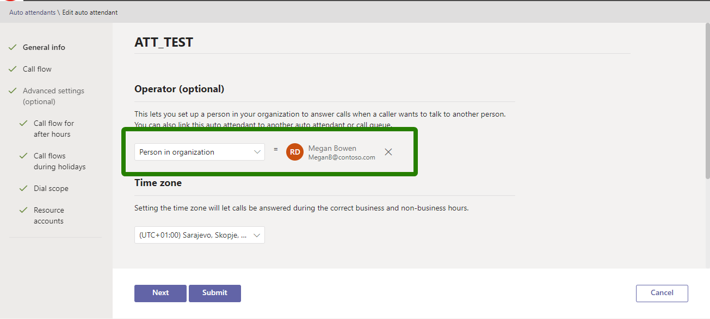
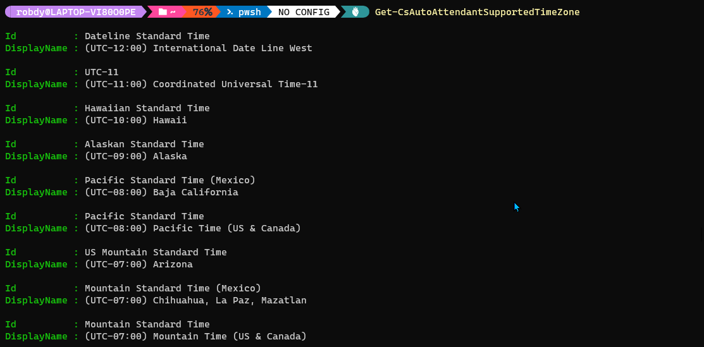
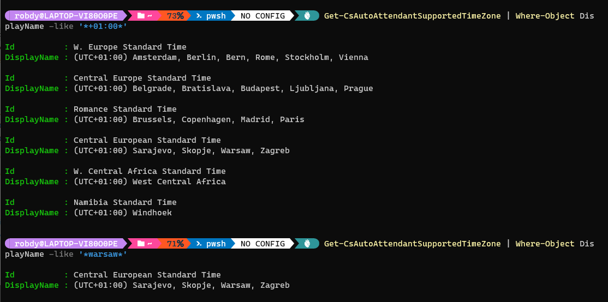

## Prerequisites

## Preparation

For this article, we'll use a test attendant. Let's save its name to a variable:

```powershell
$attendantName = 'ATT_TEST'
```

### Getting the identifiers

Next, we'll use PowerShell to pull the auto attendant object. We'll use [`Get-CsAutoAttendant`](https://docs.microsoft.com/en-us/powershell/module/skype/get-csautoattendant?view=skype-ps) cmdlet. 

<Tip>

We can also get the identity from the Teams Admin Center. When we edit an auto attendant, id is the last part of the page URL:


</Tip>

Two of the parameters might be useful to get the identifiers of our object: `Identity` and `NameFilter`. Both parameters accept a string.

We will use `NameFilter` to get our object. We need to be careful though. Using `NameFilter` returns all objects matching the filter. For example, if our filter is *Test*, we'll get the objects with names:

* Test (this is desired)
* Test2
* NotTest

After the *Get-* cmdlets we'll add `Where-Object` at the end. This is to ensure that we only use the object with the exact name we provided:

```powershell
$aa = Get-CsAutoAttendant -NameFilter $attendantName |
  Where-Object Name -eq $attendantName
```

We now have our object saved to the variable. Let's start modifying it!

<Tip>

The activities below are not dependent (unless specified otherwise). We can use only one of them and the effect will be the same.

</Tip>

## Changing the operator

### Changing the operator to a person

The operator of an auto attendant is a callable entity. There is one difference in comparison to other entities (person, voice app, or phone number). When we create the menu, there's a predefined voice command, which redirects to the operator.

In this example, we'll set Megan Bowen to be the auto attendant operator:

```powershell
# Here we enter the User Principal Name
$operatorUPN = 'MeganB@contoso.com'

# We define callable entity using Identity 
$operatorObjectId = (Get-CsOnlineUser $operatorUPN).Identity
$callableEntityPersonParams = @{
  Identity = $operatorObjectId
  Type = 'User'
}
$callableEntityPerson = New-CsAutoAttendantCallableEntity @callableEntityPersonParams

# We set the operator
$aa.Operator = $callableEntityPerson

# And we save
Set-CsAutoAttendant -Instance $aa
```

Next time we open the attendant in Teams Admin Center, we should see the operator set:



### Changing the operator to the call queue

We can also set the group of people to act as an operator. We use a call queue for that.

In the example below we'll provide the ID of the existing call queue. Then we'll set it as an operator.

```powershell
# Here we enter the call queue name 
$operatorCallQueueName = 'CQ_TEST'

# We define callable entity using the resource account 
$operatorQueue = Get-CsCallQueue -NameFilter $operatorCallQueueName |
  Where-Object Name -eq $operatorCallQueueName
$operatorQueueAccountId = $operatorQueue.ApplicationInstances[0]
$callableEntityQueueParams = @{
  Identity = $operatorQueueAccountId
  Type = 'ApplicationEndpoint'
}
$callableEntityQueue = New-CsAutoAttendantCallableEntity @callableEntityQueueParams

# We set the operator
$aa.Operator = $callableEntityQueue

# And we save
Set-CsAutoAttendant -Instance $aa
```

<Warning>

We might get the error saying *New-CsAutoAttendantCallableEntity: Cannot bind argument to parameter 'Identity' because it is an empty string.*

In that case, our call queue might not have the resource account assigned yet. We must create the resource account, assign it, and try again.

</Warning>

### Changing the operator to the auto attendant

Using an auto attendant as an operator allows to define a workflow for contacting the operator. The procedure is similar to setting a call queue as an operator:

```powershell
# Here we enter the auto attendant name 
$operatorAutoAttendantName = 'ATT_RobTest'

# We define callable entity using the resource account 
$operatorAttendant = Get-CsAutoAttendant -NameFilter $operatorAutoAttendantName |
  Where-Object Name -eq $operatorAutoAttendantName
$operatorAttendantAccountId = $operatorAttendant.ApplicationInstances[0]
$callableEntityAttendantParams = @{
  Identity = $operatorAttendantAccountId
  Type = 'ApplicationEndpoint'
}
$callableEntityAttendant = New-CsAutoAttendantCallableEntity @callableEntityAttendantParams

# We set the operator
$aa.Operator = $callableEntityAttendant

# And we save
Set-CsAutoAttendant -Instance $aa
```

<Warning>

We might get the error saying *New-CsAutoAttendantCallableEntity: Cannot bind argument to parameter 'Identity' because it is an empty string.*

In that case, our auto attendant might not have the resource account assigned yet. We must create the resource account, assign it, and try again.

</Warning>

### Changing the operator to the phone number

The only callable entity which we haven't set is the phone number. Let's set it, too.

```powershell
# Here we enter the number
# It must be in E.164 format
$operatorNumber = '+48123456789'

# We create the respective entity
$callableEntityNumberParams = @{
  Identity = $operatorNumber
  Type = 'ExternalPstn'
}
$callableEntityNumber = New-CsAutoAttendantCallableEntity @callableEntityNumberParams

# We set the operator
$aa.Operator = $callableEntityNumber

# And we save
Set-CsAutoAttendant -Instance $aa
```

### Removing the operator

To remove the operator we need to nullify the property:

```powershell
# We set the operator to $null
$aa.Operator = $null

# And we save
Set-CsAutoAttendant -Instance $aa
```

## Changing the time zone

Microsoft provides a cmdlet to find out which time zones are supported by auto attendants. The cmdlet is [`Get-CsAutoAttendantSupportedTimeZone`](https://docs.microsoft.com/en-us/powershell/module/skype/get-csautoattendantsupportedtimezone?view=skype-ps). We'll use it to find out the name of the specific zone we'd like to set.

In this example, I'll try to set the time zone used in Poland. It is UTC+1 and should have Warsaw in its name.

Let's run the `Get-CsAutoAttendantSupportedTimeZone` . We'll check the structure of the data returned:



As we can see, each entry has two properties: *Id* and *DisplayName*. We'll filter using the DisplayName. Then we'll use the *Id* and pass it to the auto attendant object.

We'll first try to filter using the hours' difference *+01:00* and then based on the city name (*Warsaw*).

```powershell
# By time difference
Get-CsAutoAttendantSupportedTimeZone |
  Where-Object DisplayName -like '*+01:00*'

# By city name
Get-CsAutoAttendantSupportedTimeZone |
  Where-Object DisplayName -like '*warsaw*'
```

Here's what is returned in both cases:



Now, when we know the identifier, we can pass it to the auto attendant object:

```powershell
# Copying data from the filtering above
$timeZoneId = 'Central European Standard Time'

# Setting the object
$aa.timeZoneId = $timeZoneId

# And saving
Set-CsAutoAttendant -Instance $aa
```