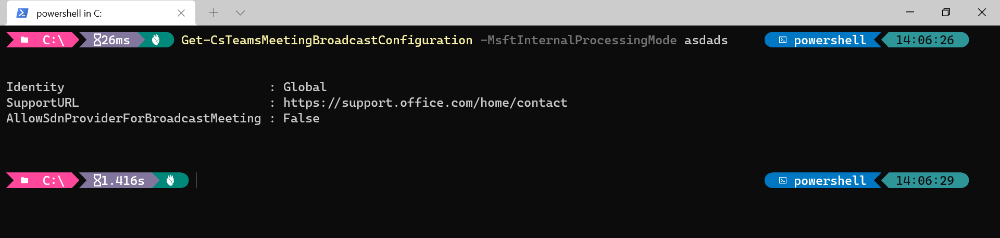

After the end-of-year holiday period, we finally got some interesting changes in Microsoft Teams PowerShell modules.

## Table of Contents

- [New cmdlets](#new-cmdlets)
  - [Unassigned number treatment](#unassigned-number-treatment)
  - [Shifts](#shifts)
- [Removed cmdlets](#removed-cmdlets)
- [New params](#new-params)
  - [Meeting policy](#meeting-policy)
  - [MSFT internal processing mode](#msft-internal-processing-mode)
  - [Sync application instance](#sync-application-instance)
- [Removed params](#removed-params)
  - [For multiple cmdlets](#for-multiple-cmdlets)
  - [Shifts schedule record](#shifts-schedule-record)
- [Conclusion](#conclusion)

## New cmdlets

We got 1 new cmdlet to test the unassigned number treatment. 6 new cmdlets for Shifts appeared in preview.

Like previously, Microsoft remote several cmdlets in the stable version and added them back in the preview release. This article lists only the new ones.

### Unassigned number treatment

We got 1 new cmdlet: *Test-CsTeamsUnassignedNumberTreatment*. Currently, there's no online documentation available.

The cmdlet provides a way to test the unassigned number treatment configured in our tenant. We specify the number using `-PhoneNumber` and it checks against all the unassigned number treatment rules. We can check if our regular expression is correct.

As the cmdlet is in preview now, it returns *Access Denied* error in my organization.

### Shifts

New Shifts cmdlets in preview:

* *Disable-CsTeamsShiftsConnectionErrorReport*
* *Get-CsTeamsShiftsConnectionErrorReport*
* *Get-CsTeamsShiftsConnectionOperation*
* *Get-CsTeamsShiftsConnectionWfmUser*
* *New-CsTeamsShiftsConnectionBatchTeamMap*
* *Remove-CsTeamsShiftsScheduleRecord*

## Removed cmdlets

There were quite a few cmdlets removed in the `3.2.0-preview` version of the module:

* *ConvertTo-JsonForPSWS*
* *Get-CsNetworkConfiguration*
* *Get-CsTeamsVerticalPackagePolicy*
* *Get-CsVoiceNormalizationRule*
* *Grant-CsTeamsVerticalPackagePolicy*
* *New-CsNetworkMediaBypassConfiguration*
* *New-CsTeamsVerticalPackagePolicy*
* *Remove-CsTeamsVerticalPackagePolicy*
* *Remove-CsTenantNetworkConfiguration*
* *Remove-CsVoiceNormalizationRule*
* *Set-CsNetworkConfiguration*
* *Set-CsTeamsVerticalPackagePolicy*
* *Set-CsTenantNetworkConfiguration*
* *Set-CsUserServicesPolicy*
* *Set-CsVoiceNormalizationRule*

You can find all the details in [Microsoft Teams PowerShell Release Notes](https://docs.microsoft.com/en-us/microsoftteams/teams-powershell-release-notes#release-notes).

## New params

This is usually where we can find hidden changes. In this instance, there was one quite important. It was related to meeting policies.

### Meeting policy

*Get-CsTeamsMeetingPolicy* outputs one new parameter: *InfoShownInReportMode*.

The role of this parameter is currently unknown. There's no documentation available. There's no respective parameter for *Set-CsTeamsMeetingPolicy* cmdlet. It means for now we cannot set any value.

The default value for the parameter is *FullInformation*. We can guess we will be able to limit what information is available in report mode for the meeting.

What is the report mode? I don't know yet.

### MSFT internal processing mode

Pretty much all the cmdlets got new parameter: *MsftInternalProcessingMode*. I haven't found any reference to this parameter.

As the name implies, the parameter is probably used internally in Microsoft. Did we get it exposed by mistake?

The parameter accepts a string value. From my checking, if you enter any random value into it, you won't get any error. PowerShell will simply ignore it, as you can see on the screenshot below:

### Sync application instance

*ApplicationId* parameter has been added for *Sync-CsOnlineApplicationInstance* cmdlet. Now we can use the cmdlet not only with object ID but also with the application ID.

## Removed params

Microsoft cleans up some parameters in the module.

### For multiple cmdlets

As noted in [Microsoft Teams PowerShell Release Notes](https://docs.microsoft.com/en-us/microsoftteams/teams-powershell-release-notes#release-notes), InMemory is no longer supported. The only exception is *New-CsVoiceNormalizationRule* cmdlet.

Based on my checking, there are 3 more parameters removed from multiple cmdlets:

* *Instance*
* *Force*
* *LocalStore*

### Shifts schedule record

*Authorization* parameter has been removed for *Remove-CsTeamsShiftsScheduleRecord* cmdlet.

## Conclusion

Each Teams PowerShell module release comes with the release notes. As you can see after reading my article, not all changes are included there. Sometimes you can learn something from unpublished changes.