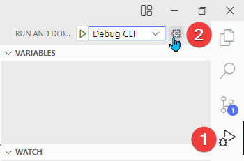
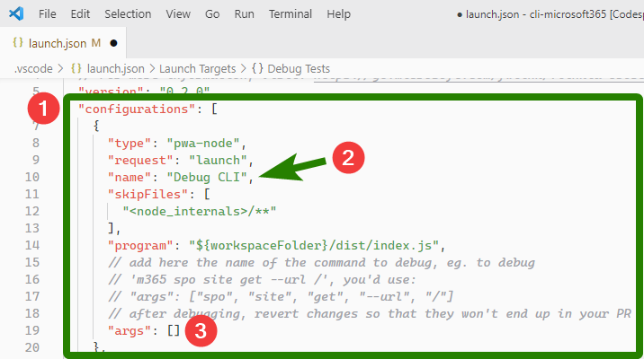
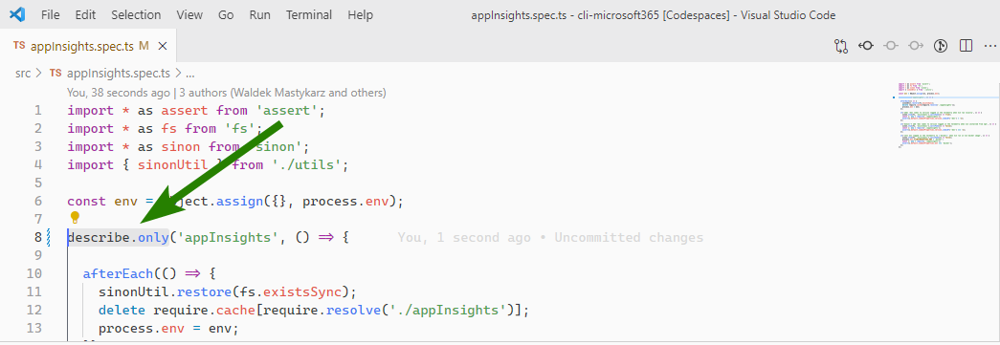
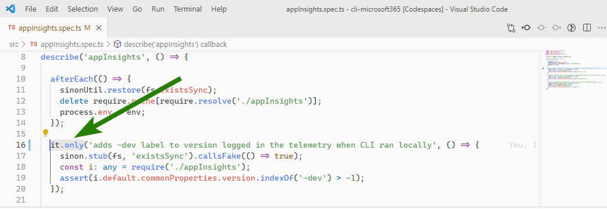
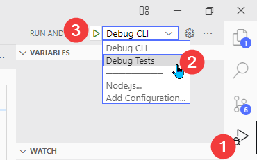
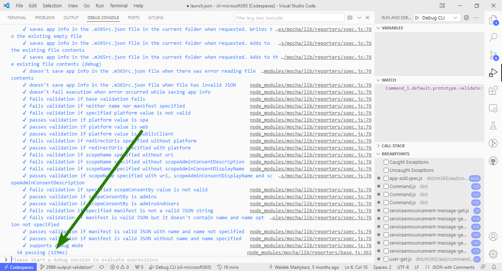
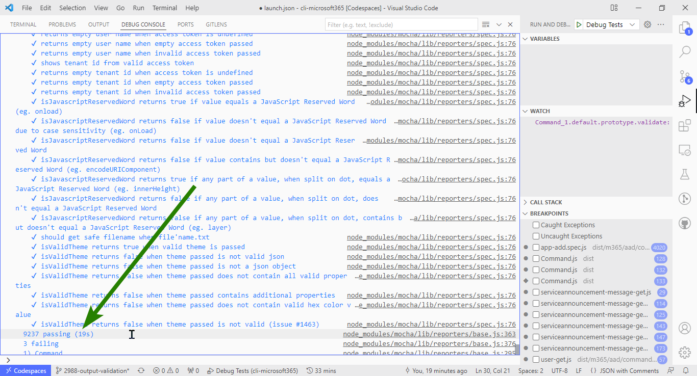
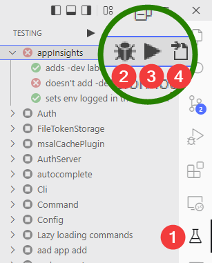
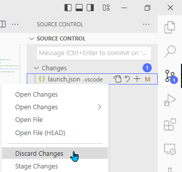

## Prerequisites

To go through the article we need to have our development environment. There are two main ways to create the environment: locally and using Remote Development Containers.

If you want to use your local environment, follow the article [Minimal Path to Awesome](https://github.com/pnp/cli-microsoft365/wiki/Minimal-Path-to-Awesome). For Remote Development Containers, follow [GitHub Codespaces & Visual Studio Remote Development Container](https://github.com/pnp/cli-microsoft365/wiki/GitHub-Codespaces-&-Visual-Studio-Remote-Development-Container).

In this article, we'll be using the environment based on GitHub Codespaces.

## Building the project

Each time we make the changes, we need to rebuild the project.

We do it by running the following command:

```shell
npm run build
```

## Debugging CLI

For CLI debugging we'll need to define the arguments. The debugger will run that *m365* command in debug mode.

We can then set our breakpoints to pause the execution. Once paused, we'll be able to inspect the current context. We could also run the program step by step.

### Opening launch file

To configure the arguments passed in debug mode, we'll edit *.vscode/launch.json*. We can open it directly from the file explorer:


We can also open it from the *Run and Debug* bar (1). We need to click a little gear icon (2) next to the *Debug CLI* dropdown:



### Setting the arguments

The arguments need to be entered under the *configurations* array (1). We'll edit the one with the name *Debug CLI* (2). Our arguments need to go to the *args* array (3):



The comments above the *args* array explain how to use it.

In my example, I troubleshoot usage of the incorrect value for `--output`. I'd like to debug what's happening when I run:

```shell
m365 version --output asdasd
```

Translated to the array, it'll look like:

```json
"args": ["version", "--output", "asdasd"]
```

Let's save the file and run the debug mode.

### Running the debug mode

To run debug mode we can simply hit the F5 button. We can also run it by opening the *Run and Debug* tab (1) and clicking the play button (2):


How to confirm we entered the debug mode? We can notice a few differences:

* The little bar with debug controls will appear
* The panel tab will switch to the *Debug Console*
* The bottom bar will be orange

The differences are outlined in the screenshot below:


## Debugging tests

We now know how to debug command execution.

But what about the tests? Tests are an important part of CLI for Microsoft 365. Current (and desired) test coverage is 100%. It means that for many of the changes we might need to troubleshoot the tests, too.

There are several options for running the tests. As described on [Adding a command](https://github.com/pnp/cli-microsoft365/wiki/Adding-a-command#implement-unit-tests) wiki page:

> To run just your tests, either add `.only` to your test suite (eg. `describe.only(commands.MY_COMMAND)`) or update the glob in the `.mocharc.json` file, `spec` property to match the path to your test files, like `dist/m365/aad/commands/approleassignment/**/*.spec.js`.

Below we're exploring all these options.

### Adding .only to the test suite

The first option is to add `.only` to the test suite. We need to open a test file something.spec.ts. Inside, we replace `describe` with `describe.only:`



If we want to run only one test, we can add `.only` after the `it` statement:



In any case, we need to compile the code using `npm run build`. When the build task is finished, we can run the debug mode.

Steps to run the debug mode are described under [Running the debug mode for tests](#running-the-debug-mode-for-tests). Before going there, let's explore other options for limiting the number of tests.

### Updating .mocharc.json

All the settings for Mocha (test framework used in the project) are stored in the `.mocharc.json` file. The file is in the root folder of the repository.

The file contains the argument *spec*. It is responsible for specifying the files to be included in the test suite. If we want to run tests from only one file, we need to supply its path to the *spec* argument.

We also need to remember that the path should lead to the compiled file. We'll simply change the *src* folder to the *dist* folder and the extension from *ts* to *js*.

See the code block below for the example:

```powershell
 src/appInsights.spec.ts
dist/appInsights.spec.js
^                     ^
folder name           extension
```

### Overwriting the launch file config

The *launch.json* file we edited for CLI debugging contains another configuration object named *Debug Tests*. The object has no arguments (property `args`). It uses the default configuration, pulled from *.mocharc.json* file.

However, we can add the arguments ourselves. We also need to tell Mocha to ignore the config file.

The example *args* array we can set would be:

```json
"args": [
  "dist/appInsights.spec.js",
  "--no-config"
],
```

The first argument in the array specifies the file (or files if we use wildcard) to be given to Mocha. The last argument tells Mocha to ignore its config file.

As we only run a couple of tests, we don't need to change the default timeout value (which is 2000 ms). If we want to increase the timeout, our *args* array would look as below:

```json
"args": [
  "dist/appInsights.spec.js",
  "timeout",
  "10000",
  "--no-config"
],
```

### Running the debug mode for tests

After we set we can now run *Debug Tests* configuration. We need to go to *Run and Debug* tab (1) choose the configuration from the dropdown (2) and then hit the play button (3): 



The debug console will now indicate that only tests from a single file run. We can see it from the number of tests and the execution time:



If all tests run, the number will be bigger than 9.000 and the execution time will usually be more than 10 seconds:



## Debugging tests via Test Explorer

[Test Explorer](https://marketplace.visualstudio.com/items?itemName=hbenl.vscode-test-explorer) is an addon to Visual Studio Code, which provides an interface to run tests from the sidebar. The addon [has been recently added](https://github.com/pnp/cli-microsoft365/pull/3024) to the default devcontainer file.

As with all the methods described above, the prerequisite is to build the project.

Once the project is built, we can click the Test Explorer UI icon in the sidebar (1). Our sidebar will show a list of all the files containing tests. Using the toggle left to the file title, we can expand the list of tests in that file.

By moving our mouse over the test or file title, we will see three buttons. Clicking the bug button (2) runs the test (or tests) in the debug mode. Play button icon (3) runs the test. File icon (4) opens the test's source file. 



## Cleaning up

Ok, we configured our environment for testing. Now we only need to talk about cleaning it up.

The reason for the cleanup is to make sure that we don't push our changes to the repository. We don't want the next person to run exactly the same tests as we did.

To clean our codebase, we need to revert changes made to the files. The easiest way to do that is to go to the *Source Control* tab and find the affected file(s). Then we right-click on them and choose *Discard changes*:



We can also do that from the console. The command to use is `git checkout` with the file path:


## Basic actions in the debug mode

To learn more about what you can do in the debug mode you can read the [Debugging in Visual Studio Code](https://code.visualstudio.com/docs/editor/debugging) article.

In the linked article you'll learn how to:

* Control the debug flow with [debug actions](https://code.visualstudio.com/docs/editor/debugging#_debug-actions)
* Set [breakpoints](https://code.visualstudio.com/docs/editor/debugging#_breakpoints) or [logpoints](https://code.visualstudio.com/docs/editor/debugging#_logpoints)
* [Inspect data](https://code.visualstudio.com/docs/editor/debugging#_data-inspection) during the execution

## Conclusion
