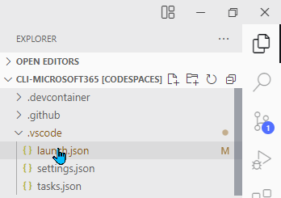
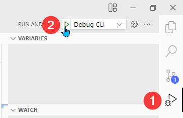
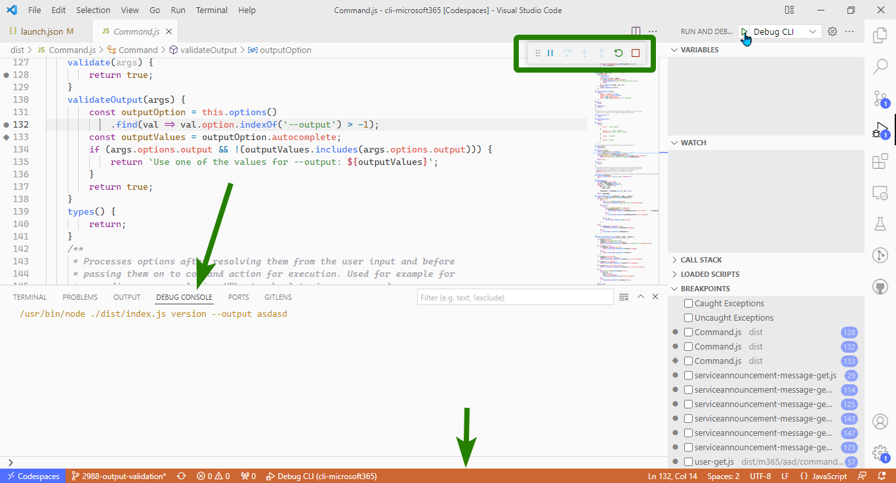

## Prerequisites

To go through the article we need to have our development environment. There are two main ways to create the environment: locally and using Remote Development Containers.

If you want to use your local environment, follow the article [Minimal Path to Awesome](https://github.com/pnp/cli-microsoft365/wiki/Minimal-Path-to-Awesome). For Remote Development Containers, follow [GitHub Codespaces & Visual Studio Remote Development Container](https://github.com/pnp/cli-microsoft365/wiki/GitHub-Codespaces-&-Visual-Studio-Remote-Development-Container).

In this article, we'll be using the environment based on GitHub Codespaces.

## Building the project

Each time we make the changes, we need to rebuild the project.

We do it by running the following command:

```shell
npm run build
```

## Debugging CLI

For CLI debugging we'll need to define the arguments. The debugger will run that *m365* command in debug mode.

We can then set our breakpoints to pause the execution. Once paused, we'll be able to inspect the current context. We could also run the program step by step.

### Opening launch file

To configure the arguments passed in debug mode, we'll edit *.vscode/launch.json*. We can open it directly from the file explorer:



We can also open it from the *Run and Debug* bar (1). We need to click a little gear icon (2) next to the *Debug CLI* dropdown:


### Setting the arguments

The arguments need to be entered under the *configurations* array (1). We'll edit the one with the name *Debug CLI* (2). Our arguments need to go to the *args* array (3):


The comments above the *args* array explain how to use it.

In my example, I troubleshoot usage of the incorrect value for `--output`. I'd like to debug what's happening when I run:

```shell
m365 version --output asdasd
```

Translated to the array, it'll look like:

```json
"args": ["version", "--output", "asdasd"]
```

Let's save the file and run the debug mode.

### Running the debug mode

To run debug mode we can simply hit the F5 button. We can also run it by opening the *Run and Debug* tab (1) and clicking the play button (2):



How to confirm we entered the debug mode? We can notice a few differences:

* The little bar with debug controls will appear
* The panel tab will switch to the *Debug Console*
* The bottom bar will be orange

The differences are outlined on the screenshot below:



## Debugging tests

We now know how to debug command execution.

But what about the tests? Tests are an important part of CLI for Microsoft 365. Current (and desired) test coverage is 100%. It means that for many of the changes we might need to troubleshoot the tests, too.

Let's see how to do this!

## Overwriting the launch file config

The *launch.json* file contains another configuration object named *Debug Tests*. If we want, we can run it as is and it'd run all the tests.

In most cases, we don't want to run all the tests each time. If tests from only one file fail, we want to run them separately. To do that, we can edit the first argument in the configuration object.

By default the first argument is:

```json
 "dist/**/*.spec.js"
```

It means all tests from the files ending with `.spec.js` will run.

## Cleaning up 

## Basic actions in the debug mode

To learn more about what you can do in the debug mode you can read the [Debugging in Visual Studio Code](https://code.visualstudio.com/docs/editor/debugging) article.

In the linked article you'll learn how to:

* Control the debug flow with [debug actions](https://code.visualstudio.com/docs/editor/debugging#_debug-actions)
* Set [breakpoints](https://code.visualstudio.com/docs/editor/debugging#_breakpoints) or [logpoints](https://code.visualstudio.com/docs/editor/debugging#_logpoints)
* [Inspect data](https://code.visualstudio.com/docs/editor/debugging#_data-inspection) during the execution

## Conclusion