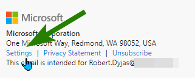
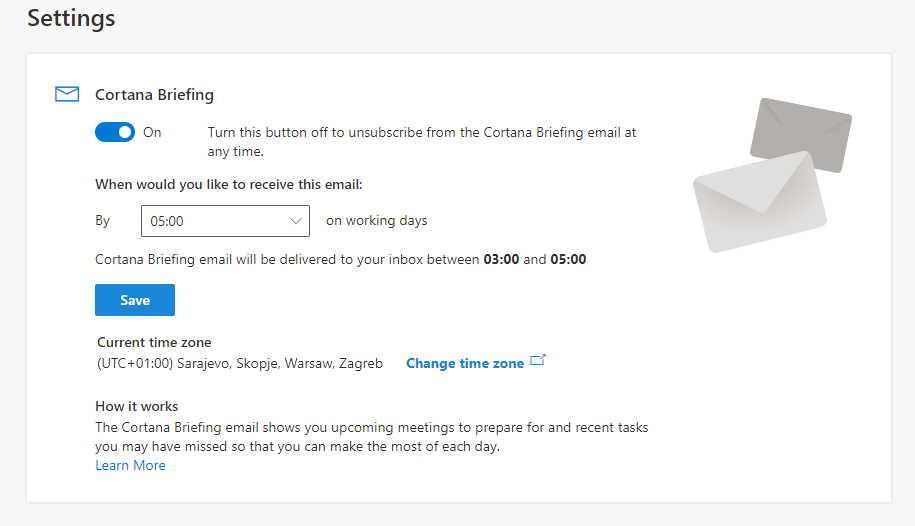

*Hi John Doe, make today count* - We all know these emails, right? 

Daily briefings from Microsoft Viva can be useful. They can save us some time finding documents related to the upcoming meeting. Or they can remind us that we have a meeting we need to prepare for.

There's one caveat for those, who like to have their emails organized into folders. You cannot make your inbox rule work with the emails from Viva.

## Prerequisites

To learn how to process Viva Insights email, we need the following:

* Microsoft 365 account with a mailbox
* Some items in the calendar for the following days - to make sure daily briefing email is sent
* No additional license is required - daily briefing emails are [already included in the Microsoft 365 license](https://www.microsoft.com/en-us/microsoft-viva/pricing)
* Viva Insights [enabled on the tenant level](https://docs.microsoft.com/en-us/viva/insights/personal/briefing/be-admin#tenant-level-configuration) (default setting)

## Setting up Viva Insights

Before we go to processing the email, let's make sure we have it enabled for our account.

<Tip>

Daily briefing emails won't be sent if there are no actionable items for the account. Make sure to have some meeting invites on the calendar for the following days.

</Tip>

To go to the settings, we can scroll down one of the daily briefing emails. At the bottom, there's a *Settings* link which leads to [the settings page](https://cortana.office.com/settings):

From here we can enable the emails and set by when they should arrive. Let's set them to arrive by 5 AM. We will have enough time to process them:

## Managing Viva Insights email with an inbox rule

If you're the person, who does first and then reads the manual, you might have gotten into the situation I have.

I created the inbox rule. Its purpose was to move emails sent by Microsoft Viva to another folder. After creating, I checked *Run this rule in inbox now*. It worked perfectly.

But the next day, Viva Insights emails were still in my inbox. I started by checking my inbox rule. Then I searched the internet. Finally, I read the [Briefing email from Microsoft Viva FAQ](https://docs.microsoft.com/en-us/viva/insights/personal/briefing/be-faqs) article. The quote below explained my issue quite well (emphasis mine):

> The Briefing email is not a standard email. It's system-generated and does not go through the standard email delivery process. Instead, it's inserted directly into your Outlook inbox by Microsoft Viva. **Briefing emails can't be managed by email rules or transport rules.**

## Creating Power Automate flow

Ok, we now know the inbox rule won't work.