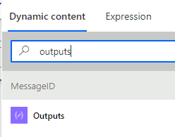

*Hi John Doe, make today count* - We all know these emails, right? 

Daily briefings from Microsoft Viva can be useful. They can save us some time finding documents related to the upcoming meeting. Or they can remind us that we have a meeting we need to prepare for.

There's one caveat for those, who like to have their emails organized into folders. You cannot make your inbox rule work with the emails from Viva.

## Prerequisites

To learn how to process Viva Insights email, we need the following:

* Microsoft 365 account with a mailbox
* Some items in the calendar for the following days - otherwise daily briefing email won't appear
* No additional license is required - daily briefing emails are [already included in the Microsoft 365 license](https://www.microsoft.com/en-us/microsoft-viva/pricing)
* Viva Insights [enabled on the tenant level](https://docs.microsoft.com/en-us/viva/insights/personal/briefing/be-admin#tenant-level-configuration) (default setting)
* Power Automate enabled for the account (M365-included license is enough)

## Setting up Viva Insights

Before we go to processing the email, let's make sure we have it enabled for our account.

<Tip>

Daily briefing emails won't be sent if there are no actionable items for the account. Make sure to have some meeting invites on the calendar for the following days.

</Tip>

To go to the settings, we can scroll down one of the daily briefing emails. At the bottom, there's a *Settings* link that leads to [](https://cortana.office.com/settings)[the settings page](https://cortana.office.com/settings):


From here we can enable the emails and set by when they should arrive. Let's set them to arrive by 5 AM. We will have enough time to process them:


## Managing Viva Insights email with an inbox rule

If you're the person, who does first and then reads the manual, you might have gotten into the situation I have.

I created the inbox rule. Its purpose was to move emails sent by Microsoft Viva to another folder. After creating, I checked *Run this rule in inbox now*. It worked perfectly.

But the next day, Viva Insights emails were still in my inbox. I started by checking my inbox rule. Then I searched the internet. Finally, I read the [Briefing email from Microsoft Viva FAQ](https://docs.microsoft.com/en-us/viva/insights/personal/briefing/be-faqs) article. The quote below explained my issue quite well (emphasis mine):

> The Briefing email is not a standard email. It's system-generated and does not go through the standard email delivery process. Instead, it's inserted directly into your Outlook inbox by Microsoft Viva. **Briefing emails can't be managed by email rules or transport rules.**

## Creating Power Automate flow

Ok, we now know the inbox rule won't work. Let's then create a flow in Power Automate and try to use it.

To start we go to [](https://flow.microsoft.com)[make.powerautomate.com](https://make.powerautomate.com/). If needed, change the environment.

We start with creating a scheduled flow from the *New flow* dropdown:


The same options are available under the *Create* position in the menu:


In the initial window, we choose the name (1) and we set the flow to run **at 5:30 AM** (2) **every day** (3). This ensures that the flow runs after the daily briefing email pops up in the mailbox.

We confirm the settings by *Create* (4):


We now start adding the actions.

### Getting the email

The first action is pretty obvious - we need to find the email(s). We choose the newest version available: *Get emails (V3)*:


The action pulls from the *Inbox* folder by default. At a minimum, we need to specify the *From* address. The value of it will be *viva-noreply@microsoft.com*.

There are also other options we can consider, depending on our needs:

* *Fetch Only Unread Messages* - if we leave the default value *Yes*, the flow won't do anything if we mark the message as read earlier. For this demo, I change it to *No*.
* *Top* - we can set it to 1 to fetch only the latest message. I'm leaving it as the default (10) for this demo.
* *Subject Filter* - we can filter only the daily briefing messages. If left empty, the flow will also process the weekly digest and other emails sent from the address. I'm not using it in this demo. 

The chosen settings are as follows:


### Analyzing the output

Ok, we have the first step. Let's now save the flow and make a test run. We'll take a look at the output from the previous step.

<Note>

Before running the test, make sure that at least one Viva email is in your inbox. Otherwise, the output will be empty.

</Note>

We save first:


Then we click *Test*:


We need to manually trigger the test (1) and confirm by *Save & Test* (2):


We confirm the setting with the *Run flow* button:


On the next page, we close the modal with *Done*:


After the first test is finished, we should see both steps with the green checkmark:


Now we can click the *Get emails (V3)* title bar to see all the inputs and outputs from the action. We don't need to check inputs (we've just defined them), but we'll be interested in outputs.

Let's click the Show raw outputs to look at the response structure. We'll need that knowledge in a bit:


The raw output shows the JSON structure. The top-level element *body* (1) has the *value* element (2). The *value* element stores an array of objects (3 - in JSON, square brackets represent an array). The objects in the array store the mail data, such as its ID (4):


### Creating the loop

We now know where is the message data. Let's create a loop to iterate through the messages.

To go to the edit mode, we click the *Edit* button. Then we hit the *New step* button at the bottom:


 Our next step will be *Apply to each*:


In the newly-added action, we click the empty field. It'll show us the dynamic content window. From it, we click the *value* property (1) from the *Get emails (V3)* action. Once clicked, it'll be displayed in the *Select an output...* field (2):


Let's now add the *Compose* action inside the loop. It'll show us whether we're pulling the message ID correctly. The input for the action will be:

```text
item()?['id']
```

We use `item()` to refer to the [current item in the loop](https://powerusers.microsoft.com/t5/General-Power-Automate/How-to-get-just-the-quot-Value-quot-of-the-quot-Current-Item/m-p/346451/highlight/true#M33612). Then we use `?['id']` to access the property *id*. We need to paste the formula into the *Expression* tab of the *Dynamic Content* window.

We first need to click the *Inputs* textbox (1) and then need to switch to the *Expression* tab (2). From here we can paste the value into the formula box (3) and confirm by *OK* (4):


We can now run a test to confirm the composed value is the message id. After clicking test we can run it either manually or automatically with a recently used trigger:


Follow the wizard to run the test. Once finished, click the titles to go into *Apply to each* and then *Compose* actions. The *Outputs* (and in that case also *Inputs*) field should contain the message ID:


We have extracted the message ID. We can reuse it for other actions. Let's just rename the compose action so that it's clear what it contains:


Now we can add the action to move emails. We'll use *Move email (V2)* - at the moment of writing, the newest version.

For the *Message Id* we'll use the value from the previous action:


Next, we choose a folder from the folder picker:


That's all! We can save and test. The message should disappear from our Inbox this time. It'll disappear every time the flow runs in the morning. When we start work, we won't see it in our inbox.

### Marking the message as read

Ok, the message is moved. End of story... NOT! Now our message is in the folder but doesn't it annoy you that it's shown as unread?


Personally, I set all my inbox rules to mark messages as read. Thanks to it, I don't see the number of emails I still need to read. It helps to focus on priority tasks.

If you have a similar approach, let's add an additional action to mark the message as read. If you don't, skip this step.

<Warning>

Before reading further, move the message from Viva back to your *Inbox* folder and mark it as unread. Otherwise, your flow will return *success* but will do nothing.

</Warning>

The action we'll add will be *Mark as read or unread (V3)*. *Message Id* will get the value from our composing action (*MessageID*).

<Tip>

If you search for *MessageID* value and you get way too many options, search for *Outputs*:



</Tip>

Next, we need to choose the value for *Mark as* property. It's a bit counterintuitive in my opinion, but we need to choose *Yes*. Let's think of it as *Is read?* - might help to better remember the value.

<Note>

Here's the reference thread from the community forum: [Move email then mark as 'unread' action offers... - Power Platform Community](https://powerusers.microsoft.com/t5/Building-Flows/Move-email-then-mark-as-unread-action-offers-Boolean-yes-no/m-p/892030/highlight/true#M125459).

</Note>

Our action should look like this:


We run it and... boom 💣. It doesn't work:


Apparently, the action is only capable of finding the message in the *Inbox* folder. Our message has already been moved. Let's change the order of actions so that moving comes after marking as read:


Let's move the email back to *Inbox*. Then, let's run the test. Now it works like a charm!

## Summary

Daily briefings from Viva cannot be managed using inbox rules. But we have Power Automate! It allows us to move email and mark it as read using scheduled flow. Thank you, Power Automate!