I currently explore using [Notion](https://www.notion.so/) as my notepad for writing blog posts. One of the steps I plan is to convert Notion pages to MDX. Before going there, I need to pull the site content. This article demonstrates the steps to do so.

## Prerequisites

For the demo we'll need:

- [Notion.so](http://Notion.so) account (free personal license is enough and will be used by me)
- PowerShell (I use the newest preview version `7.3.0-preview.6`)

## Creating the database

We'll need a database, so let's create one. At the bottom of the Notion's left bar, hit *New page*:

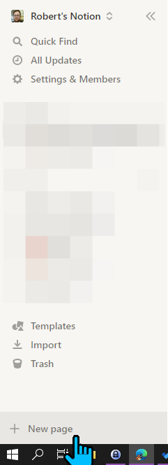

Let's name it *Test DB* and create a database table:

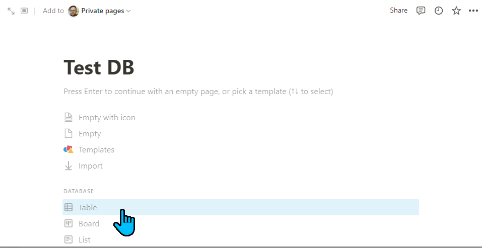

From here we'll create a new database, instead of connecting to the existing one. We'll click *New database* at the bottom right:

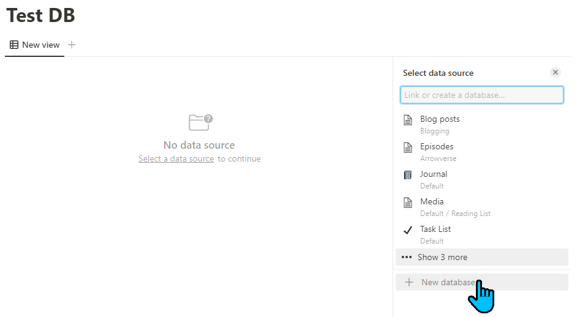

From here we'll see the database with 3 empty records:

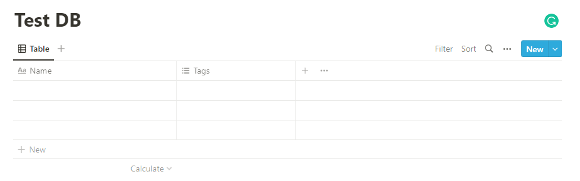

Let's add some names to it:

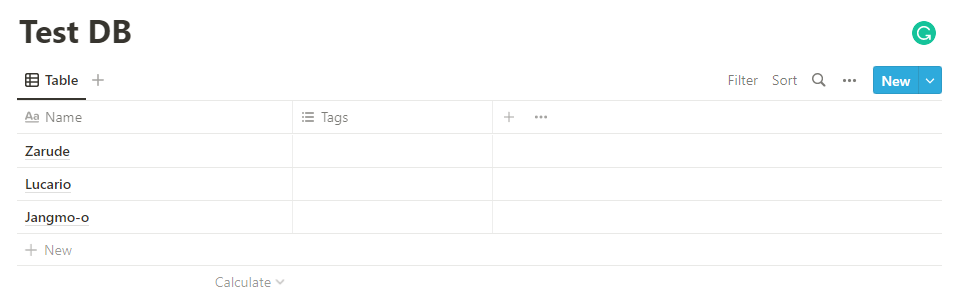

Now let's add some content. Click *Open* (1) next to the page name. Then hit *Enter* or click below the comment section (2):

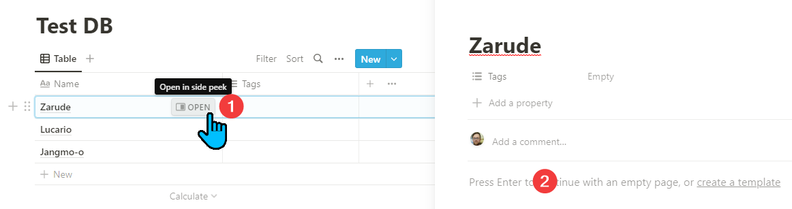

Add some content there and click outside the page view to save:

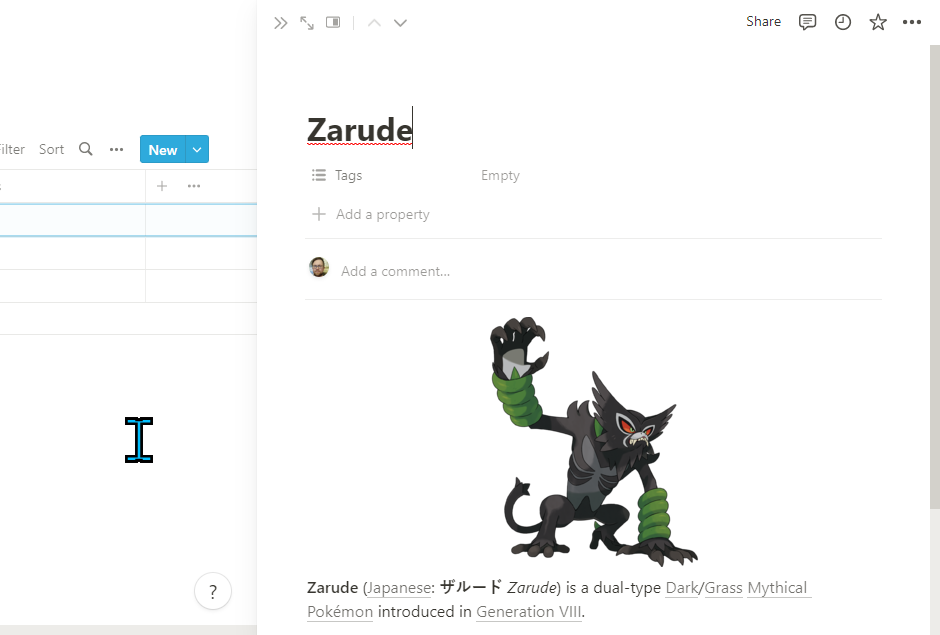

## Setting up the integration

We will set up the private integration and get the internal integration key. Follow the guide from Notion: [Getting started: Step 1](https://developers.notion.com/docs/getting-started#step-1-create-an-integration). Copy the key, we'll need it later.

For the capabilities, we only need the *Read content*. No user information is needed. For reference, see the picture below:

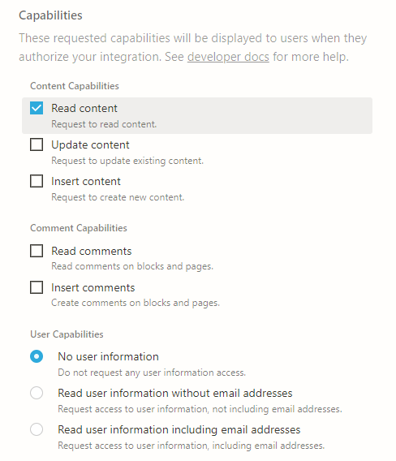

Now, make sure to [share the database with the integration](https://developers.notion.com/docs/getting-started#step-2-share-a-database-with-your-integration). You're done with the setup.

## Getting the database entries

We can now start working on our script. First, let's set variables.

We'll need our integration key. We copied it in the previous step.

We'll also need our database ID. As mentioned on the Getting started page:

> The database ID is the part of the URL after your workspace name (if you have one) and the slash (`myworkspace/`) and before the question mark (`?`). The ID is 32 characters long, containing numbers and letters.
> 
> ```
> https://www.notion.so/myworkspace/a8aec43384f447ed84390e8e42c2e089?v=...
>                                   |--------- Database ID --------|
> ```
> Copy the ID and paste it somewhere you can easily find later.
>

We're saving them to variables:

```powershell
# We're storing the key as a secure string
# because... it's secure
$notionKey = 'secret_xxxxxx'| ConvertTo-SecureString -AsPlainText -Force
$notionDatabaseId = 'a8aec43384f447ed84390e8e42c2e089'
```

### Request parameters

Now we gather all the parameters and save them to a hashtable.

To find out which parameters are required, we refer to the [API reference for the database query](https://developers.notion.com/reference/post-database-query).

<Tip>

Notion API reference can generate the PowerShell cmdlet for us. Choose PowerShell on the right pane and then change from `Invoke-WebRequest` to `Invoke-RestMethod`. We'll use the generated code but with some improvements.

</Tip>

The code generated from the API reference page is:

```powershell
$headers=@{}
$headers.Add("Accept", "application/json")
$headers.Add("Notion-Version", "2022-06-28")
$headers.Add("Content-Type", "application/json")
$headers.Add("Authorization", "Bearer secret_xxxxxx")
$response = Invoke-RestMethod -Uri 'https://api.notion.com/v1/databases/a8aec43384f447ed84390e8e42c2e089/query' -Method POST -Headers $headers -ContentType 'application/json' -Body '{"page_size":100}'
```

First, let's remove the unnecessary parameters. According to [Notion API reference for pagination](https://developers.notion.com/reference/pagination), `page_size` defaults to 100, so we don't need it. Therefore, we don't need a request body.

We also have `Content-Type` added twice. Let's remove the header and use the cmdlet parameter instead.

We now have:

```powershell
$headers=@{}
$headers.Add("Accept", "application/json")
$headers.Add("Notion-Version", "2022-06-28")
$headers.Add("Authorization", "Bearer secret_xxxxxx")
$response = Invoke-RestMethod -Uri 'https://api.notion.com/v1/databases/a8aec43384f447ed84390e8e42c2e089/query' -Method POST -Headers $headers -ContentType 'application/json'
```

Now, let's replace the hardcoded values (database ID and integration token) with our variables. Note that we'll change single quotes to double quotes. Double quotes allow passing the variables inline.

For the toke - we converted it to *SecureString*. We'd either need to decrypt it or use the cmdlet parameters `Token` and `Authentication`. That's the option we choose. `Token` accepts *SecureString so* we can pass it directly.  

We now have:

```powershell
$headers=@{}
$headers.Add("Accept", "application/json")
$headers.Add("Notion-Version", "2022-06-28")
$response = Invoke-RestMethod -Uri "https://api.notion.com/v1/databases/$notionDatabaseId/query" -Method POST -Headers $headers -ContentType 'application/json' -Authentication 'Bearer' -Token $notionKey
```

Almost ready! Only two more changes. We'll now convert to [splatting](https://docs.microsoft.com/en-us/powershell/module/microsoft.powershell.core/about/about_splatting?view=powershell-7.2). We'll also change the name of the response variable:

```powershell
$dbRequestParams = @{
	Uri = "https://api.notion.com/v1/databases/$notionDatabaseId/query"
	Method = 'POST'
	Headers = $headers
	ContentType = 'application/json'
	Authentication = 'Bearer'
	Token = $notionKey
}
$dbRequestRes = Invoke-RestMethod @dbRequestParams
```

### Response

The response we should receive will look like that:

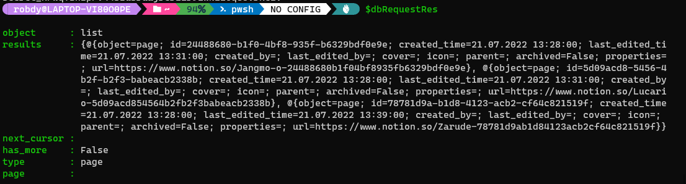

It's quite clear that we're interested in the `results` property. Let's inspect it:

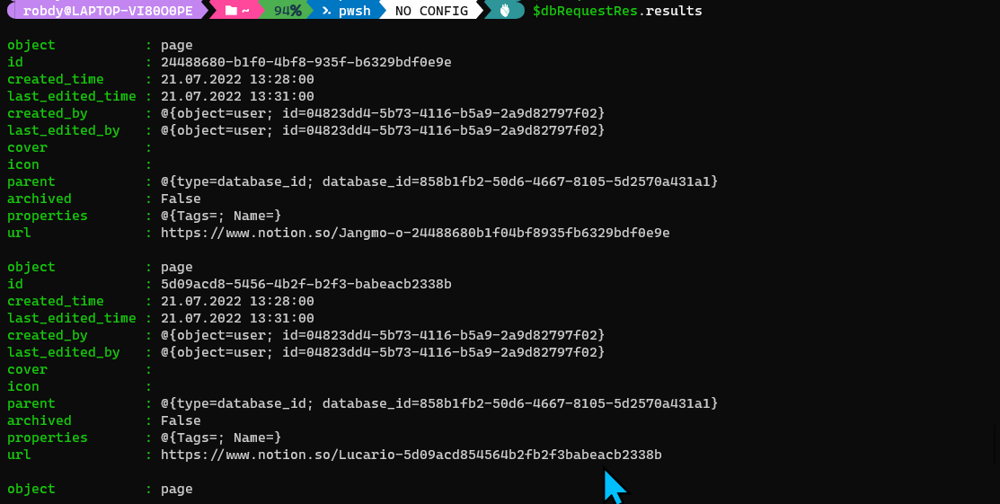

Voilà! We got the array of objects. All objects contain the page ID. We'll use it later.

<Tip>

Note that the page URL contains its ID **at the end**. Next time, we can get it from the URL instead of querying the database.

</Tip>

## Getting the page block children

We now have the page object. However, it only contains the page property. It's mentioned in the API docs article: [Page object](https://developers.notion.com/reference/page).

> The Page object contains the [property values](https://developers.notion.com/reference/property-value-object) of a single Notion page. (…)
Page content is available as [blocks](https://developers.notion.com/reference/block). The content can be read using [retrieve block children](https://developers.notion.com/reference/get-block-children).

Ok, so now we need to retrieve block children. We'll modify our previous request with the new URL, and another method. We'll also update the variable names. The rest of the parameters stay as it is:

```powershell
$pageId = $dbRequestRes.results[0].id
$pageChildrenParams = @{
	Uri = "https://api.notion.com/v1/blocks/$pageId/children"
	Method = 'GET'
	Headers = $headers
	ContentType = 'application/json'
	Authentication = 'Bearer'
	Token = $notionKey
}
$pageChildrenRes = Invoke-RestMethod @pageChildrenParams
```

Similarly, let's inspect the `results` property:

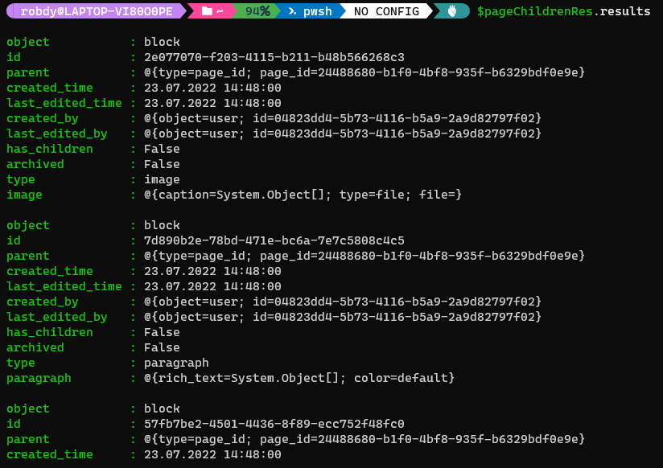

We now got the array of blocks. Each block represents the block on the page.

Going through the blocks and converting them to a readable format is out of the scope of this article. We got the data and that's it for now.

## Summary

Notion's API is beginner-friendly, especially when it comes to authorization. We went through sending two requests. We've also learned a bit about the object types from the API. Now the tough tasks - how to convert the objects to Markdown.

Do you want this article to have a part 2? Let me know in the comments!