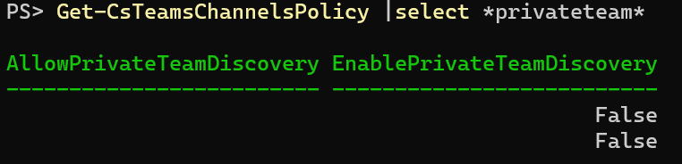

In this article, I'm describing the changes to the Teams PowerShell module introduced in October and November. The changes appeared in the versions up to 4.9.1.

## SMS in Teams

There are two places where we can see *SMS* in the recent changes. *Get-CsTenantFederationConfiguration* now returns *AllowTeamsSms* property. *Get-CsExternalAccessPolicy* returns *EnableTeamsSmsAccess*.

Both properties default to `true`. They first appeared in the 4.9.0 version of the module. At the moment, there are no corresponding parameters in *Set-* cmdlets. That means the properties are not settable.

## Editing messages by owners

With this parameter, team owners will get the ability to edit all the messages sent in the team channel. Useful when you want to fix typos or improve the announcement sent to the team. It will no longer be an issue that the original sender is temporarily unavailable.

The parameter first appeared in the 4.9.0 version released on November 2, 2022.

## Security end-user reporting

*AllowSecurityEndUserReporting* is the new property in the messaging policy. Its default value is *true* and it expects a boolean value. The parameter is already settable. It's not mentioned anywhere in the docs. The only place I found it is [the issue opened in Office docs PowerShell repository](https://github.com/MicrosoftDocs/office-docs-powershell/issues/10141).

My guess is there will be an option to report spam in the chats. Perhaps it will go directly to Microsoft so that they can block the sender after it's confirmed to be a spammer. I guess it might work similarly to reporting spam emails in Outlook.

The parameter first appeared in the 4.9.0 version released on November 2, 2022.

## New Teams client

*Get-CsTeamsUpdateManagementPolicy* now returns *UseNewTeamsClient*. It defaults to *MicrosoftChoice*. It might mean that we'll have *AdminChoice* or *UserChoice* available. We cannot check it yet as there's no corresponding parameter for *Set-CsTeamsUpdateManagementPolicy*.

The parameter first appeared in the 4.9.0 version of the module. It's mentioned in the [official release notes](https://learn.microsoft.com/en-us/microsoftteams/teams-powershell-release-notes) for the 4.9.1 version. 

## Private team discovery

*EnablePrivateTeamDiscovery* property appeared in *Get-CsTeamsChannelsPolicy* output. The same parameter appeared in the corresponding cmdlets for setting (*Set-CsTeamsChannelsPolicy*) and creating (*New-CsTeamsChannelsPolicy*) policies.

The parameter above adds some confusion to channel policy. We currently have two similarly-named parameters:
* *AllowPrivateTeamDiscovery*
* *EnablePrivateTeamDiscovery*.

See the output from the *Get-CsTeamsChannelsPolicy* cmdlet*:*

The *AllowPrivateTeamDiscovery* parameter was removed in version 4.9.0 (November 11, 2022) and then added back with the release of the 4.9.1 version. Something similar happened in July - the same parameter was removed and added back one day later. To be even more confusing, the *AllowPrivateTeamDiscovery* is in the documentation. *EnablePrivateTeamDiscovery* is not mentioned there yet.

The good news is that the *AllowPrivateTeamDiscovery* is not settable, so we cannot mix the parameters while changing them.

Officially, the parameters were released on November 15, 2022, with the 4.9.1 version. It's mentioned in the [official release notes](https://learn.microsoft.com/en-us/microsoftteams/teams-powershell-release-notes). However, the parameter appeared in the policies output 4 days before.

## Private meeting scheduling

We have a parameter to control, whether a user can schedule private meetings: *AllowPrivateMeetingScheduling*. It has existed for a very long time. However, recently a new parameter appeared: *AllowedPrivateMeetingScheduling*.

The parameter is not suitable. Most likely, it's a mistake during the development process. We'll find out whether it was intended or not soon (I hope).

The parameter first appeared in the 4.9.0 version released on November 2, 2022.

## Feature suggestion in feedback policy

[Feedback policies](https://learn.microsoft.com/en-us/microsoftteams/manage-feedback-policies-in-teams) got a new parameter: *EnableFeatureSuggestions*. It is responsible for showing Suggest a feature button under the *Help* section in Teams client.

The parameter is settable and well-documented.

## Old parameters added back to meeting policy

There are some old parameters being added to the meeting policy. For now, it's not clear whether it's by mistake or intended.

*EnableLowBandwidthConsumption *is the first one from this list. Is Microsoft going to introduce a low-bandwidth mode for meetings?

*AllowTeamsMeeting* seems to be no longer necessary these days. Teams meetings are default now and why would Microsoft block them?

*MeetingRecordingExpirationDays* used to be the parameter responsible for the expiration of meeting recording. It has been replaced by *NewMeetingRecordingExpirationDays* in [the first half of 2022](https://petri.com/m365-changelog-updated-teams-meeting-recordings-auto-expiration-in-onedrive-and-sharepoint/).

### Timeline

The following properties re-appeared in the 4.9.0 version released on November 2, 2022:

* *EnableLowBandwidthConsumption*
* *AllowTeamsMeeting*

* *MeetingRecordingExpirationDays*
* *MeetingInviteLanguage1* and *MeetingInviteLanguage2*

* *AppDesktopSharingMode*
* *EnableOutlookAddIn*

*EnableLowBandwidthConsumption*, *AllowTeamsMeeting*, and *EnableOutlookAddIn* were removed from the docs in this commit: [Update Meeting and Messaging policy cmdlets](https://github.com/MicrosoftDocs/office-docs-powershell/commit/465ec0843e01f61da951272aa014857ede1b8945#diff-46482f2e1cfbef702f8d1c66bc54656966aa7bc8eedd0b58bec32b490b53eaed)

*MeetingRecordingExpirationDays* was removed between October and November 2021 (versions 2.6.0 and 2.6.2 of the module).

*MeetingInviteLanguage1* and *MeetingInviteLanguage2 *appeared first in May 2021. In June 2021 they were replaced by *MeetingInviteLanguages*. This parameter is still in use, so I'm not sure why would the separated ones be reintroduced.

*AppDesktopSharingMode *was removed in 2018 with this commit: [AppDesktopSharingMode parameter cannot set with New-CsTeamsMeeting…](https://github.com/MicrosoftDocs/office-docs-powershell/commit/072112266c77370ae85eb8329985327463d88008))

## Summary

Personally, I'm most interested in the SMS access. Editing messages by team owners will help to create content collaboratively. After all, Teams is all about collaboration, isn't it?
