In this article, we're going to talk about the three types of description fields available for an Azure Active Directory Access Review. We're going to talk about how to use them to improve the experience of reviewers

## Prerequisites

Just so you know – the article doesn't require any setup from you. It describes the text fields within an Access Review. If you want to test it yourself, look at the [license requirements](https://learn.microsoft.com/en-us/azure/active-directory/governance/access-reviews-overview#license-requirements).

## Types of descriptions available for Azure AD Access Review

When configuring the access review in Azure Active Directory, we have three text fields available.

<Note>

In the article, we're going to refer to the types using the numbers from the list below.

</Note>

1. *Additional content for reviewer email* (in the *Settings* section)
2. *Review name* (in the *Review + Create* section)
3. *Description* (in the *Review + Create* section)

The image below shows these three fields in the *New access review* wizard:

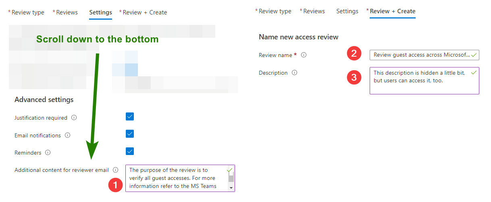

## Additional context for reviewer email

The first field is easy to understand. Based on its name we know it'll land in the email sent to the reviewer. Our guess is correct - we can see the text in the email:

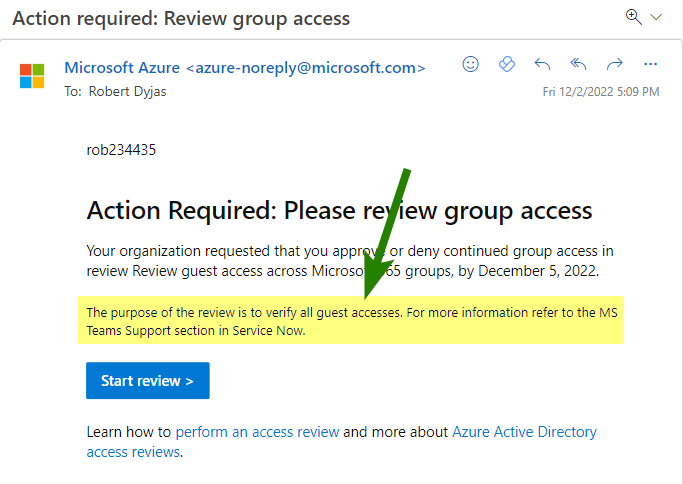

However, there's another place to see the content of that field. When we check the access review setting in the Azure Portal, we'll see it has a different name.

To check the settings of the access review, you can go to the [Azure portal](https://portal.azure.com). When we search for *access review* in the top bar, we should get the *Identity Governance* icon:

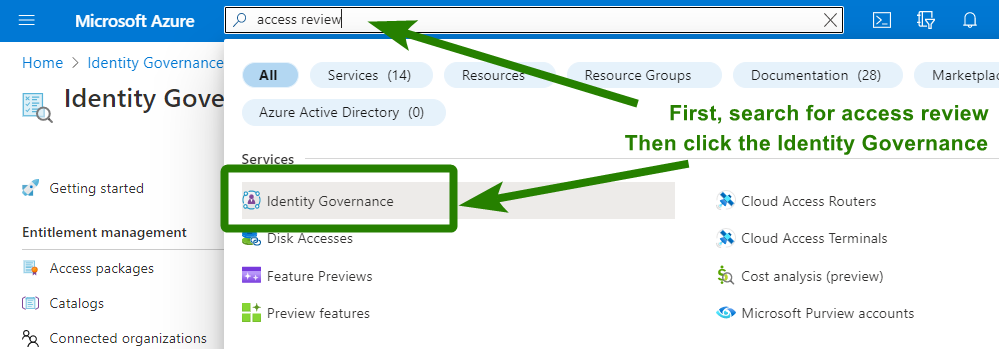

In the Identity Governance blade, the *Access Reviews* option is in the left menu:

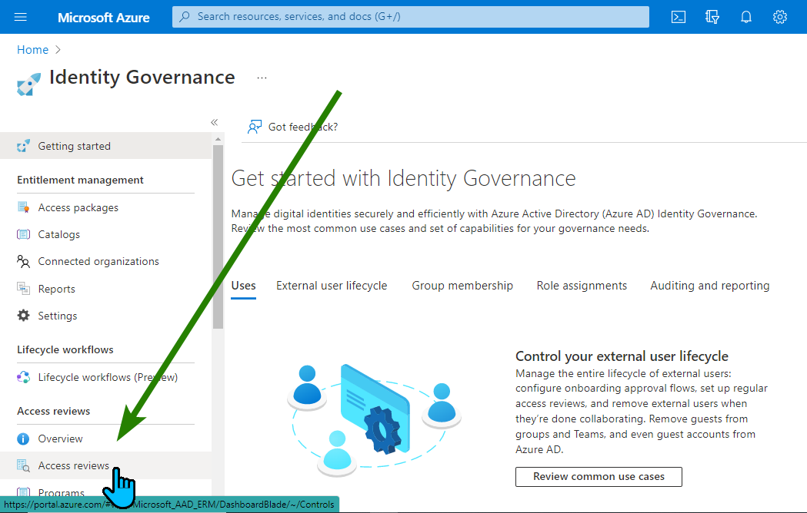

From the list, we click on the name of our access review:

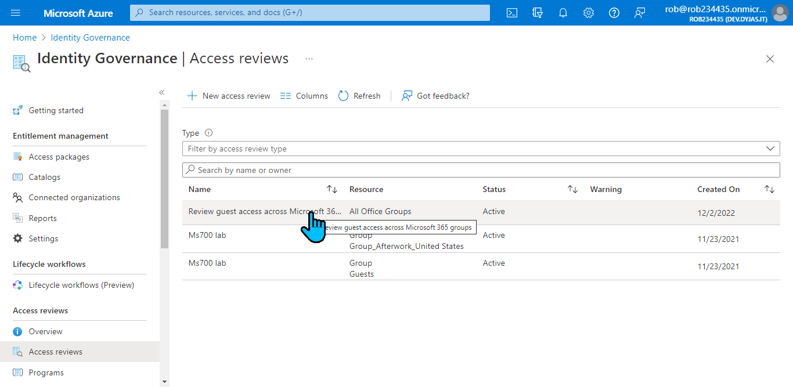

When we click the *Settings* option from the left menu, we will see the descriptions we set. The one marked with number 1, is named there as *Additional content for reviewer email*. Note that in this view it's called *Friendly description*: 

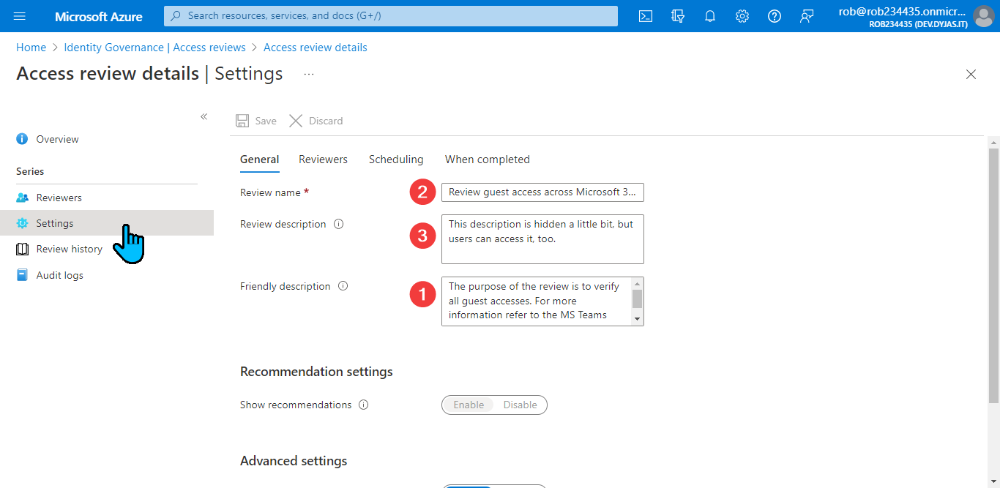

Quite strange, isn't it? It took me a bit to realize that the *friendly description* and *additional context for reviewer email* are two names for the same fields.

## Review name

Ok, we now know about the friendly description. How about the review name? Where can reviewers see it?

First of all, the name is in the email. See the icon with number 2 below:

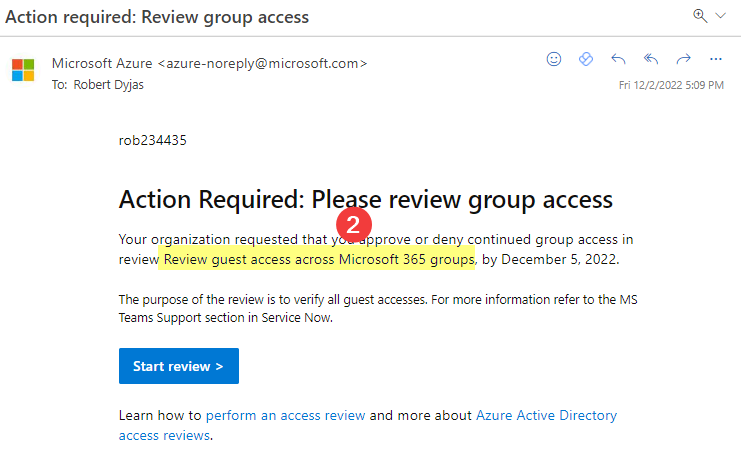

The name is also visible on the list after clicking the *Start review* button. Note that each resource (in our case, each group) has a separate entry on the list:

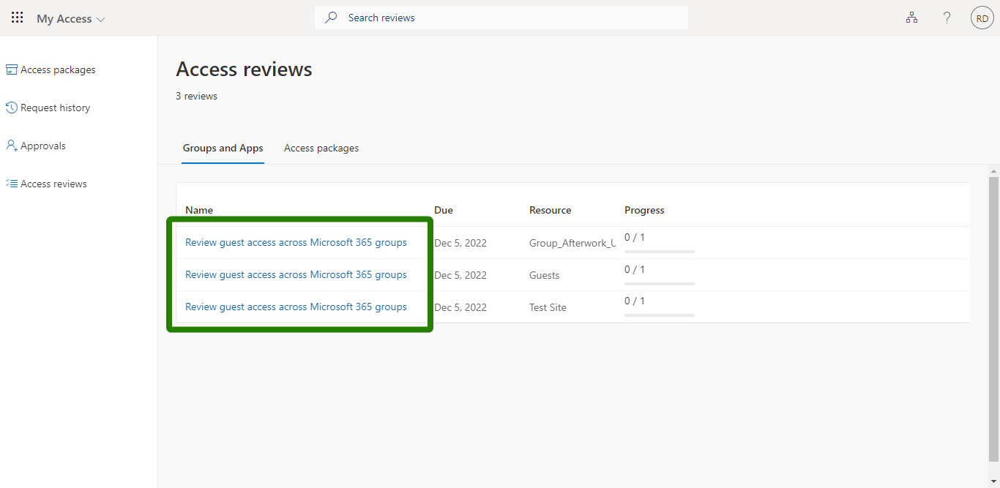

In the detailed view for a single resource, the name is visible at the top of the page:

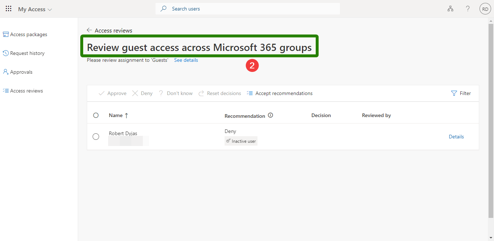

Finally, let's look at the *Access review details* page. The review name is at the top, where it should be:

## Review description

We talked about two out of the three text fields. Let's look at the review description. Where is it?

If we take a look at the email sent to reviewers, it's not there:

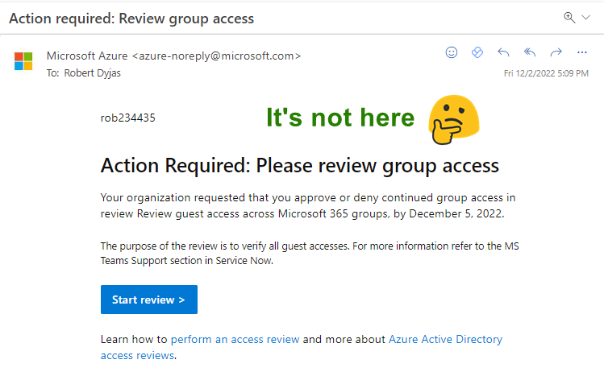

It's also not visible in the review list:

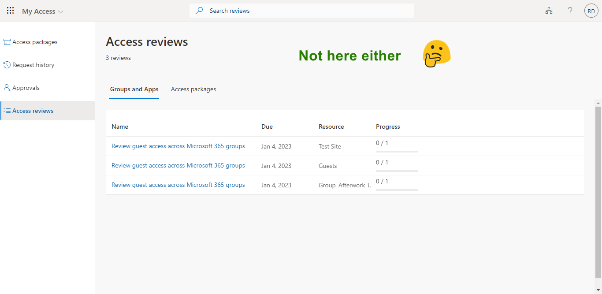

Let's dig deeper and check the view of a single review. Spoiler alert - it's not there, too:

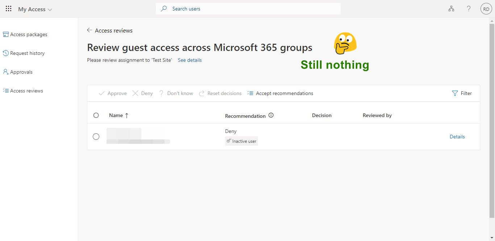

But it's getting warmer and warmer. Let's click the *Show details* button and tada, we got it:

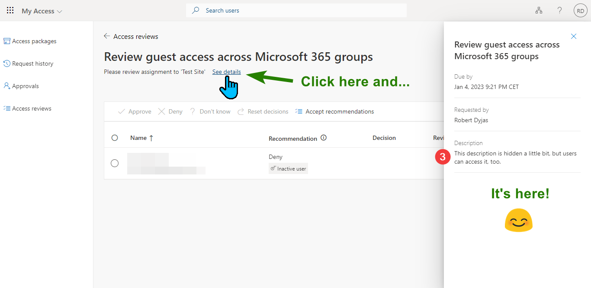

Fortunately, in the admin view, we don't need to play hide and seek. The description is visible in the editing view. It's in the same view as the others (this one is marked with the 3 icon):

## Summary

Text fields for Access Review might benefit from a slightly better user experience. While you cannot guarantee whether Microsoft improves that in the future, you can help others by sharing this article with them.

Is something still unclear? Let me know in the comments below!
