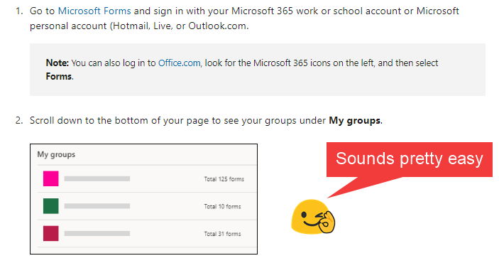
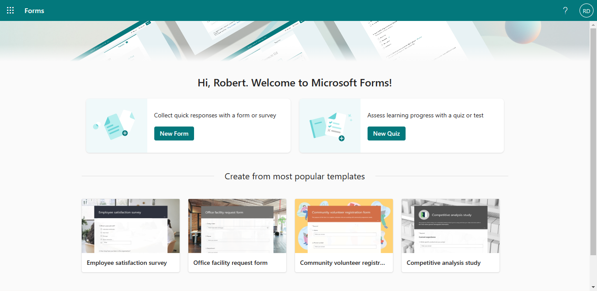
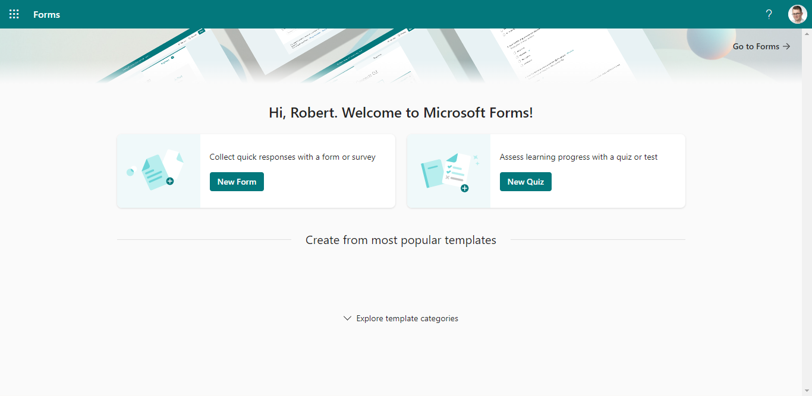

I have recently received a ticket saying ‘I cannot create a group form in MS Forms'. It was a bit surprising to me - I don't receive tickets about Forms very frequently.

Quick checking on my account didn't help. I followed the steps easily and created the form for my test group. But then I tried on my admin account. It was my first time using Forms there. And voilà - I got the same issue.

Quick checking on my account didn't help. I followed the steps easily and created the form for my test group. But then I tried on my admin account. It was my first time using Forms there. And voilà - I got the same issue.

According to the [Create a group form or quiz](https://support.microsoft.com/en-us/office/create-a-group-form-or-quiz-7228eebb-a6ab-45ec-8123-52026a2f52ff), you need to go to MS Forms and then scroll down to see **My groups** section:

However, when you open Microsoft Forms, you see the following page:

The page doesn't have the **My groups** section.

The page doesn't have the **My groups** section.

Create an empty form and save it. Once you have your first form, you'll see a different welcome screen. Follow the steps below:

Create an empty form and save it. Once you have your first form, you'll see a different welcome screen. Follow the steps below:

Create an empty form and save it. Once you have your first form, you'll see a different welcome screen. Follow the steps below:

Create an empty form and save it. Once you have your first form, you'll see a different welcome screen. Follow the steps below:

Create an empty form and save it. Once you have your first form, you'll see a different welcome screen. Follow the steps below:

## Summary

The solution for this issue was quite quick. One important lesson from it - sometimes the interface is not the same when you use the service for the first time.

