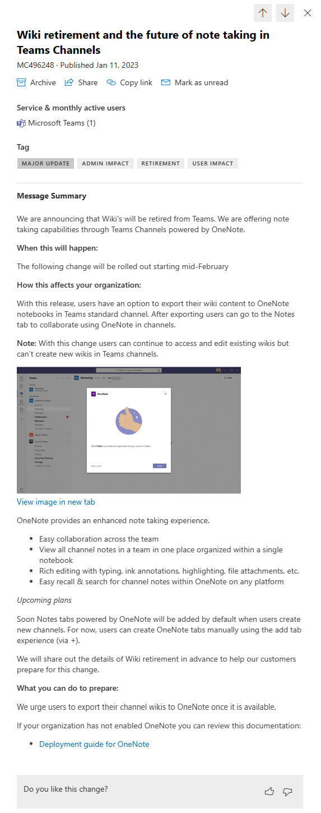
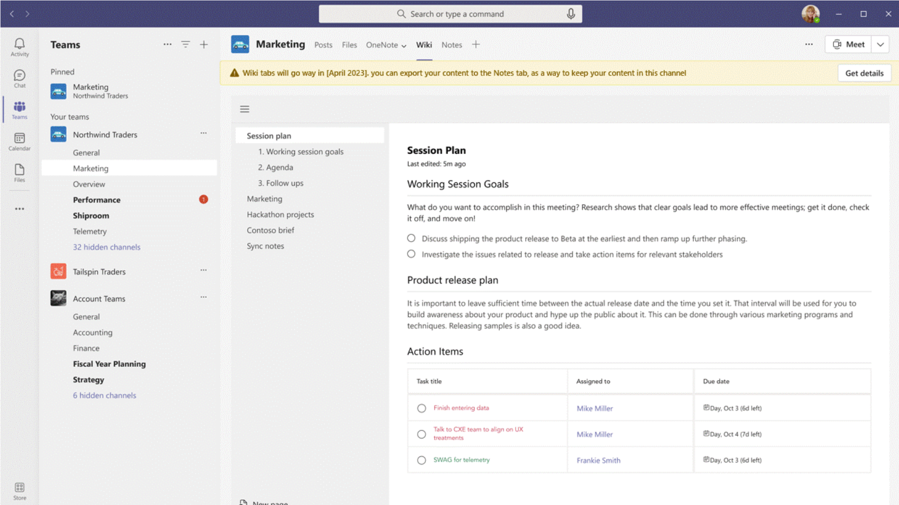
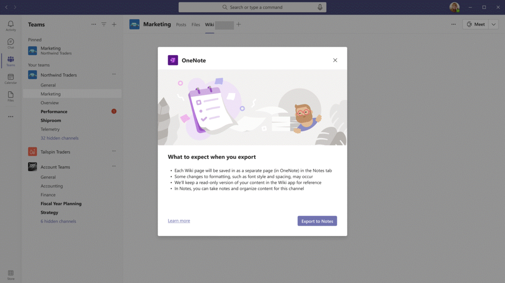
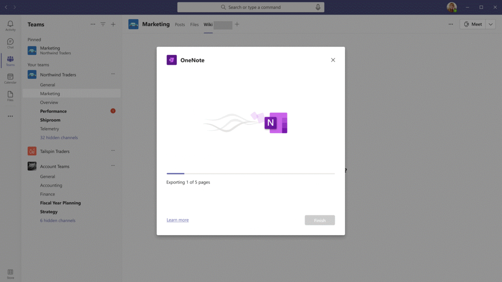
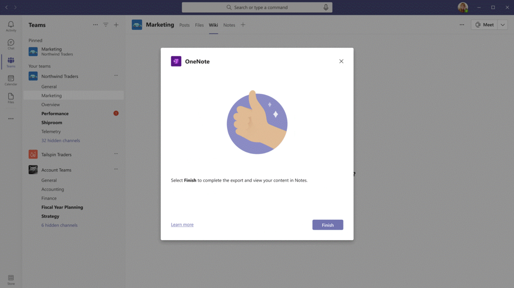
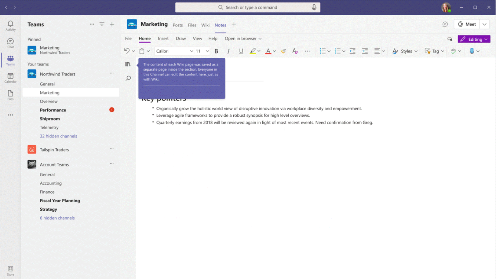
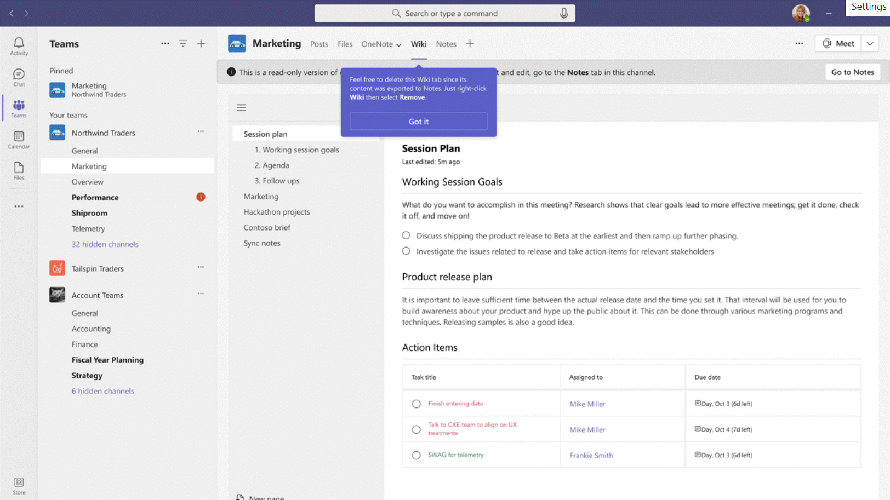

In January 2023 Microsoft announced the retirement of wiki functionality in Teams. This article talks about everything you need to know to be prepared for it, when the time comes

## TL;DR

Below are the more important information from the article:

* Wiki migration tool will arrive in February 2023
* OneNote is the tool to replace wiki

* It's not yet announced what will happen to meeting notes
* There's a script available to estimate the impact of this change

* Microsoft has plenty of learning materials about OneNote

If you want to know the details, keep reading. If you stop here, thanks for your short visit!

## Announcement

Wiki will be retired from Teams. We know that based on Microsoft's announcement published in the beginning of January:

If you want to check the announcement here is the link (requires admin account to access) [Message Center entry MC496248](https://admin.microsoft.com/Adminportal/Home?ref=MessageCenter/:/messages/MC496248). You can also read it on [unofficial M365 Changelog](https://petri.com/m365-changelog-wiki-retirement-and-the-future-of-note-taking-in-teams-channels/) (no account required).

## When will wiki be retired from Teams?

The Message Center announcement doesn't specify any date when wiki will be completely removed. It only says what is going to happen with the next release of Teams wiki.

The changes announced already are:

* Users will have an option to export their wiki content to OneNote notebooks in Teams standard channel (I write about private channels below)
* Users will be able to continue to access and edit existing wikis but will not be able to create new wikis in Teams channels

* Notes tabs powered by OneNote will be added by default when users create new channels

## When the change will happen?

The upcoming release *will be rolled out starting mid-February*. There is no mention of the end date. It means that you can see the new release of Teams wiki in the second week of February or you can see it later - in February or maybe in March.

The dates mentioned above apply to these two changes:

* Users will have an option to export their wiki content to OneNote notebooks in Teams standard channel
* Users will be able to continue to access and edit existing wikis but will not be able to create new wikis in Teams channels

There's one change with no specific date. The announcement mentions that soon *Notes tabs powered by OneNote will be added by default when users create new channels*.

## How will the migration process look like?

We don't have any details yet. The only information we can get is from the [GIF attached to the Message Center entry](https://img-prod-cms-rt-microsoft-com.akamaized.net/cms/api/am/imageFileData/RE5egwT?ver=2d0e%22). The GIF shows the yellow warning bar which will be added to the top of wiki tab:

The bar says:

> Wiki tabs will go away in [April 2023], you can export your content to the Notes tab, as a way to keep your content in this channel

The mentioned date is probably a placeholder. There was no official announcement yet. Also, Microsoft likes to postpone decommissioning dates based on client's feedback. They did that for [basic authentication](https://techcommunity.microsoft.com/t5/exchange/microsoft-pushes-removal-of-basic-authentication-from-exchange/m-p/1279824), [license assignment APIs](https://techcommunity.microsoft.com/t5/microsoft-entra-azure-ad-blog/migrate-your-apps-to-access-the-license-managements-apis-from/ba-p/2464366) and some other.

Once we click the **Get details** button you'll be redirected to the next screen giving more information:

The pop-up says:

> What to expect when you export:
- Each wiki page **will be saved in as a separate page** (in OneNote) in the Notes tab
- Some changes to formatting such as font style and spacing may occur
- We'll keep a read-only version of your content in the Wiki app for reference
- In Notes, you can take notes and organize content for this channel

After using **Export to Notes** button we'll see the progress screen:

And then the confirmation screen:

After confirming with **Finish** we'll be redirected to the **Notes **tab. The tab is the default name for a OneNote tab in the channel.

The context pop-up says that each page from wiki was saved as a separate page in the section. It's currently unknown whether we'll be able to choose the section or there's going to be a default one (such as **Wiki**).

Next pop-up will suggest to delete the **Wiki** tab:

## Will private channel wiki be retired?

The Message Center announcement doesn't distinguish the type of channel, except one sentence. It says that users will have an option to export their wiki content to OneNote notebooks in Teams **standard channel**.

Currently there's no information about private or shared channels. I'd assume the migration tool will work the same way, regardless of channel type. We'll find out when new announcements come.

## Will meeting notes be retired?

Although meeting notes are based on the wiki functionality, the announcement doesn't cover it at all.

If we dig more, we can find something about the meeting notes in the [roadmap entry 101509](https://www.microsoft.com/en-us/microsoft-365/roadmap?filters=&searchterms=101509). The entry says:

> Every Teams meeting now comes with a collaborative OneNote canvas. Create notes from the Teams calendar or during a meeting. You can easily recall your notes and manage your tasks directly from OneNote.

The feature is planned for April 2023. It seems interesting - would that mean a separate notebook for every meeting? The sharing might be a challenging part to design - perhaps MS is thinking about a per-page sharing in OneNote?

## What's the difference between wiki and OneNote?

OneNote can be considered *wiki on steroids*. Wiki was always meant to be a simple text editor. The main things that are making wiki less usable than OneNote are:

* Cannot be used outside of Teams
* Limited formatting options

* No full-text search
* No recycle bin

* No offline use
* Poorly designed version history

If you want to read more, I recommend the following articles: [Don't use Teams wiki – Vesa Nopanen](https://mymetaverseday.com/2018/05/08/dont-use-teams-wiki/) and [What's wrong with Microsoft Teams built-in wiki? Five built-in wiki limitations that you should know](https://perfectwikiforteams.com/blog/ms-teams-wiki-cons/).

## Upcoming OneNote improvements

On the other hand, OneNote [got a nice refresh in 2022](https://techcommunity.microsoft.com/t5/microsoft-365-blog/refreshing-the-onenote-app-on-windows/ba-p/3401914). There are more improvements coming, such as [meeting notes](https://www.microsoft.com/en-us/microsoft-365/roadmap?filters=&searchterms=101509) (mentioned above in the section about meeting notes retirement), [new navigation options](https://www.microsoft.com/en-us/microsoft-365/roadmap?filters=&searchterms=100492), [dictating notes](https://www.microsoft.com/en-us/microsoft-365/roadmap?filters=&searchterms=https://www.microsoft.com/en-us/microsoft-365/roadmap?filters=&searchterms=88993).

If you want to be up-to-date, here's the [OneNote section of the M365 roadmap](https://www.microsoft.com/en-us/microsoft-365/roadmap?filters=OneNote).

## Can we export list of wiki users in an organization?

Now when we know what to expect, let's think how many users will be affected by this change. Are our users using wiki at all? How to check this?

Tony Redmond has written an excellent guide describing [How to Find Teams Channels With a Wiki Tab](https://office365itpros.com/2023/01/24/teams-wiki-report/).

For meeting notes, the only discovery way I can think of is via eDiscovery. Knowing that meeting notes are kept under *OneDrive* > *Microsoft Teams Data* > *Wiki*, we'd need to find the people with such folder existing. But that only covers people, who created the notes, not talking about the ones reading them.

## How can I prepare for Teams wiki retirement?

The wiki retirement in inevitable. How to better prepare for it? I think the most important part is about education - promote OneNote across the organization as it'll be our new friend in the upcoming days.

Microsoft has some good resources you can use to get people familiar with OneNote: [OneNote help & learning](https://support.microsoft.com/en-us/onenote) and [OneNote video training](https://support.microsoft.com/en-us/office/onenote-video-training-1c983b65-42f6-42c1-ab61-235aae5d0115).

Next part is discovery - find out who uses wiki and prepare a targeted communication about migrating to OneNote. Check the section Can we export list of wiki users in an organization to find out how to do that.

Last, but not least - stay in the loop. Get back to this post frequently for updates. Keep checking the [Message Center](https://admin.microsoft.com/#/MessageCenter) and [M365 Roadmap](https://www.microsoft.com/en-us/microsoft-365/roadmap). Make sure you don't miss important updates.

## Summary

There's a lot of things uncovered for the Teams wiki retirement. However, there are things we can already do to be prepared.

Once we're prepared, we only can hope that Microsoft provides a nice transition experience for the discovery, migration and decommission of the wiki.

Bye, bye, wiki! You'll be missed (but only by some of us) ;)
