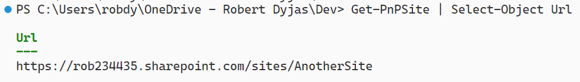
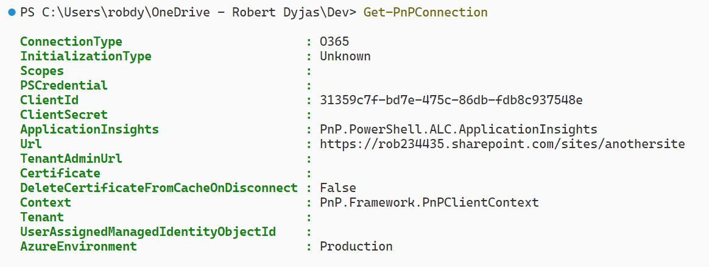
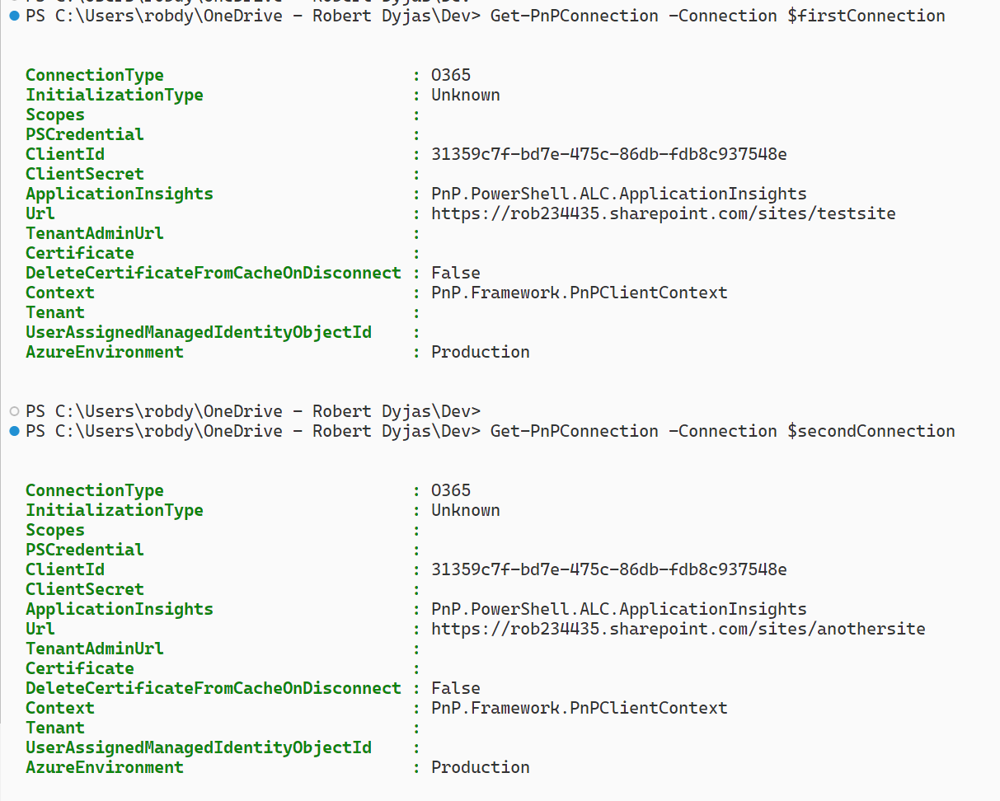
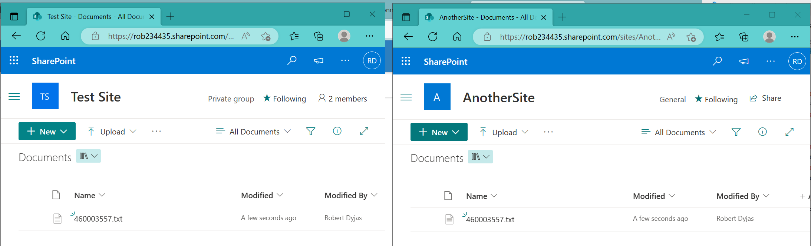

Imagine we have a PowerShell script to upload a file to a specific SharePoint site. It's pretty simple - we can use *Connect-PnPOnline* and then *Add-PnPFile*.

But at some point, our script gets popular and someone else is coming to us. They are asking to upload the same file to another SharePoint site. Then things start to be interesting.

In the article, we'll go through the steps and issues of dealing with multiple PnP connections. Ready? Let's go then!

## Prerequisites

For this tutorial we'll need to have:

* Access to Microsoft 365
* Two SharePoint sites

* PowerShell with [PnP module installed](https://pnp.github.io/powershell/articles/installation.html)

## Preparing our testing space

First, let's prepare variables and connect to the first site. We'll upload the file to see if it works fine

```powershell
$uploadFilePath = 'C:\temp\aaaa.txt'
if (-not (Test-Path $uploadFilePath)) { Get-Random | Out-File $uploadFilePath}

# Sites data
$firstSiteUrl = 'https://rob234435.sharepoint.com/sites/TestSite'
$firstSiteFolderPath = 'Shared Documents'
$secondSiteUrl = 'https://rob234435.sharepoint.com/sites/AnotherSite'
$secondSiteFolderPath = 'Shared Documents'

# Action
Connect-PnPOnline -Url $firstSiteUrl -LaunchBrowser -Interactive
$localFileName = Split-Path $uploadFilePath -Leaf
$randomFileName = $localFileName.Replace($localFileName.Split('.')[0], [string](Get-Random))
Add-PnPFile -path $uploadFilePath -Folder $firstSiteFolderPath -NewFileName $randomFileName
```

## Adding another connection

Let's now add the other connection. If we do it the same way as the first one:

```powershell
Connect-PnPOnline -Url $secondSiteUrl -LaunchBrowser -Interactive
```

We'll now be able to operate only on the second site. We can check it by either uploading the file or using [Get-PnPSite](https://pnp.github.io/powershell/cmdlets/Get-PnPSite.html) cmdlet:

```powershell
$randomFileName = $localFileName.Replace($localFileName.Split('.')[0], [string](Get-Random))
Add-PnPFile -path $uploadFilePath -Folder $firstSiteFolderPath -NewFileName $randomFileName

Get-PnPSite | Select-Object Url
```

Get-PnPSite will return the second site:



## Inspecting the connections


If we search the [PnP cmdlet list](https://pnp.github.io/powershell/cmdlets/Add-PnPAlert.html), we'll find something that can help: Get-PnPConnection. Let's check what it returns:



There is only one connection returned. We cannot find the first connection at all.

<Tip>

If you use *Connect-PnPOnline* twice, the second connection will always take over. It might cause errors, that are difficult to trace if we are not aware of that.

</Tip>

## Disconnecting

Let's see if disconnecting the last session can help. We will first disconnect and then try to see if the previous connection is still available:

```powershell
Disconnect-PnPOnline
Get-PnPConnection
```

What we get in return doesn't help:


## Returning connection

In the [Connect-PnPOnline](https://pnp.github.io/powershell/cmdlets/Connect-PnPOnline.html) documentation, we'll find the solution to our problem. It's the *ReturnConnection* parameter.

The parameter gives us an object that we can save to a variable. Afterward, we can pass the variable using the *Connection* parameter:

```powershell
$firstConnection  = Connect-PnPOnline -Url $firstSiteUrl -LaunchBrowser -Interactive -ReturnConnection
$secondConnection = Connect-PnPOnline -Url $secondSiteUrl -LaunchBrowser -Interactive -ReturnConnection

# Check the connection
Get-PnPConnection -Connection $firstConnection
Get-PnPConnection -Connection $secondConnection
```

And we get both sites in return:



Now we can incorporate the parameters we found into our script:

```powershell
# File data
$uploadFilePath = 'C:\temp\aaaa.txt'
if (-not (Test-Path $uploadFilePath)) { Get-Random | Out-File $uploadFilePath }

# Sites data
$firstSiteUrl = 'https://rob234435.sharepoint.com/sites/TestSite'
$firstSiteFolderPath = 'Shared Documents'
$secondSiteUrl = 'https://rob234435.sharepoint.com/sites/AnotherSite'
$secondSiteFolderPath = 'Shared Documents'

# Connection
$firstConnection = Connect-PnPOnline -Url $firstSiteUrl -LaunchBrowser -Interactive -ReturnConnection
$secondConnection = Connect-PnPOnline -Url $secondSiteUrl -LaunchBrowser -Interactive -ReturnConnection

# Processing file data
$localFileName = Split-Path $uploadFilePath -Leaf
$randomFileName = $localFileName.Replace($localFileName.Split('.')[0], [string](Get-Random))

# Uploading
Add-PnPFile -path $uploadFilePath -Folder $firstSiteFolderPath -NewFileName $randomFileName -Connection $firstConnection
Add-PnPFile -path $uploadFilePath -Folder $secondSiteFolderPath -NewFileName $randomFileName -Connection $secondConnection
```

As a result, the file is uploaded to both sites:



## Summary

In this article, we covered the topic of adding an additional SharePoint connection using the PnP module. We've tested what happens if we do this incorrectly. Later, we discovered what is the correct way to do this.
